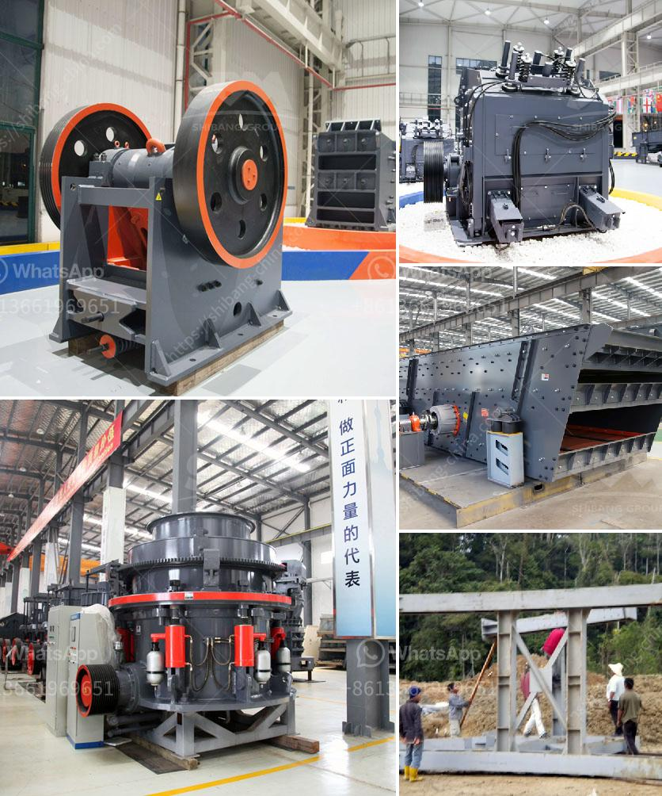

<h3>كسارة للحجر الجيري</h3>
يعتبر الحجر الجيري أحد أهم المواد الخام في صناعة البناء والإنشاءات. يستخدم الحجر الجيري في العديد من التطبيقات مثل صناعة الأسمنت والجص والخرسانة. ولكن قبل استخدامه في هذه الصناعات، يحتاج الحجر الجيري إلى تكسير وسحق لتحجيمه وتحويله إلى حجم مناسب يناسب الاستخدام النهائي. ولتنفيذ عملية التكسير والسحق، يستخدم العديد من المصانع والشركات كسارات الحجر الجيري.

تعتبر الكسارة للحجر الجيري أداة رئيسية في صناعة الحجر، حيث تستخدم لتكسير الحجر الجيري إلى جزيئات أصغر. تتم عملية التكسير عن طريق تطبيق قوة الضغط على الحجر الجيري الموجود في الكسارة. تقوم شفرات المطرقة ضمن الكسارة بضرب الحجر الجيري بقوة كبيرة حتى يتم تكسيره وسحقه إلى قطع صغيرة.

هناك العديد من أنواع الكسارات التي تستخدم للحجر الجيري، مثل كسارة الفك وكسارة الصدم. يعتبر استخدام نوع الكسارة المناسب أمراً مهماً لتحقيق أداء مرضٍ، حيث تأخذ في الاعتبار عوامل مثل حجم الحجر الجيري واحتياجات الإنتاج.

تتميز كسارات الحجر الجيري بقدرتها على معالجة كميات كبيرة من الحجر بشكل فعال وسريع. تعتبر هذه الكسارات فعالة من حيث الطاقة وتقلل الكثير من العمل اليدوي وتعزز الإنتاجية. كما أنها قادرة على تعديل حجم الحجر بسهولة من خلال ضبط الفجوة بين شفرات الكسارة.

باستخدام كسارة الحجر الجيري، يتم الحصول على حجم الحجر المناسب للاستخدام في عمليات البناء. يمكن استخدام الحجر الجيري المكسر في تشييد الطرق والمباني والجدران والأرصفة، وحتى في صناعة البلاط والألواح الزجاجية.

باختصار، تعتبر كسارات الحجر الجيري أداة مهمة في صناعة الحجر، حيث تقوم بتكسير وسحق الحجر الجيري لتحويله إلى حجم مناسب للاستخدام النهائي في العديد من التطبيقات. تعزز هذه الكسارات الإنتاجية وتوفر جودة الحجر المكسر ،وتعتبر عنصراً أساسياً في عمليات البناء والإنشاءات.
<h3>Contact us</h3><ul><li><strong>Whatsapp:&nbsp;<a href="https://wa.me/8613661969651">+8613661969651</a></strong></li><li><a href="https://swt.shibang-china.com/?git&amp;zhl&amp;كسارة للحجر الجيري"><strong>Online Service(chat now)</strong></a></li></ul><h3>Related</h3><ul><li><a href='مطحنة الكرة الطين.md'>مطحنة الكرة الطين</a></li><li><a href='كسارة حجر محمولة.md'>كسارة حجر محمولة</a></li><li><a href='معدات كسارة الحجر.md'>معدات كسارة الحجر</a></li><li><a href='حجم كسارة الفك.md'>حجم كسارة الفك</a></li><li><a href='شركات تصنيع أحزمة الناقل في كولكاتا.md'>شركات تصنيع أحزمة الناقل في كولكاتا</a></li></ul>