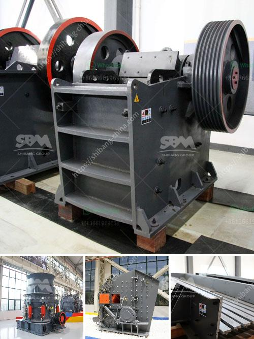

<h3>كسارة للذهب</h3>
تعتبر الكسارات للذهب من أهم الأدوات التي تستخدم في صناعة التعدين. وتعتبر الذهب أحد المعادن الثمينة التي تستخدم في العديد من التطبيقات، بدءًا من المجوهرات وصولاً إلى الصناعات الإلكترونية. وبالتالي، فإن كسارة الذهب تلعب دورًا حيويًا في استخراج هذا المعدن النفيس.

تختلف الكسارات للذهب من حيث الحجم والسعة والإمكانيات. إذ تستخدم الشركات والمناجم الكبيرة كسارات ضخمة بطاقات تصل إلى عدة آلاف من الاطنان لسحق ألواح الصخور المحملة بالذهب. وفي المقابل، يمكن للمناجم الصغيرة والهواة استخدام كسارات أصغر بطاقة تتراوح من 200 إلى 400 كيلوغرام.

تعمل الكسارات على طحن الصخور وتفتيتها إلى أحجام أصغر، مما يسهل عملية فصل الذهب عن الصخور. وتتكون الكسارات الصغيرة للذهب عادةً من فكين متحركين وثابتين. حيث يتم وضع الصخور بين الفكين، وبفضل الحركة المتناسبة بينهما، يتم سحق الصخور وتحويلها إلى كتل أصغر.

إضافةً إلى ذلك، تستخدم بعض الكسارات تقنيات أخرى مثل الاهتزاز والترددات العالية لتسهيل عملية السحق. كما يتم تركيز كسارات الذهب على تحقيق أدنى نسبة فاقد للذهب، حيث يكون الهدف الرئيسي هو استخراج أكبر قدر ممكن من الذهب دون فقده.

وتزود الكسارات الصغيرة للذهب بعض المنجمين الصغار بفرصة تحقيق ربح مستدام، حيث تتيح لهم استخلاص الذهب بطريقة كفؤة وسريعة. وتعد هذه الكسارات الصغيرة ميسورة التكلفة وقابلة للنقل، مما يتيح للمناجم الهواة الوصول إلى مناطق التعدين البعيدة.

باختصار، فإن كسارات الذهب تلعب دورًا حاسمًا في عملية استخلاص هذا المعدن الثمين. فهي تقوم بسحق الصخور وتفتيتها لتسهيل عملية فصل الذهب، وتعد ميسورة التكلفة وقابلة للنقل، مما يجعلها مثالية للاستخدامات التجارية والهواة على حد سواء.
<h3>Contact us</h3><ul><li><strong>Whatsapp:&nbsp;<a href="https://wa.me/8613661969651">+8613661969651</a></strong></li><li><a href="https://swt.shibang-china.com/?git&amp;zhl&amp;كسارة للذهب"><strong>Online Service(chat now)</strong></a></li></ul><h3>Related</h3><ul><li><a href='سعر طاحونة المطرقة.md'>سعر طاحونة المطرقة</a></li><li><a href='موزعون للأحزمة والناقلات في إندونيسيا.md'>موزعون للأحزمة والناقلات في إندونيسيا</a></li><li><a href='كسارة فك محمولة مستعملة في إسبانيا.md'>كسارة فك محمولة مستعملة في إسبانيا</a></li><li><a href='كيف يتم استخدام مسحوق الدولوميت في البناء.md'>كيف يتم استخدام مسحوق الدولوميت في البناء</a></li><li><a href='كسارات محمولة مستعملة للبيع في جنوب أفريقيا.md'>كسارات محمولة مستعملة للبيع في جنوب أفريقيا</a></li></ul>