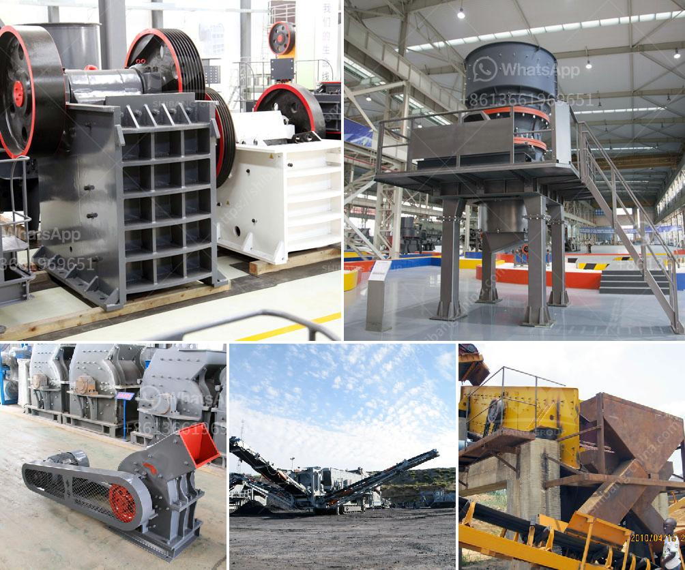

<h3>كسارة متنقلة القطرة</h3>
تُعتبر الكسارات المتنقلة القطرة من التكنولوجيات المبتكرة والحديثة التي تستخدم في صناعة البناء والهندسة المدنية. تعتبر هذه الكسارات ذات أهمية كبيرة للمقاولين والشركات البنائية التي تحتاج إلى تكسير الصخور والحصى في مواقع متعددة دون الحاجة إلى نقل المواد الخام.

تأتي الكسارات المتنقلة القطرة بمختلف الأحجام والموديلات، وغالبًا ما تكون مناسبة لتكسير الصخور والحصى بقطر يتراوح بين 200 و 400 ملم. وتعتبر الكسارات المتنقلة ممتازة للاستخدام في الأماكن النائية أو المواقع البعيدة عن المدن، حيث تسهل عملية التنقل والتشغيل. بفضل تصميمها المحمول، يمكن نقل هذه الكسارات بسهولة من موقع لآخر دون الحاجة إلى تفكيكها وتركيبها.

تحتوي الكسارات المتنقلة القطرة على محركات صغيرة ومتطورة تعمل بمصدر الطاقة المحمول، مما يضمن تشغيلها بشكل فعال ومستمر. وتمتاز هذه الكسارات أيضًا بقدرتها على ضبط حجم التكسير وفقًا لاحتياجات المشروع. فمع تعديل الإعدادات، يمكن للمشغل ضبط حجم المنتج النهائي بدقة وفقًا للمواصفات المطلوبة.

وبالإضافة إلى ذلك، تحتوي الكسارات المتنقلة القطرة على أنظمة تحكم متقدمة تسمح بتشغيل الكسارة وضبطها عن بُعد، مما يقلل من الحاجة إلى وجود فني في موقع العمل بشكل دائم. وبالتالي، تقلل الكسارات المتنقلة القطرة من التكاليف العمالية وتزيد من الإنتاجية.

بفضل مرونتها وقابليتها للتكيف مع مجموعة متنوعة من المشاريع، تعد الكسارات المتنقلة القطرة خيارًا شائعًا للشركات البنائية. توفر هذه الكسارات القدرة على تكسير المواد الخام في الموقع نفسه، مما يقلل من نفقات النقل والتخزين. كما تساعد في تحسين كفاءة الإنتاج والتقليل من تأثير المشروعات على البيئة.

في الختام، تُعد الكسارات المتنقلة القطرة أداة مهمة وفعالة في صناعة البناء والهندسة المدنية. بفضل تصميمها المتنقل وقدراتها المتقدمة، توفر هذه الكسارات القدرة على تكسير المواد الخام في الموقع نفسه، مما يسهل العملية ويزيد من الإنتاجية.
<h3>Contact us</h3><ul><li><strong>Whatsapp:&nbsp;<a href="https://wa.me/8613661969651">+8613661969651</a></strong></li><li><a href="https://swt.shibang-china.com/?git&amp;zhl&amp;كسارة متنقلة القطرة"><strong>Online Service(chat now)</strong></a></li></ul><h3>Related</h3><ul><li><a href='آلة طحن الحجر الجيري المصنع.md'>آلة طحن الحجر الجيري المصنع</a></li><li><a href='سعات مطحنة الأسطوانة العمودية.md'>سعات مطحنة الأسطوانة العمودية</a></li><li><a href='تكلفة معدات التكسير والطحن في إثيوبيا.md'>تكلفة معدات التكسير والطحن في إثيوبيا</a></li><li><a href='البحث عن شريك لكسارة الآلات.md'>البحث عن شريك لكسارة الآلات</a></li><li><a href='طاحونة عمودية للأسمنت في كينيا بسعة 100 طن.md'>طاحونة عمودية للأسمنت في كينيا بسعة 100 طن</a></li></ul>