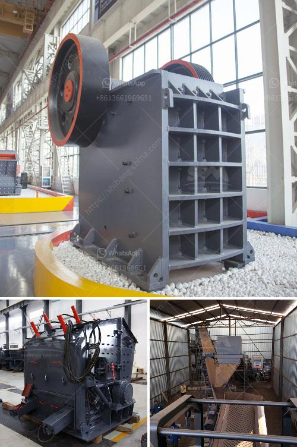

<h3>كسارة متنقلة بسعة 100 طن في الساعة</h3>
تعتبر الكسارة المتنقلة بسعة 100 طن في الساعة من أهم الآلات المستخدمة في صناعة التعدين والبناء والهندسة المدنية. تُعد الكسارة المتنقلة وسيلة فعالة لتكسير الصخور والأحجار وإعادة تدويرها لاستخدامها في الإنشاءات المختلفة.

تتميز الكسارة المتنقلة بسعة 100 طن في الساعة بأنها قادرة على تكسير كمية كبيرة من المواد الخام في وقت قصير جدًا. تعمل بفاعلية كبيرة، وتوفر وسيلة مريحة لتجهيز المواد الخام في مكان العمل مباشرة، مما يوفر الوقت والجهد والتكاليف المرتبطة بنقل المواد إلى مكان آخر لتجهيزها.

هذه الكسارة المتنقلة تتميز أيضًا بحجم صغير وخفة وزنها، مما يجعلها مثالية للاستخدام في المناطق الضيقة والمواقع البعيدة التي لا يمكن الوصول إليها بسهولة بواسطة الكسارات الثابتة. يتم تشغيل الكسارة بواسطة محرك قوي يوفر قدرة كافية لتحمل الأعباء الثقيلة، مما يضمن تشغيل سلس وفعال.

توفر الكسارة المتنقلة بسعة 100 طن في الساعة خيارات متعددة لتقديم المنتج النهائي. فهي مجهزة بشاشة اهتزازية وناقل من الصعب تجاوزها، مما يتيح فرز المواد أثناء عملية التكسير وإعادة تدويرها بفعالية. تتوفر أيضًا خيارات لتحويل الكسارة إلى مثبتة على المطبخ (باركر الكسارة) لأعمال التكسير في المواقع الصغيرة.

تُعد الكسارة المتنقلة بسعة 100 طن في الساعة حلاً فعالًا لتلبية الطلب المتزايد على المواد الإنشائية. إنها تساعد على زيادة إنتاجية موقع البناء وتعزيز كفاءة التشغيل. بالإضافة إلى ذلك، فإن التكسير المتنقل يقلل من تكاليف نقل المواد الخام من مكان إلى آخر، فضلاً عن تقليل تأثيرات التلوث الناتجة عن عمليات التكسير التقليدية.

في النهاية، تشكل الكسارة المتنقلة بسعة 100 طن في الساعة حلاً فريدًا لمشاكل صناعة التعدين والبناء، حيث أنها تجمع بين الكفاءة والمرونة والاقتصاد. نظرًا لمزاياها العديدة، فإنها تُعتبر استثمارًا مواتيًا للشركات والمقاولين الذين يبحثون عن تحسين عملياتهم وزيادة الإنتاجية وتقليل التكاليف.
<h3>Contact us</h3><ul><li><strong>Whatsapp:&nbsp;<a href="https://wa.me/8613661969651">+8613661969651</a></strong></li><li><a href="https://swt.shibang-china.com/?git&amp;zhl&amp;كسارة متنقلة بسعة 100 طن في الساعة"><strong>Online Service(chat now)</strong></a></li></ul><h3>Related</h3><ul><li><a href='مصنع لطحن الأسمنت في الهند.md'>مصنع لطحن الأسمنت في الهند</a></li><li><a href='سعر كسارة الحصى في رانشي.md'>سعر كسارة الحصى في رانشي</a></li><li><a href='مصنع معالجة خام الذهب 200 طن في الساعة.md'>مصنع معالجة خام الذهب 200 طن في الساعة</a></li><li><a href='مصنع أسمنت صغير بسعة 100 طن في اليوم.md'>مصنع أسمنت صغير بسعة 100 طن في اليوم</a></li><li><a href='آلة كسارة الحجر للبيع في الإمارات.md'>آلة كسارة الحجر للبيع في الإمارات</a></li></ul>