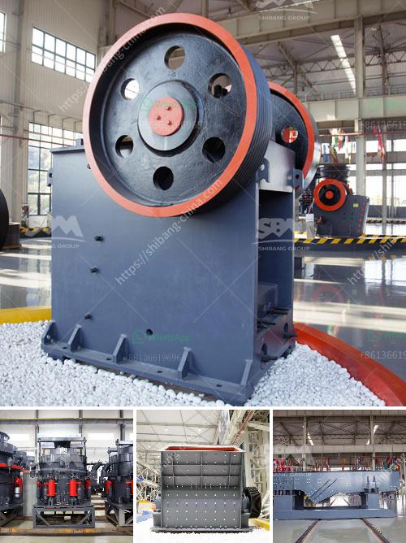

<h3>كسارة متنقلة بنظام هيدروليكي</h3>
الكسارات المتنقلة بنظام هيدروليكي هي واحدة من أحدث التقنيات المستخدمة في صناعة التعدين والبناء. تهدف هذه الكسارات إلى تحسين كفاءة العمل وتقليل تكاليف الإنتاج في هذه الصناعات.

تعتبر الكسارات المتنقلة بنظام هيدروليكي خيارًا مثاليًا للمواقع التي تحتاج إلى إجراء عمليات التكسير بصورة متكررة وفعالة. تتميز هذه الكسارات بقدرات تكسير عالية ومرونة في التنقل، حيث يمكن نقلها بسهولة بين مختلف المواقع لتلبية الطلب الزائد على الكسارة المحمولة.

تعمل الكسارات المتنقلة بنظام هيدروليكي بواسطة محرك هيدروليكي قوي يستخدم لتحريك الأجزاء الميكانيكية الرئيسية للكسارة، مما يسمح بسهولة التعامل مع المواد الكبيرة والصلبة. تتميز هذه الأجزاء بقدرات قوية ومتينة تتحمل عمليات التكسير الشاقة.

تضمن الكسارات المتنقلة بنظام هيدروليكي أداءً مستدامًا وفعالًا من حيث استهلاك الوقود والتشغيل. فهي تستخدم تقنيات متطورة تسمح بتحسين كفاءة الوقود وتقليل الانبعاثات الضارة للبيئة. بالإضافة إلى ذلك، تحتوي الكسارات المتنقلة على نظام تحكم هيدروليكي متقدم يسمح بتعديل وتنظيم القوة والسرعة للعملية، مما يزيد من دقة وفعالية التكسير.

وبالإضافة إلى المزايا التقنية، فإن الكسارات المتنقلة بنظام هيدروليكي تقدم أيضًا فوائد اقتصادية كبيرة. فهي تقلل من تكاليف النقل والتركيب، حيث يمكن نقلها بسهولة عبر المواقع دون الحاجة إلى إعادة تجميعها بشكل كبير. بالإضافة إلى ذلك، تساهم الكسارات المتنقلة في زيادة الإنتاجية وتقليل التكلفة بشكل عام.

في النهاية، الكسارات المتنقلة بنظام هيدروليكي هي تكنولوجيا حديثة ومبتكرة تمثل الخطوة القادمة في تطور صناعة التعدين والبناء. تمثل هذه الآلات التكنولوجيا الحديثة المستدامة والفعالة، والتي يمكن الاعتماد عليها لتحسين عمليات التعدين والبناء، وتحقيق الأهداف البيئية والاقتصادية في نفس الوقت.
<h3>Contact us</h3><ul><li><strong>Whatsapp:&nbsp;<a href="https://wa.me/8613661969651">+8613661969651</a></strong></li><li><a href="https://swt.shibang-china.com/?git&amp;zhl&amp;كسارة متنقلة بنظام هيدروليكي"><strong>Online Service(chat now)</strong></a></li></ul><h3>Related</h3><ul><li><a href='التكلفة المقدرة لإنشاء محجر.md'>التكلفة المقدرة لإنشاء محجر</a></li><li><a href='أفضل كسارة مخروط.md'>أفضل كسارة مخروط</a></li><li><a href='آلة كسارة الرمل السيليكا المصنعة.md'>آلة كسارة الرمل السيليكا المصنعة</a></li><li><a href='كسارة الفك 100 طن في الساعة للبيع.md'>كسارة الفك 100 طن في الساعة للبيع</a></li><li><a href='تجار الكسارات المحمولة في جنوب أفريقيا.md'>تجار الكسارات المحمولة في جنوب أفريقيا</a></li></ul>