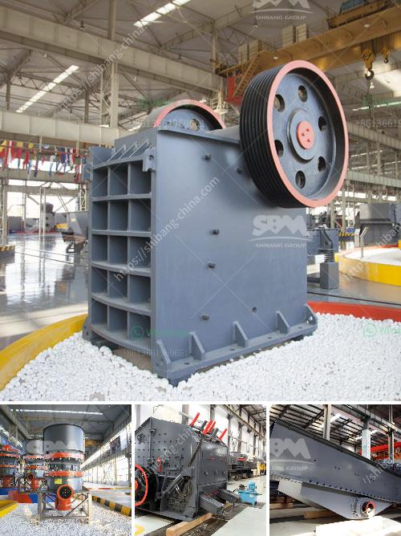

<h3>كسارة متنقلة صغيرة الخرسانة</h3>
تعتبر الكسارات المتنقلة صغيرة الخرسانة من أهم الأدوات التي يستخدمها العديد من العمال في مجال البناء والهدم. فهي تتميز بقدرتها على سحق الخرسانة وإعادة تدويرها لاستخدامها في أعمال البناء مرة أخرى، مما يساهم في تقليل النفايات وحماية البيئة.

تتميز الكسارات المتنقلة صغيرة الخرسانة بعدة مزايا تجعلها مفضلة لدى العديد من المقاولين وأصحاب المشاريع. فأولاً وقبل كل شيء، فإنها صغيرة الحجم وقابلة للنقل بسهولة من موقع إلى آخر. هذا يعني أنها يمكن أن تنتقل بسرعة لتلبية احتياجات المشاريع المختلفة، سواء كانت صغيرة الحجم أو كبيرة.

ثانيًا، توفر الكسارة المتنقلة صغيرة الخرسانة الكثير من الوقت والجهد. فهي تساعد في تقطيع الخرسانة بسرعة وفعالية، من خلال استخدام الأسنان المعدنية الحادة الموجودة في الجزء العلوي من الكسارة، والتي تقوم بتفتيت الخرسانة إلى قطع صغيرة. ثم يتم سحق هذه القطع لتكوين مواد جاهزة للاستخدام في عملية البناء.

وبالإضافة إلى ذلك، فإن استخدام الكسارة المتنقلة صغيرة الخرسانة يقلل من التكلفة. فعندما يتم إعادة تدوير الخرسانة القديمة واستخدامها في مشاريع بناء جديدة، يتم توفير تكاليف شراء مواد جديدة، مما يعني خفض تكاليف المشروع بشكل عام.

وأخيرًا، فإن استخدام الكسارة المتنقلة صغيرة الخرسانة يساهم في حماية البيئة. حيث أنها تساعد في إعادة تدوير الخرسانة القديمة بدلاً من التخلص منها وإلقائها في المزابل، وبالتالي تقليل النفايات والتلوث الناجم عنها.

في النهاية، يمكن القول إن الكسارة المتنقلة صغيرة الخرسانة تعتبر أداة مهمة في صناعة البناء والهدم. فهي توفر الوقت والجهد، وتقلل من التكلفة، وتساهم في حماية البيئة. لذا، يجب على المقاولين وأصحاب المشاريع الاستثمار في هذه الأداة لتحسين كفاءة وجودة العمل.
<h3>Contact us</h3><ul><li><strong>Whatsapp:&nbsp;<a href="https://wa.me/8613661969651">+8613661969651</a></strong></li><li><a href="https://swt.shibang-china.com/?git&amp;zhl&amp;كسارة متنقلة صغيرة الخرسانة"><strong>Online Service(chat now)</strong></a></li></ul><h3>Related</h3><ul><li><a href='وحدة تكسير الحجر الكوارتز في الهند.md'>وحدة تكسير الحجر الكوارتز في الهند</a></li><li><a href='كسارة مخروطية في الشرق الأوسط.md'>كسارة مخروطية في الشرق الأوسط</a></li><li><a href='آلات الطحن والتعبئة في باكستان.md'>آلات الطحن والتعبئة في باكستان</a></li><li><a href='شركات تصنيع مصانع المحاجر في المملكة المتحدة.md'>شركات تصنيع مصانع المحاجر في المملكة المتحدة</a></li><li><a href='كسارة لخام الحديد.md'>كسارة لخام الحديد</a></li></ul>