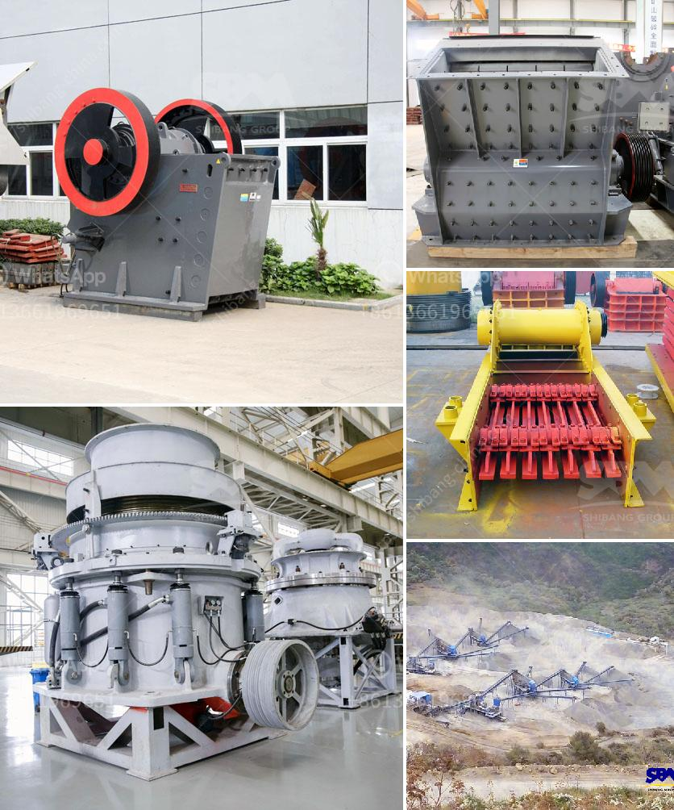

<h3>كسارة متنقلة قابلة للنقل بسعة 200 طن</h3>
تعد الكسارات المتنقلة قابلة للنقل بسعة 200 طن هي إحدى التكنولوجيات المتقدمة في صناعة البناء والتعدين. تستخدم هذه الكسارات لسحق الصخور والأحجار والمواد الخام الأخرى لإنتاج المواد الأساسية المطلوبة في عمليات البناء والبناء.

تمتاز الكسارات المتنقلة بقدرتها على النقل والتنقل بسهولة بين المواقع المختلفة. يتم تجهيز هذه الكسارات بعجلات أو مسارات قابلة للانزلاق أو حتى تجهيزها بسفن أو شاحنات كبيرة لسهولة نقلها وتنقلها من موقع إلى موقع آخر.

توفر الكسارات المتنقلة سعة تصل إلى 200 طن، وهذا يتيح لها استيعاب كميات كبيرة من المواد الخام المحطمة في مرحلة واحدة. تضم التكوينات القياسية للكسارات المتنقلة مغذي اهتزازي وكسارة فكية وشاشة اهتزازية وناقل رئيسي. تعمل هذه المكونات بتناغم لضمان تجهيز المواد الخام بطريقة فعالة وسلسة.

ميزة هامة للكسارات المتنقلة هي قدرتها على التكيف مع التقلبات في المواقع والظروف الجغرافية المختلفة. فهي مصممة للعمل في الطقس الساخن والبارد، وحتى البيئات الرطبة والقاحلة. بالإضافة إلى ذلك، الكسارات المتنقلة قابلة للتكيف مع المواد المختلفة ، بما في ذلك الحجارة والأحجار الصلبة والمواد الخام الأخرى.

تعتبر الكسارات المتنقلة قابلة للنقل بسعة 200 طن حلاً مثاليًا للشركات التي تحتاج إلى إنتاج كميات كبيرة من المواد الخام في فترة زمنية قصيرة. فهي توفر الكفاءة والإنتاجية العالية وتساهم في تحسين عمليات البناء والبناء بشكل عام.

في النهاية، الكسارات المتنقلة قابلة للنقل بسعة 200 طن تمثل إضافة قيمة حقيقية لصناعة البناء والتعدين. فهي توفر القدرة على العمل في مواقع مختلفة وتكيفها مع ظروف مختلفة. بالإضافة إلى ذلك، فإنها توفر الكفاءة والإنتاجية العالية، وتساهم في تقليل تكاليف الإنتاج وتحسين جودة المنتج النهائي.
<h3>Contact us</h3><ul><li><strong>Whatsapp:&nbsp;<a href="https://wa.me/8613661969651">+8613661969651</a></strong></li><li><a href="https://swt.shibang-china.com/?git&amp;zhl&amp;كسارة متنقلة قابلة للنقل بسعة 200 طن"><strong>Online Service(chat now)</strong></a></li></ul><h3>Related</h3><ul><li><a href='تقرير مشروع مصنع كسارة الحجر.md'>تقرير مشروع مصنع كسارة الحجر</a></li><li><a href='كسارة صخور لخام الكروم أو الكروميت.md'>كسارة صخور لخام الكروم أو الكروميت</a></li><li><a href='كسارة محمولة في المملكة العربية السعودية.md'>كسارة محمولة في المملكة العربية السعودية</a></li><li><a href='معدات طحن الرماد الخشن.md'>معدات طحن الرماد الخشن</a></li><li><a href='مصنع معالجة ملح الصخور.md'>مصنع معالجة ملح الصخور</a></li></ul>