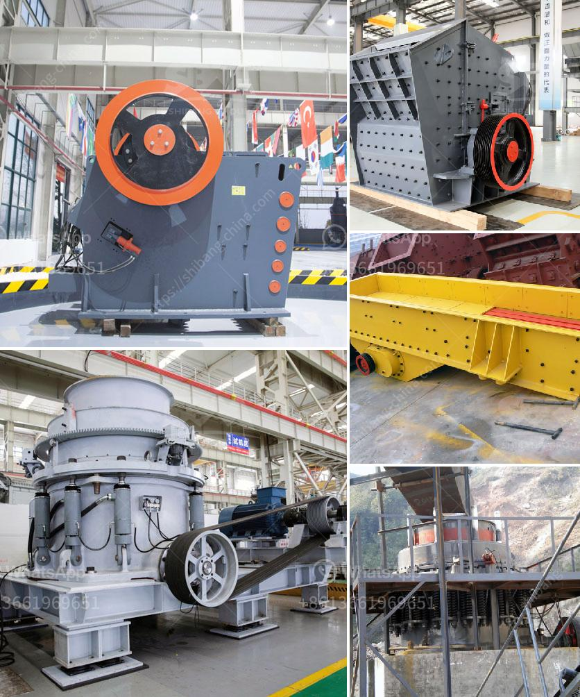

<h3>كسارة متنقلة لخام الحديد</h3>
تعد الكسارة المتنقلة لخام الحديد من الأجهزة المهمة والفعالة في صناعة التعدين واستخراج المعادن. تلعب هذه الكسارة دورًا حاسمًا في سلسلة عمليات استخلاص الحديد من الخام، حيث تساعد في تكسير وفصل الصخور والتربة عن الخام، مما يسهم في زيادة كفاءة إنتاج الحديد وتحقيق الربحية.

تتميز الكسارة المتنقلة لخام الحديد بعدة مميزات رئيسية، أبرزها قدرتها على التنقل بسهولة وسرعة بين المواقع المختلفة. فهي تجهاز على هيكل متحرك قابل للتعديل يمكنه الانتقال بكفاءة في مناطق العمل المختلفة والتضاريس المختلفة. هذا النوع من الكسارات يُستخدم على نطاق واسع في مناطق التعدين البعيدة عن المدن والأماكن النائية التي لا يوجد بها منظومة ثابتة لاستخدام الأجهزة الثقيلة.

تمتلك الكسارة المتنقلة لخام الحديد أيضًا قدرة عالية على سحق الخام بفعالية، حيث تعتمد على تقنيات متقدمة في عملية التكسير. يتم استخدام المحركات القوية والكسارات الهيدروليكية المتطورة لقطع الصخور وتجزئتها إلى أحجام صغيرة ومناسبة لعملية الاستخلاص. بإمكان هذه الكسارة أن تتعامل مع مجموعة واسعة من المواد، بدءًا من الخامات ذات القوام الصلب حتى الصخور الصلبة.

بالإضافة إلى ذلك، تتميز الكسارة المتنقلة لخام الحديد بثباتها وقوتها الهيكلية. فهي تصمم بعناية لتتحمل الظروف القاسية في مناطق التعدين، بما في ذلك التربة المتغيرة والمناطق غير المستوية. يضاف إلى ذلك، يتم تجهيز الكسارة بأنظمة متقدمة للتحكم والأمان تضمن عملية سلسة وآمنة.

بشكل عام، تعتبر الكسارة المتنقلة لخام الحديد أداة حيوية في صناعة التعدين وتعزز عملية استخراج الحديد بفاعلية وكفاءة. توفر هذه الكسارة فرصًا للمناجم لخفض تكاليف الإنتاج وتحسين الأرباح، كما تساهم في حماية البيئة من تأثيرات التعدين، حيث يمكن نقل الكسارة بسهولة إلى مواقع أخرى بعد الانتهاء من تشغيلها في موقع معين. بصفة عامة، تُعتبر الكسارة المتنقلة لخام الحديد أحدث التقنيات في صناعة التعدين وتعزز العمليات الاستخراجية بفعالية وفاعلية.
<h3>Contact us</h3><ul><li><strong>Whatsapp:&nbsp;<a href="https://wa.me/8613661969651">+8613661969651</a></strong></li><li><a href="https://swt.shibang-china.com/?git&amp;zhl&amp;كسارة متنقلة لخام الحديد"><strong>Online Service(chat now)</strong></a></li></ul><h3>Related</h3><ul><li><a href='إنشاء محجر في نيجيريا.md'>إنشاء محجر في نيجيريا</a></li><li><a href='مصنع تكسير الكروم.md'>مصنع تكسير الكروم</a></li><li><a href='آلة كسارة الفحم 5 طن في الساعة.md'>آلة كسارة الفحم 5 طن في الساعة</a></li><li><a href='آلة تكبير الفحم الدقيقة في الهند.md'>آلة تكبير الفحم الدقيقة في الهند</a></li><li><a href='مطاحن تحضير الدولوميت.md'>مطاحن تحضير الدولوميت</a></li></ul>