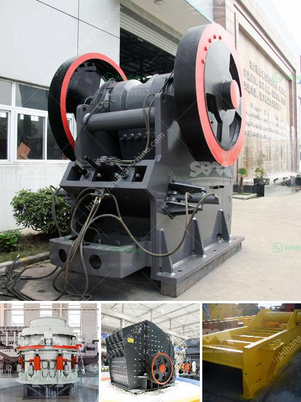

<h3>كسارة متنقلة نيجيريا</h3>
تعتبر صناعة التعدين في نيجيريا من أهم القطاعات الاقتصادية التي تسهم بشكل كبير في تحقيق النمو والتنمية الاقتصادية للبلاد. ومع زيادة الطلب على المواد الخام والحاجة إلى معدات تعدين متطورة وفعالة، ظهرت الكسارات المتنقلة كابتكار يعزز عمليات التعدين في نيجيريا.

تتميز الكسارة المتنقلة بقدرتها على التنقل بسهولة بين المواقع المختلفة داخل المناجم، مما يوفر الوقت والجهد في نقل المواد الخام من مكان لآخر. تعتبر هذه الكسارات حلاً مثاليًا لمناجم نيجيريا التي تتطلب نقل المعدات والمواد عبر مسافات طويلة، ومناطق العمل النائية التي يصعب الوصول إليها بالعربات الثقيلة.

بفضل تطور التكنولوجيا، أصبحت الكسارات المتنقلة أكثر كفاءة وفعالية في استخدام الطاقة وتكاليف الصيانة. تتميز هذه الكسارات بسهولة التشغيل والصيانة، مما يقلل من تكاليف العمل ويعزز إنتاجية عمليات التعدين. وبالتالي، يتم تحسين العائد المادي للمناجم ويتم تسريع عمليات استخراج المواد الخام.

وتأتي الكسارات المتنقلة بعدة أحجام وأنواع تناسب احتياجات مختلفة وتفضيلات التعدين في نيجيريا. تتميز هذه الأجهزة بأنها يمكنها سحق وتكسير مجموعة متنوعة من المواد مثل الصخور والخامات والحصى والركام. بالإضافة إلى ذلك، تعتبر الكسارات المتنقلة ذات أهمية كبيرة في صناعة البناء والبنية التحتية وتطوير الطرق في نيجيريا.

وبجانب فوائدها الاقتصادية، تساهم الكسارات المتنقلة في تقليل التأثير البيئي لعمليات التعدين. فهي تعمل بنظام متكامل يقوم بتصفية الغبار ومنع تسرب المواد الضارة إلى البيئة. وبالتالي، تساهم هذه الأجهزة في المحافظة على البيئة والحفاظ على صحة العاملين في قطاع التعدين.

باختصار، تعتبر الكسارة المتنقلة ابتكارًا هامًا وفعالًا في صناعة التعدين في نيجيريا. تساهم في تحسين عمليات التعدين، وتقليل التكاليف، وتحسين العائد المادي للمناجم. بالإضافة إلى ذلك، تحافظ على البيئة والصحة والسلامة في مواقع التعدين. وباستخدام الكسارات المتنقلة، يمكن لنيجيريا أن تستفيد من قدراتها العملية وتكتسب المزيد من الفوائد والتقدم في قطاع التعدين.
<h3>Contact us</h3><ul><li><strong>Whatsapp:&nbsp;<a href="https://wa.me/8613661969651">+8613661969651</a></strong></li><li><a href="https://swt.shibang-china.com/?git&amp;zhl&amp;كسارة متنقلة نيجيريا"><strong>Online Service(chat now)</strong></a></li></ul><h3>Related</h3><ul><li><a href='وزن آلة كسارة الصخور.md'>وزن آلة كسارة الصخور</a></li><li><a href='معدات طحن مطحنة ريموند.md'>معدات طحن مطحنة ريموند</a></li><li><a href='أسعار كسارة الحجر بسعة 500 طن في الساعة.md'>أسعار كسارة الحجر بسعة 500 طن في الساعة</a></li><li><a href='صنع الحجر الجيري.md'>صنع الحجر الجيري</a></li><li><a href='سعر مصنع كربونات الكالسيوم.md'>سعر مصنع كربونات الكالسيوم</a></li></ul>