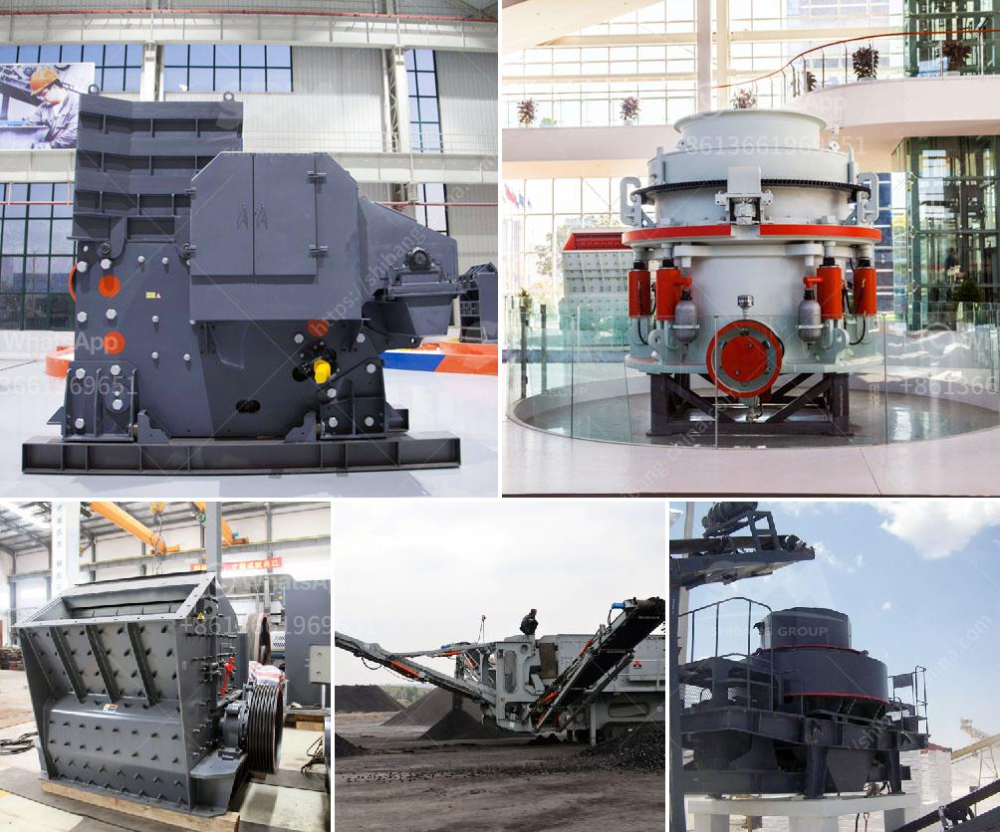

<h3>كسارة محجر الجرانيت في نيجيريا</h3>
تعتبر نيجيريا واحدة من البلدان الرائدة في إنتاج الجرانيت في العالم، حيث توجد بها ثروات طبيعية هائلة من هذه الصخرة. وتعد كسارة محجر الجرانيت في نيجيريا وجهة رئيسية لعمليات استخراج وتصنيع الجرانيت في البلاد.

تقع كسارة محجر الجرانيت في منطقة مثالية لاستغلال الموارد الطبيعية، وتتمتع بإمكانيات تصنيع عالية مع رواسب ضخمة من الجرانيت ذات الجودة العالية. وبفضل تلك العوامل، أصبحت الكسارة وجهة مفضلة للشركات والمنظمات التجارية التي تعمل في صناعة البناء والتشييد وصناعة الديكور.

توفر كسارة محجر الجرانيت في نيجيريا نوعية جيدة من الجرانيت التي يمكن استخدامها في العديد من التطبيقات المختلفة. فالجرانيت يتمتع بمظهر جمالي فريد وقوة ميكانيكية ممتازة، مما يجعله مادة بناء رئيسية في تشييد المباني وتصميم التماثيل والأعمال الفنية. كما أن الجرانيت مقاوم للتآكل والصدمات، مما يجعله مثاليًا للاستخدام في المطابخ والحمامات وتصميم المناظر الطبيعية.

تعمل الكسارة على إنتاج مجموعة واسعة من المنتجات من الجرانيت، بما في ذلك البلاط والألواح والأعمدة والمنحوتات والأعمال المعمارية الأخرى. يتم اختيار الجرانيت والتعامل معه بعناية لضمان تحقيق أفضل النتائج النهائية.

وبفضل الإرتفاع الكبير في الطلب على الجرانيت في السوق المحلية والدولية، تلعب كسارة محجر الجرانيت في نيجيريا دورًا حيويًا في تشجيع النشاط الاقتصادي وتوفير فرص العمل. حيث تساهم صناعة الجرانيت في تعزيز النمو الاقتصادي المستدام وتوفير فرص للشباب المحلي في مجالات مثل العمل في المحاجر والتعدين وصناعة النقل.

وبالنظر إلى الإمكانات الهائلة للجرانيت في نيجيريا والطلب المتزايد على هذه المواد، يمكن القول بأن كسارة محجر الجرانيت في نيجيريا مصدر رئيسي للدخل ومقصد للاستثمارات في البلاد. إذا تم استغلال هذه الثروة الطبيعية بطريقة مستدامة وذكية، فإنه يمكن أن يكون للجرانيت دور هام في دعم التطور الاقتصادي للبلاد وتحسين مستقبلها.
<h3>Contact us</h3><ul><li><strong>Whatsapp:&nbsp;<a href="https://wa.me/8613661969651">+8613661969651</a></strong></li><li><a href="https://swt.shibang-china.com/?git&amp;zhl&amp;كسارة محجر الجرانيت في نيجيريا"><strong>Online Service(chat now)</strong></a></li></ul><h3>Related</h3><ul><li><a href='كيفية حساب تكلفة الطحن.md'>كيفية حساب تكلفة الطحن</a></li><li><a href='مطحنة طحن عمودية مستعملة بسعة 100 طن في الساعة.md'>مطحنة طحن عمودية مستعملة بسعة 100 طن في الساعة</a></li><li><a href='معدات معالجة مسحوق الجرافيت.md'>معدات معالجة مسحوق الجرافيت</a></li><li><a href='مطحنة كرات مخروطية للبيع.md'>مطحنة كرات مخروطية للبيع</a></li><li><a href='كسارة الحجر كسارة الحجر.md'>كسارة الحجر كسارة الحجر</a></li></ul>