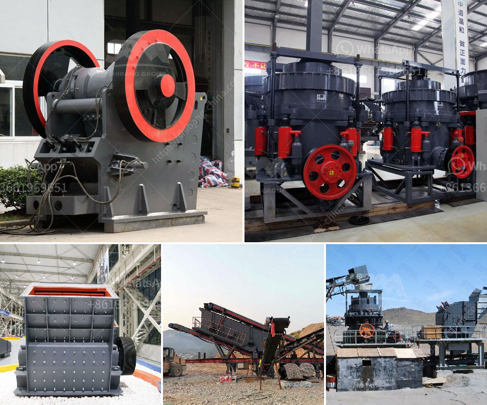

<h3>كسارة محمولة تريمان</h3>
كسارة محمولة تريمان: التكنولوجيا المتقدمة لمعالجة الحجارة في أماكن متنقلة

تعد الكسارة المحمولة تريمان واحدة من أهم الأدوات التكنولوجية في صناعة البناء والتشييد وتعدين الحجارة. تقوم هذه الكسارة بتكسير الحجارة وغربلتها بكفاءة عالية وسرعة إنتاجية مذهلة مقارنة بالكسارات التقليدية.

إحدى الميزات البارزة للكسارة المحمولة تريمان هي القدرة على نقلها بسهولة وسرعة من موقع إلى آخر. حيث تتميز بتصميم مدمج وهيكل قوي يمكنها المقاومة للظروف الجوية المختلفة والأرضيات غير المستوية. يعني ذلك أنها يمكن نقلها بسهولة بين عدة مواقع دون الحاجة إلى تكاليف إضافية لتوصيلها أو تفكيكها.

تعتبر الكسارة المحمولة تريمان اقتصادية للغاية في استخدام الطاقة وصيانتها. تعمل بتقنية فعالة تعتمد على محرك بقوة عالية يستهلك كمية أقل من الوقود ويوفر الكثير من التكاليف على المدى الطويل. بالإضافة إلى ذلك، فإنها تتطلب صيانة أقل مما يعني أنك ستوفر المزيد من الوقت والجهد في الحفاظ على عمل الكسارة بكفاءة عالية.

مع الكسارة المحمولة تريمان، يمكنك الاعتماد على أداءها القوي والمتميز في تكسير مختلف أنواع الحجارة. تتميز هذه الكسارة بفتحة الإدخال الكبيرة التي تسمح بمعالجة حجارة كبيرة الحجم بدون مشاكل. كما أنها تتميز بنظام التحكم الذكي الذي يسمح لك بضبط حجم الانتاج وصفاء المنتج المكسور بسهولة وفقًا لاحتياجاتك المحددة.

بالإضافة إلى تكسير الحجارة، تستخدم الكسارة المحمولة تريمان أسلوب الغربلة لفصل المواد المكسورة إلى مقاسات محددة. يعني ذلك أنه يمكنك استخدامها لإنتاج خامات ذات مقاسات مختلفة، ومن ثم توفير الموارد والوقت في عمليات الفرز المستقلة.

باختصار، الكسارة المحمولة تريمان هي الحل الأمثل لتكسير الحجارة في أماكن متنقلة. توفر الكفاءة والسهولة في النقل والصيانة وتحقق أداء قوي وتكلفة منخفضة في استخدام الطاقة. إذا كنت تعمل في صناعة البناء أو التعدين، فإنه من الضروري النظر في الاستفادة من الكسارة المحمولة تريمان لتحسين إنتاجيتك وتوفير الوقت والتكاليف.
<h3>Contact us</h3><ul><li><strong>Whatsapp:&nbsp;<a href="https://wa.me/8613661969651">+8613661969651</a></strong></li><li><a href="https://swt.shibang-china.com/?git&amp;zhl&amp;كسارة محمولة تريمان"><strong>Online Service(chat now)</strong></a></li></ul><h3>Related</h3><ul><li><a href='أفضل كسارة لمسحوق الكوارتز.md'>أفضل كسارة لمسحوق الكوارتز</a></li><li><a href='نموذج عملي لكسارة الحجر.md'>نموذج عملي لكسارة الحجر</a></li><li><a href='آلة صنع مسحوق الحجر الجيري في باكستان.md'>آلة صنع مسحوق الحجر الجيري في باكستان</a></li><li><a href='عمليات كسارة وغسل الحجر.md'>عمليات كسارة وغسل الحجر</a></li><li><a href='قائمة الآليات لمصانع تجهيز الرخام.md'>قائمة الآليات لمصانع تجهيز الرخام</a></li></ul>