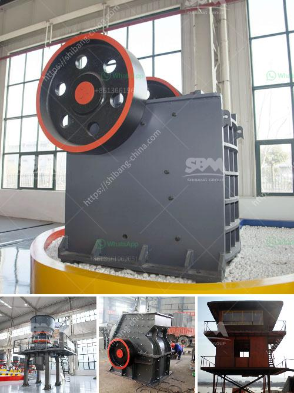

<h3>كسارة محمولة في السويد</h3>
تعتبر الكسارات المحمولة واحدة من الابتكارات التي قدمتها السويد في مجال صناعة التعدين والبناء وتجهيز المواد الخام. تم تصميم هذه الكسارات لتكون سهلة النقل وقابلة للتشغيل في أماكن متنوعة وفي ظروف مختلفة.

تتميز الكسارات المحمولة بعدة مزايا رئيسية. فأولاً وقبل كل شيء، يمكن نقلها بسهولة من موقع لآخر، مما يوفر الوقت والجهد في نقل المواد الخام ومنتجات الكسارة. بفضل الحجم المناسب لهذه الكسارات، يمكن نقلها بسهولة على متن شاحنات أو أجهزة نقل أخرى بدون الحاجة إلى وسائل نقل خاصة.

ثانيًا، تعتبر الكسارات المحمولة سهلة الاستخدام وقابلة للتشغيل. بالإضافة إلى أنها مصممة للعمل تحت ظروف صعبة، مثل الحرارة الشديدة أو البرد القارس، مما يجعلها مثالية للاستخدام في مناطق متنوعة حول العالم.

بفضل التكنولوجيا العالية المستخدمة في تصميم وتصنيع هذه الكسارات، يتم تحسين الكفاءة والإنتاجية لعملية السحق. تتميز بقدرة على سحق مجموعة متنوعة من المواد، بدءًا من الصخور الكبريتية وحتى الأحجار الكبيرة. كما أن الكسارات المحمولة تتميز بتوفيرها لتكلفة النقل والتشغيل، حيث تعمل بكفاءة عالية وباستهلاك منخفض للوقود.

يعتبر قطاع التعدين والبناء من أكثر القطاعات التي تستفيد من الكسارات المحمولة. فهي تستخدم على نطاق واسع في سحق وتجهيز المعادن والصخور في مواقع التعدين، وكذلك في تجهيز المواد الخام في مواقع البناء والبنى التحتية.

في النهاية، تعد الكسارات المحمولة ابتكارًا رائعًا في صناعة التعدين والبناء. بفضل تصميمها الكفء وسهولة نقلها واستخدامها، تعتبر هذه الكسارات حلاً مثاليًا لتلبية احتياجات العملاء في مجال تكسير المواد وتجهيزها بكفاءة واقتصادية. توفر الكسارات المحمولة السويدية فرصًا عالمية لمزيد من التقدم والتطور في صناعة التعدين والبناء.
<h3>Contact us</h3><ul><li><strong>Whatsapp:&nbsp;<a href="https://wa.me/8613661969651">+8613661969651</a></strong></li><li><a href="https://swt.shibang-china.com/?git&amp;zhl&amp;كسارة محمولة في السويد"><strong>Online Service(chat now)</strong></a></li></ul><h3>Related</h3><ul><li><a href='مصنع معالجة رمل السيليكا.md'>مصنع معالجة رمل السيليكا</a></li><li><a href='سعر مصنع الجبس.md'>سعر مصنع الجبس</a></li><li><a href='أسطوانات لكسارات في بوغوتا.md'>أسطوانات لكسارات في بوغوتا</a></li><li><a href='تخطيط مصنع الأسمنت الصغير بتنسيق PDF.md'>تخطيط مصنع الأسمنت الصغير بتنسيق PDF</a></li><li><a href='حجر الحجر الجيري المسحوق بحجم 34 بوصة.md'>حجر الحجر الجيري المسحوق بحجم 3/4 بوصة</a></li></ul>