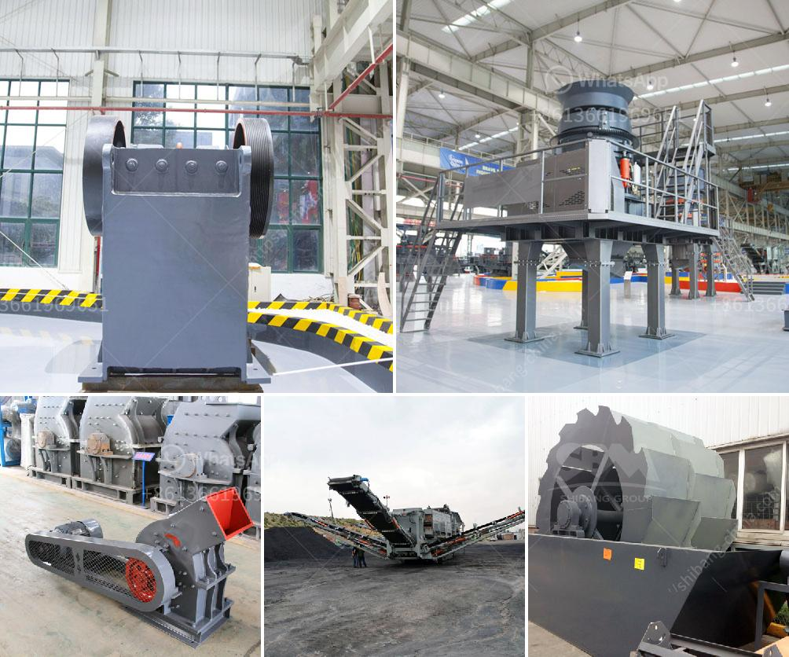

<h3>كسارة محمولة في الفلبين بسعر مناسب</h3>
تعتبر الكسارات المحمولة من أهم الأدوات المستخدمة في صناعة التعدين وإعادة التدوير في جميع أنحاء العالم. وفي الفلبين، يتزايد الطلب على هذه المعدات التي تقدم مجموعة واسعة من المزايا للعاملين في هذا القطاع. تتميز الكسارات المحمولة بالقدرة على نقلها بسهولة من موقع لآخر، مما يوفر المرونة والكفاءة في عملية تكسير الصخور.

عندما يتعلق الأمر بالسعر، فإن الكسارات المحمولة التي تتراوح بين 200-400 دولار تعتبر خيارًا مغريًا للمشترين في الفلبين. يوفر هذا النطاق من الأسعار الجودة والأداء العالي بتكلفة معقولة، مما يجعلها متاحة للشركات الصغيرة والمتوسطة التي تبحث عن تطوير عملياتها بكفاءة، دون الحاجة إلى استثمار كبير.

وتعد الكسارات المحمولة المتوفرة في هذا النطاق من الأسعار متعددة الاستخدامات، حيث يمكن استخدامها في تكسير الصخور الصلبة والمواد المعدنية وكذلك الخرسانة المسلحة. وبفضل التكنولوجيا المتقدمة التي تستخدمها، تعمل هذه الكسارات بكفاءة عالية وتنتج مواد ذات جودة عالية.

إن استخدام الكسارات المحمولة بأسعار في متناول اليد يعطي الفرصة للمقاولين في الفلبين لتنفيذ المشروعات بفعالية وفقًا للمواعيد المحددة والميزانية المخصصة. بالإضافة إلى ذلك، يمكن إعادة استخدام مواد التكسير في المشروعات القادمة، مما يوفر الموارد ويقلل من تكاليف الإنتاج.

علاوة على ذلك، تتميز الكسارات المحمولة بمستوى عالٍ من المرونة في الاستخدام، حيث يمكن تعديل إعدادات التكسير والتحكم في حجم الإخراج بسهولة وفقًا لاحتياجات المشروع. هذه الخاصية تسمح للمشغلين بتحقيق أداء مثلى وتلبية متطلبات العميل بشكل أكبر.

بصفة عامة، يعد الاستثمار في كسارة محمولة في الفلبين بأسعار معقولة خطوة مهمة لتعزيز كفاءة العمل ورفع جودة المنتج في قطاع التعدين وإعادة التدوير. تجمع هذه الآلات بين الأداء العالي والكلفة المعقولة، مما ينعكس بشكل إيجابي على الإنتاجية والربحية للشركات.

وفي الختام، يمكن القول أن الكسارات المحمولة بأسعار مناسبة هي خيار مربح للشركات في الفلبين. توفر الكفاءة والجودة بتكلفة معقولة، مما يسهم في تطوير صناعة التعدين وإعادة التدوير في البلاد.
<h3>Contact us</h3><ul><li><strong>Whatsapp:&nbsp;<a href="https://wa.me/8613661969651">+8613661969651</a></strong></li><li><a href="https://swt.shibang-china.com/?git&amp;zhl&amp;كسارة محمولة في الفلبين بسعر مناسب"><strong>Online Service(chat now)</strong></a></li></ul><h3>Related</h3><ul><li><a href='معدات معالجة الحجر الكاملة محطم 100 طن.md'>معدات معالجة الحجر الكاملة محطم 100 طن</a></li><li><a href='ناقل البناء للبيع.md'>ناقل البناء للبيع</a></li><li><a href='عملية التحول للأسمنت.md'>عملية التحول للأسمنت</a></li><li><a href='تطبيق كسارة الصدم.md'>تطبيق كسارة الصدم</a></li><li><a href='مصنعو آلات تكسير الحجر.md'>مصنعو آلات تكسير الحجر</a></li></ul>