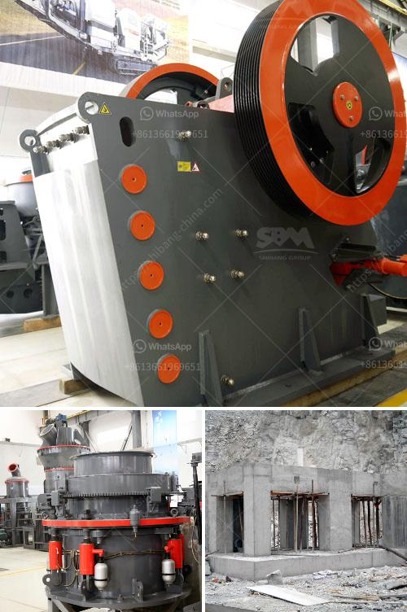

<h3>كسارة محمولة في الفلبين</h3>
تعد الفلبين واحدة من الوجهات السياحية الرائعة في جنوب شرق آسيا، حيث يمكن للزوار اكتشاف العديد من الجزر الخلابة والمناظر الطبيعية الجميلة. ومن المعروف أن الفلبين تحتوي على العديد من المواقع السياحية التي يمكن الوصول إليها بسهولة، ولكن هذا لا يعني أن الوصول إلى جميع هذه المواقع سهل ومناسب للجميع.

هنا يأتي دور كسارة محمولة في الفلبين، حيث تعتبر هذه الآلة تقنية حديثة تساعد في تسهيل عملية سحق الصخور والأحجار بطريقة فعالة وسريعة. ويتم ذلك عن طريق نقل الكسارات إلى مكان العمل بسهولة، وتركيبها واستخدامها في الهواء الطلق. ويتميز الكسارة المحمولة بقدرتها على سحق مجموعة متنوعة من المواد مثل الحجر الجيري والجرانيت والبازلت والحجارة الأخرى.

إن استخدام الكسارة المحمولة في الفلبين يوفر العديد من المزايا، حيث يمكن للشركات والمقاولات البنائية استخدامها في مشاريع البناء والترميم بطريقة أكثر كفاءة وتوفير للوقت والجهد. كما يمكن أيضًا استخدام الكسارة المحمولة في عمليات استخراج المواد الخام من المناجم والمحاجر بكفاءة عالية.

واحدة من الفوائد الرئيسية للكسارة المحمولة هي قدرتها على التكيف مع الظروف المحيطة، حيث يمكن نقلها وتركيبها بسهولة في أي موقع ترغب فيه. وبالتالي، يمكن للمشغلين الاستفادة من هذه الآلة في مواقع العمل النائية التي من الصعب الوصول إليها بواسطة كسارات ثابتة.

نظرًا للطبيعة المحمولة للكسارة، يمكن أيضًا تحقيق توفير في تكاليف النقل، حيث لا يلزم القلق بشأن تكاليف النقل الباهظة لنقل الصخور والأحجار إلى موقع العمل المحدد. كما أن الكسارة المحمولة توفر أيضًا مزيدًا من المرونة في عملية الإنتاج، حيث يمكن ضبط حجم وشكل الحصص المطلوبة حسب الطلب وفقًا لاحتياجات المشروع.

وفي الختام، فإن استخدام الكسارة المحمولة في الفلبين أصبح إحدى الحلول الرائعة للشركات والمقاولات البنائية وعمليات التعدين، حيث يمكن الاعتماد عليها لتحقيق نتائج فعالة وتوفير الكثير من الجهد والتكاليف. حيث تعتبر الكسارة المحمولة خيارًا مثاليًا للجميع الذين يبحثون عن طريقة سهلة وفعالة لسحق الصخور والأحجار في الموقع.
<h3>Contact us</h3><ul><li><strong>Whatsapp:&nbsp;<a href="https://wa.me/8613661969651">+8613661969651</a></strong></li><li><a href="https://swt.shibang-china.com/?git&amp;zhl&amp;كسارة محمولة في الفلبين"><strong>Online Service(chat now)</strong></a></li></ul><h3>Related</h3><ul><li><a href='عملية سحق الكسارة.md'>عملية سحق الكسارة</a></li><li><a href='مطحنة ريموند مستعملة للبيع في تايوان.md'>مطحنة ريموند مستعملة للبيع في تايوان</a></li><li><a href='آلة تصنيع الحجر من جنوب أفريقيا.md'>آلة تصنيع الحجر من جنوب أفريقيا</a></li><li><a href='شركات آلات مصنع الأسمنت في كويمباتور.md'>شركات آلات مصنع الأسمنت في كويمباتور</a></li><li><a href='طريقة التعويم لتحليل رمل السيليكا.md'>طريقة التعويم لتحليل رمل السيليكا</a></li></ul>