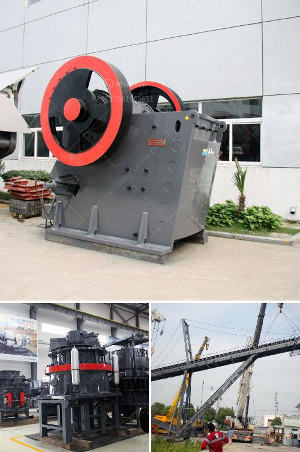

<h3>كسارة محمولة في المملكة العربية السعودية</h3>
تعد الكسارات المحمولة واحدة من الأدوات الرئيسية المستخدمة في صناعة التعدين والبناء. وفي المملكة العربية السعودية، تلعب الكسارات المحمولة دورًا مهمًا في تلبية احتياجات الإنشاءات وتصحيح الطرق وتدوير المواد الخرسانية والركام.

تعد الكسارة المحمولة عبارة عن آلة صغيرة الحجم وسهلة النقل من مكان إلى آخر. يتم تثبيتها على شاحنات أو مقطورات خاصة بها، مما يمنحها مرونة كبيرة وسهولة في الاستخدام في مناطق مختلفة. بفضل هذه السمات، يمكن استخدام الكسارة المحمولة في أماكن التشييد والبناء التي تعاني من نقص الكسارات الثابتة.

توفر الكسارات المحمولة العديد من المزايا. أولاً، تسمح بتحطيم المواد في موقع العمل نفسه، ما يقلل من التكاليف والتعقيدات المتعلقة بنقل المواد وإعادة تدويرها. ثانيًا، تعزز الكسارات المحمولة سرعة وكفاءة العملية التشغيلية. بفضل القدرة على تحطيم المواد على الفور، يمكن للمقاولين تقليل وقت الإنتاج وزيادة الإنتاجية.

في المملكة العربية السعودية، يتم استخدام الكسارات المحمولة بشكل واسع في مجموعة متنوعة من الصناعات. مثلاً، يمكن استخدامها في تكسير الصخور والركام لإنتاج مواد البناء المختلفة. كما يمكن استخدامها في تصحيح الطرق، حيث يمكن تحطيم الأحجار الكبيرة وخلطها مع الأسفلت لإعادة بناء الطرق المتضررة. تساهم الكسارات المحمولة أيضًا في عملية إعادة التدوير، حيث يتم تحويل المواد الخرسانية المهجورة إلى حصى وركام يمكن استخدامه في المشروعات الجديدة.

بالإضافة إلى فوائدها الاقتصادية والتشغيلية، تساهم الكسارات المحمولة أيضًا في الحد من التأثير البيئي الناتج عن عمليات الكسارة. فعند استخدام الكسارات المحمولة، يمكن التحكم بشكل أفضل في إزالة الغبار والتلوث الصوتي، مما يحسن جودة الهواء والبيئة المحيطة بمواقع العمل.

باختصار، تلعب الكسارات المحمولة دورًا كبيرًا في صناعة التعدين والبناء في المملكة العربية السعودية. توفر هذه الآلات القدرة على تحطيم المواد في الموقع نفسه وتعزز الإنتاجية وتحسن الجودة البيئية. وبفضل المزايا التي توفرها، فإن الكسارات المحمولة تعد استثمارًا جيدًا في صناعة البناء والتشييد في المملكة.
<h3>Contact us</h3><ul><li><strong>Whatsapp:&nbsp;<a href="https://wa.me/8613661969651">+8613661969651</a></strong></li><li><a href="https://swt.shibang-china.com/?git&amp;zhl&amp;كسارة محمولة في المملكة العربية السعودية"><strong>Online Service(chat now)</strong></a></li></ul><h3>Related</h3><ul><li><a href='أسعار كسارات نيجيريا الجديدة.md'>أسعار كسارات نيجيريا الجديدة</a></li><li><a href='تأجير حزام الناقل في أيرلندا.md'>تأجير حزام الناقل في أيرلندا</a></li><li><a href='آلات صنع البودرة.md'>آلات صنع البودرة</a></li><li><a href='مطحنة كرات صغيرة لهنان الصين.md'>مطحنة كرات صغيرة لهنان الصين</a></li><li><a href='آلات إنتاج الجبس.md'>آلات إنتاج الجبس</a></li></ul>