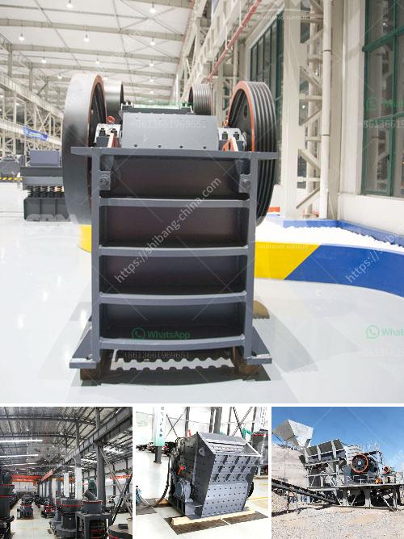

<h3>كسارة محمولة في ماليزيا</h3>
تعتبر كسارات المحمولة من الآلات المهمة في صناعة التعدين والإنشاءات، وتستخدم على نطاق واسع في ماليزيا وجميع أنحاء العالم. تساهم كسارات المحمولة في تقليل تكاليف الإنشاءات وزيادة الإنتاجية، مما يعني تحسين الأرباح وتوفير الوقت والجهد للشركات والعمال في القطاعات المختلفة.

تتميز كسارات المحمولة بقدرتها على نقل الحجارة والمواد الخام من منطقة إلى أخرى بسهولة وسرعة. تتكون هذه الكسارات من وحدات متعددة، تشمل المغذي الاهتزازي، والكسارة الفكية، والكسارة الصدمية، والغربال الاهتزازي، والحزام الناقل. وبفضل تصميمها المدمج وهيكلها القابل للتعديل، يمكن نقلها بسهولة إلى المناطق الصغيرة والضيقة.

تتميز الكسارات المحمولة في ماليزيا بعدة مزايا. لأول شيء، فهي تجمع بين فعالية التكسير وسهولة النقل، مما يعني انخفاض التكاليف العمالية والوقت المستغرق في نقل المواد. كما أنها تسمح بتحقيق إنتاجية عالية في عمليات التعدين والإنشاءات مقارنة بالكسارات التقليدية.

ثانيًا، تعمل الكسارات المحمولة بتقنيات حديثة ومتقدمة، مما يساهم في تقليل تلوث البيئة الناتج عن عمليات التكسير. تستخدم بعض الكسارات المحمولة أيضًا مصدر طاقة بديلة مثل الطاقة الشمسية أو الطاقة الهيدروليكية، وهو ما يحسن الاستدامة البيئية للصناعة.

علاوة على ذلك، تلعب الكسارات المحمولة دورًا حاسمًا في تعزيز البنية التحتية في ماليزيا. فبفضل قدرتها على تلبية الاحتياجات الفورية للمشاريع الكبيرة والصغيرة، تسهم في توفير المواد الخام الضرورية للبناء، مثل الحصى والركام. هذا يعني أن الكسارات المحمولة تساهم في تطوير البنية التحتية للمدن والمناطق النائية في ماليزيا وتعزيز التنمية الاقتصادية في البلاد.

لخلاصة القول، تعتبر الكسارات المحمولة في ماليزيا أداة حاسمة في صناعة التعدين والإنشاءات. توفر هذه الآلات فعالية في التكسير وسهولة في النقل، مما يقلل التكاليف ويزيد الإنتاجية. كما تساهم في تعزيز البنية التحتية والتنمية الاقتصادية في ماليزيا. لذا، يمكن القول إن الكسارات المحمولة هي حلاً مثالياً للشركات والعمال في قطاعات التعدين والإنشاءات في ماليزيا وتلبية احتياجاتهم الفورية والمستقبلية.
<h3>Contact us</h3><ul><li><strong>Whatsapp:&nbsp;<a href="https://wa.me/8613661969651">+8613661969651</a></strong></li><li><a href="https://swt.shibang-china.com/?git&amp;zhl&amp;كسارة محمولة في ماليزيا"><strong>Online Service(chat now)</strong></a></li></ul><h3>Related</h3><ul><li><a href='سير ناقل في دبي.md'>سير ناقل في دبي</a></li><li><a href='مطحنة أسطوانية عمودية.md'>مطحنة أسطوانية عمودية</a></li><li><a href='سعر مصنع الأسمنت على نطاق صغير في الهند.md'>سعر مصنع الأسمنت على نطاق صغير في الهند</a></li><li><a href='إعلانات الصحف لمصنع كسارة.md'>إعلانات الصحف لمصنع كسارة</a></li><li><a href='معدات سحق للإيجار.md'>معدات سحق للإيجار</a></li></ul>