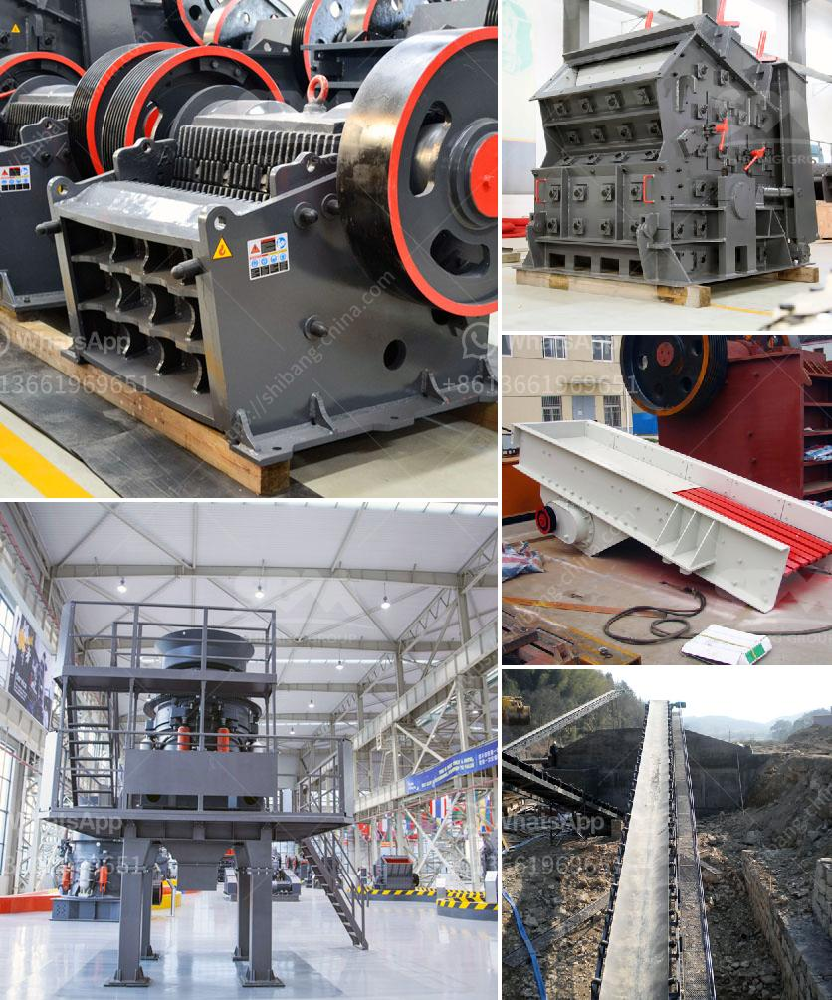

<h3>كسارة محمولة للحطام</h3>
تعتبر الكسارات المحمولة للحطام من الأدوات الحديثة التي تستخدم في صناعة البناء والهدم. تم تطوير هذه الكسارات لتلبية الاحتياجات الحالية للمقاولين والمهندسين المعماريين الذين يواجهون تحديات في التخلص من الحطام وإعادة تدويره بطريقة فعالة وبأسعار معقولة.

تعتبر الكسارات المحمولة للحطام عبارة عن وحدات محمولة بحجم صغير يمكن نقلها بسهولة بين مواقع البناء المختلفة. هذه الكسارات تستخدم تقنية الكسر بالعرض المباشر وتستطيع طحن الحطام المنتج بجودة عالية وتقليل حجمه ليتناسب مع استخدامات أخرى. يمكن استخدام الحطام المكسر كأساس للطرق والأساسات والخرسانة المسلحة.

واحدة من أهم مزايا الكسارات المحمولة للحطام هي قدرتها على توفير الوقت والمال. فمن خلال استخدام هذه الكسارات، لم يعد هناك حاجة لنقل الحطام إلى مواقع بعيدة للتخلص منه، بل يمكن تدويره مباشرة في مكان البناء. بالإضافة إلى ذلك، فإن ركام البناء الناتج من كسارات الحطام المحمولة ذات جودة عالية ويمكن استخدامه في مشاريع البناء الأخرى، مما يوفر تكاليف الشراء لركام جديد.

علاوة على ذلك، تساعد الكسارات المحمولة للحطام في حماية البيئة. حيث أن إعادة تدوير الحطام يقلل من الاعتماد على استخراج الموارد الطبيعية ويقلل من كمية النفايات التي يتم إرسالها إلى المزابل. بالإضافة إلى ذلك، فإن استخدام الكسارات المحمولة للحطام يقلل من الحاجة إلى نقل الحطام بشاحنات كبيرة، مما يقلل من انبعاثات غازات الدفيئة والتلوث البيئي.

باختصار، الكسارات المحمولة للحطام تعتبر حلاً مستدامًا وفعالًا لمشاكل التخلص من الحطام في صناعة البناء والهدم. توفر وحدات الكسارة القابلة للنقل تحسينًا كبيرًا في الكفاءة والتوفير من حيث الوقت والمال، فضلاً عن حماية البيئة واستدامة الموارد الطبيعية. لذا، يجب أن تكون هذه الكسارات جزءًا أساسيًا من أدوات البناء في المستقبل.
<h3>Contact us</h3><ul><li><strong>Whatsapp:&nbsp;<a href="https://wa.me/8613661969651">+8613661969651</a></strong></li><li><a href="https://swt.shibang-china.com/?git&amp;zhl&amp;كسارة محمولة للحطام"><strong>Online Service(chat now)</strong></a></li></ul><h3>Related</h3><ul><li><a href='الأحجار الكريمة الموجودة في نيجيريا.md'>الأحجار الكريمة الموجودة في نيجيريا</a></li><li><a href='كسارة الأسطوانة للبيع.md'>كسارة الأسطوانة للبيع</a></li><li><a href='آلات إنتاج الكالسيوم.md'>آلات إنتاج الكالسيوم</a></li><li><a href='صور شاشات الاهتزاز.md'>صور شاشات الاهتزاز</a></li><li><a href='كسارة مخروطية سلسلة CS.md'>كسارة مخروطية سلسلة CS</a></li></ul>