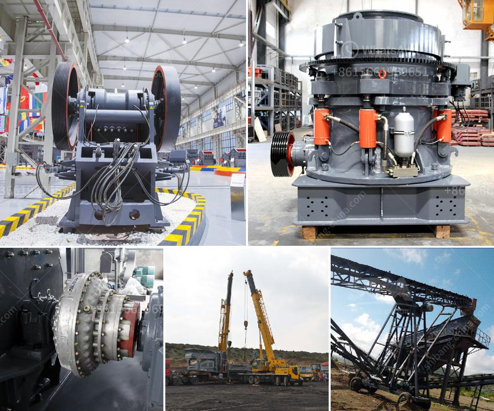

<h3>كسارة محمولة للكوبالت</h3>
تلعب عمليات التعدين دورًا حيويًا في تلبية الطلب المتزايد على المعادن والمواد الخام في جميع أنحاء العالم. واحدة من هذه المعادن الهامة هي الكوبالت، والتي تستخدم بشكل رئيسي في صناعة البطاريات القابلة لإعادة الشحن والتي تغطي مجالات واسعة من التطبيقات الحديثة. ولضمان استخراج كوبالت بطرق فعالة، تم تطوير كسارة محمولة للكوبالت التي تعتبر نقلة نوعية في هذه الصناعة.

تساهم كسارات الكوبالت المحمولة في حل العديد من المشاكل التي يواجهها قطاع التعدين. فعندما يتم استخراج الكوبالت أو أي معدن آخر، يجب نقل الصخور والتربة التي تحتوي على المعدن إلى مكان المعالجة والفصل. وفي السابق، كانت هذه العملية تشتمل على نقل الصخور والتربة على نطاق واسع عبر بعد طويل مما يستلزم ترتيبات صعبة وتكاليف وقود مرتفعة. لكن الكسارات المحمولة للكوبالت عكس هذا التوجه.

بفضل التطور التكنولوجي، يتم تجهيز هذه الكسارات بمحركات قوية وهياكل متطورة تتيح لها القدرة على تكسير الصخور والتربة المتضخمة في الموقع ذاته. يعني ذلك أن عمليات نقل المواد الخام قد تم تبسيطها وتخفيف العبء عند إرسالها إلى الموقع الثابت للمعالجة. يعطي تلك الكسارات المحمولة للكوبالت قدرة على إجراء عمليات التكسير في مواقع متعددة داخل مناجم الكوبالت، مما يوفر الوقت والمال في عمليات النقل.

المميزات الأخرى التي تجعل من الكسارات المحمولة للكوبالت ابتكارًا لافتًا هي: قدرتها على تكسير الصخور بشكل فعال وسريع، وتوفير نفقات الاحتراق والصيانة، وزيادة كفاءة عملية التعدين، وتقليل تأثير التجريف على البيئة. وبالإضافة إلى ذلك، يتم تزويد هذه الكسارات بنظام تنقية الهواء والغبار الذي يضمن الحفاظ على نظافة الموقع وسلامة العمال.

لذا، يمكن القول بأن كسارة الكوبالت المحمولة هي ابتكار مهم في صناعة التعدين. تمثل هذه التقنية طفرة في استخراج الكوبالت وتمكن الشركات من تحقيق أعلى مستويات الكفاءة والاستدامة في عمليات التعدين. إن وجود هذه الكسارات المحمولة يسهم في تسهيل عمليات استخراج الكوبالت بشكل مستدام والتقليل من تكاليف الإنتاج. وبهذه الطريقة، تساهم في تلبية احتياجات السوق المتزايدة والمستدامة لهذه المعدن الهام.
<h3>Contact us</h3><ul><li><strong>Whatsapp:&nbsp;<a href="https://wa.me/8613661969651">+8613661969651</a></strong></li><li><a href="https://swt.shibang-china.com/?git&amp;zhl&amp;كسارة محمولة للكوبالت"><strong>Online Service(chat now)</strong></a></li></ul><h3>Related</h3><ul><li><a href='كسارة الفك للبيع في جنوب أفريقيا.md'>كسارة الفك للبيع في جنوب أفريقيا</a></li><li><a href='مورد كسارة في الصين.md'>مورد كسارة في الصين</a></li><li><a href='أفضل آلة سحق الكوارتز في الهند.md'>أفضل آلة سحق الكوارتز في الهند</a></li><li><a href='التكلفة الرأسمالية لمصنع تحسين خام الكروم.md'>التكلفة الرأسمالية لمصنع تحسين خام الكروم</a></li><li><a href='محطم متنقل لسحق الفحم.md'>محطم متنقل لسحق الفحم</a></li></ul>