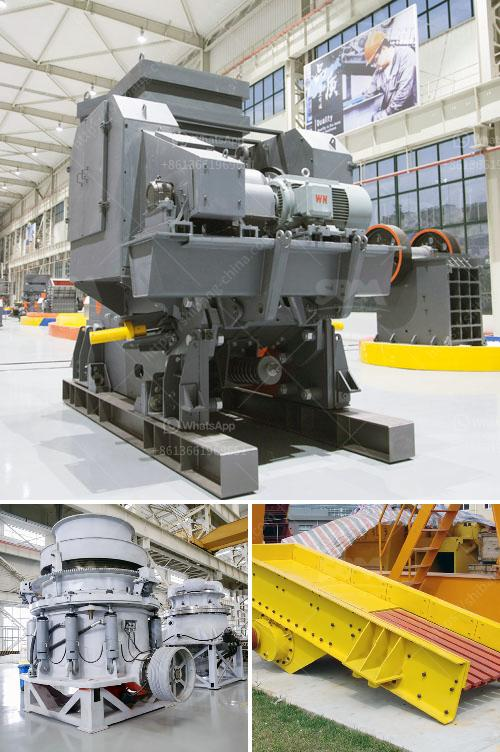

<h3>كسارة محمولة مستعملة للبيع في جنوب أفريقيا</h3>
في جنوب أفريقيا، البلد الذي يتميز بتنوع وثراء موارده الطبيعية، تعد الصناعات التعدينية واحدة من القطاعات الحيوية في الاقتصاد. ومن أجل استخراج وتكرير المعادن والمحاجر، يلجأ رجال الأعمال والمستثمرون إلى استخدام الكسارات المحمولة المستعملة.

تُعد الكسارة المحمولة واحدة من الأدوات الأساسية في صناعة التعدين والبناء. فهي تستخدم لكسر وسحق الصخور والحجارة بشتى أحجامها وأنواعها وتحويلها إلى قطع مرغوب فيها للاستخدام في مواقع الإنشاءات أو لإنتاج المواد الخام للصناعة. تتميز الكسارات المحمولة بقابليتها للتنقل والنقل بين المواقع بسهولة، مما يوفر الوقت والجهد للعاملين في المرافق التعدينية والبنائية.

في السوق الجنوب أفريقية تجد العديد من الكسارات المحمولة المستعملة للبيع، وذلك بأسعار تنافسية وفي متناول الجميع. بإمكان المستثمرين ورجال الأعمال الاستفادة من هذه الكسارات المستعملة لتحقيق توفير في التكاليف مقارنة بشراء كسارات جديدة.

أحد الأمور الهامة التي يجب مراعاتها عند البحث عن كسارة محمولة مستعملة للبيع هو فحص حالتها الفنية. ينبغي التأكد من أن الكسارة تعمل بكفاءة وليس بها عيوب مهمة قد تؤثر على أداء العمل. من المستحسن أخذ استشارة من خبراء الصيانة والفنيين للتأكد من سلامة المعدة وجودتها.

علاوة على ذلك، يجب مراعاة القدرة الإنتاجية للكسارة ومدى توافقها مع احتياجات المشروع المراد تنفيذه. فبعض الكسارات تتميز بقدرتها على تكسير كميات كبيرة من الحجارة، في حين أن البعض الآخر يصلح للاستخدام في مشاريع أصغر الحجم.

في النهاية، يعتبر الاستثمار في كسارة محمولة مستعملة في جنوب أفريقيا خيارًا ممتازًا للأفراد والشركات الباحثة عن طرق فعّالة ومربحة لاستخراج المعادن وتحويلها لتلبية احتياجات السوق المحلية والدولية. وبالتالي، يجب على الراغبين في شراء كسارة محمولة مستعملة أن يحددوا احتياجاتهم وميزانيتهم وإجراء البحوث والاستشارات اللازمة للعثور على أفضل العروض التي تناسبهم.
<h3>Contact us</h3><ul><li><strong>Whatsapp:&nbsp;<a href="https://wa.me/8613661969651">+8613661969651</a></strong></li><li><a href="https://swt.shibang-china.com/?git&amp;zhl&amp;كسارة محمولة مستعملة للبيع في جنوب أفريقيا"><strong>Online Service(chat now)</strong></a></li></ul><h3>Related</h3><ul><li><a href='كسارة الحجر للجرار.md'>كسارة الحجر للجرار</a></li><li><a href='مصنع معالجة رمل السيليكا.md'>مصنع معالجة رمل السيليكا</a></li><li><a href='موردي آلة فحص الفحم.md'>موردي آلة فحص الفحم</a></li><li><a href='آفاق صناعة كسارة الجرانيت.md'>آفاق صناعة كسارة الجرانيت</a></li><li><a href='مصنع لطحن الحجر الجيري والجبس للإسمنت.md'>مصنع لطحن الحجر الجيري والجبس للإسمنت</a></li></ul>