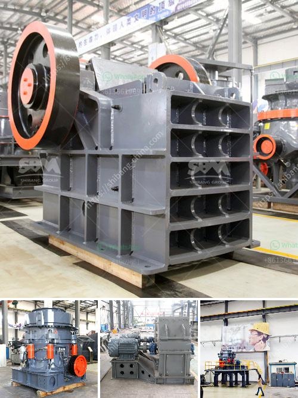

<h3>كسارة محمولة</h3>
تعتبر الكسارة المحمولة تقنية حديثة وعملية تستخدم في صناعة التعدين والبناء لتكسير المواد الخام وإعادة تدوير الخرسانة والأنقاض. تتميز هذه الكسارات بأنها متنقلة وقابلة للنقل بسهولة ، مما يوفر الوقت والمجهود في نقل المواد الخام إلى الموقع المطلوب للتكسير.

تتوفر الكسارات المحمولة بمجموعة متنوعة من الأحجام والسعات ، وتعتمد الاختيار على نوعية المواد وكمية المواد التي تحتاج إلى تكسيرها. تعمل الكسارة المحمولة عن طريق تغذية المواد في فوهة الدخول وتجريها إلى غرفة التكسير حيث يتم تكسيرها بواسطة طاحونة أو كسارة مدمجة داخل الجهاز. من ثم يتم إخراج المواد الناتجة من الكسارة من خلال فوهة الخروج.

تعتبر الكسارات المحمولة بديلاً عملياً للكسارات التقليدية ، حيث يمكن استخدامها في أي مكان دون الحاجة إلى تجهيزات خاصة. بفضل حجمها الصغير وقابليتها للنقل بسهولة ، يمكن تركيب الكسارة المحمولة داخل مواقع البناء أو مقالع التعدين أو حتى على صهاريج النقل لتكسير المواد في الموقع الذي تم جمعها.

تقدم الكسارة المحمولة العديد من الفوائد للشركات والمشغلين. فهي تسهل من عملية التكسير وإعادة التدوير ، مما يوفر الكثير من الوقت والجهد. بالإضافة إلى ذلك ، فإن هذه الكسارات قادرة على معالجة مجموعة متنوعة من المواد بما في ذلك الصخور والأنقاض والخرسانة والأسمنت ، مما يزيد من مرونة الاستخدام وتوفير التكاليف.

بالنسبة للمشغلين ، فإن الكسارة المحمولة تعزز الإنتاجية وتحسن كفاءة العمل. توفر هذه الكسارات الوصول السهل إلى المواد المحجوزة ، مما يقلل من الحاجة إلى استخدام الشاحنات والمعدات الثقيلة الأخرى لنقل المواد. كما أنها تقلل من تكاليف النقل والحفاظ على الطرق ، وتقلل من تكاليف التشغيل بشكل عام.

في الختام ، تعد الكسارة المحمولة حلاً عملياً وعصرياً لتكسير وإعادة تدوير المواد في أي مكان. توفر هذه الكسارة الراحة والكفاءة للشركات والمشغلين ، وتعزز إنتاجيتهم وتحقق توفيرًا في التكاليف. بفضل تلك التقنية الابتكارية ، يمكن تحقيق الاستدامة في صناعة التعدين والبناء وتحسين البيئة العامة.
<h3>Contact us</h3><ul><li><strong>Whatsapp:&nbsp;<a href="https://wa.me/8613661969651">+8613661969651</a></strong></li><li><a href="https://swt.shibang-china.com/?git&amp;zhl&amp;كسارة محمولة"><strong>Online Service(chat now)</strong></a></li></ul><h3>Related</h3><ul><li><a href='مطحنة الطحن بالميكرون.md'>مطحنة الطحن بالميكرون</a></li><li><a href='مطاحن تعدين الذهب المحمولة.md'>مطاحن تعدين الذهب المحمولة</a></li><li><a href='قطع غيار آلة المطحنة ووظيفتها.md'>قطع غيار آلة المطحنة ووظيفتها</a></li><li><a href='تكلفة وحدة طحن الأسمنت tpd كسارة.md'>تكلفة وحدة طحن الأسمنت tpd كسارة</a></li><li><a href='كيف يتم استخدام مسحوق الدولوميت في البناء.md'>كيف يتم استخدام مسحوق الدولوميت في البناء</a></li></ul>