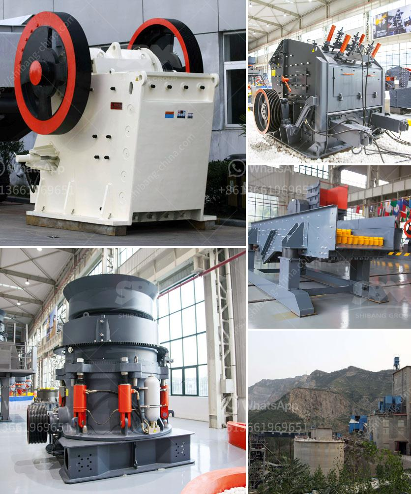

<h3>كسارة مخروط في أمريكا</h3>
تعتبر كسارات المخروط من الآلات المهمة في صناعة التعدين والبناء. وفي الولايات المتحدة، توجد العديد من الشركات التي تقدم هذه الآلات وتعتبر الرائدة في هذا المجال.

تستخدم كسارات المخروط في عملية سحق الصخور والمواد الصلبة الأخرى. تمتاز بكفاءتها العالية وقدرتها على سحق المواد الكبيرة إلى قطع صغيرة قابلة للتحمل. وتستخدم هذه الآلات في إنشاء الطرق والجسور والمباني، بالإضافة إلى صناعة الأسمنت والزجاج والسيراميك.

تعد الولايات المتحدة من أكبر الأسواق لكسارات المخروط في العالم. يعود ذلك إلى حجم البناء الهائل في البلاد والطلب المرتفع على المواد الخام. وتوجد في الولايات المتحدة شركات معروفة عالمياً في إنتاج كسارات المخروط، مثل فلسميث، ماكستراك، وتريو.

تتميز كسارات المخروط المصنوعة في الولايات المتحدة بالتكنولوجيا المتقدمة والجودة العالية. تتمتع هذه الآلات بأنها قادرة على مقاومة الظروف الجوية القاسية والعمل في بيئات صعبة. وتستخدم تكنولوجيا الهيدروليك في عملية ضبط حجم الصخور وتحسين جودة المنتج.

بالإضافة إلى ذلك، تمتاز كسارات المخروط في الولايات المتحدة بسهولة الصيانة والتشغيل. توفر الشركات المصنعة دعماً فنياً متخصصاً وقطع غيار ذات جودة عالية لضمان استدامة أداء الآلات وتحقيق أقصى قدر من الكفاءة.

بشكل عام، تعتبر كسارات المخروط في أمريكا أدوات أساسية في الصناعات التعدينية والبنائية. ومن خلال تقديم التكنولوجيا المتقدمة والجودة العالية، تلعب هذه الآلات دوراً حاسماً في تحقيق التنمية الاقتصادية في البلاد وتلبية احتياجات البنية التحتية المتزايدة.
<h3>Contact us</h3><ul><li><strong>Whatsapp:&nbsp;<a href="https://wa.me/8613661969651">+8613661969651</a></strong></li><li><a href="https://swt.shibang-china.com/?git&amp;zhl&amp;كسارة مخروط في أمريكا"><strong>Online Service(chat now)</strong></a></li></ul><h3>Related</h3><ul><li><a href='مطاحن زيمبابوي.md'>مطاحن زيمبابوي</a></li><li><a href='مطحنة طحن السخام في الهند.md'>مطحنة طحن السخام في الهند</a></li><li><a href='خطة عمل لإنتاج الجبس.md'>خطة عمل لإنتاج الجبس</a></li><li><a href='مطحنة الكرة في الصناعة.md'>مطحنة الكرة في الصناعة</a></li><li><a href='كسارة صخور محمولة صغيرة للسحق.md'>كسارة صخور محمولة صغيرة للسحق</a></li></ul>