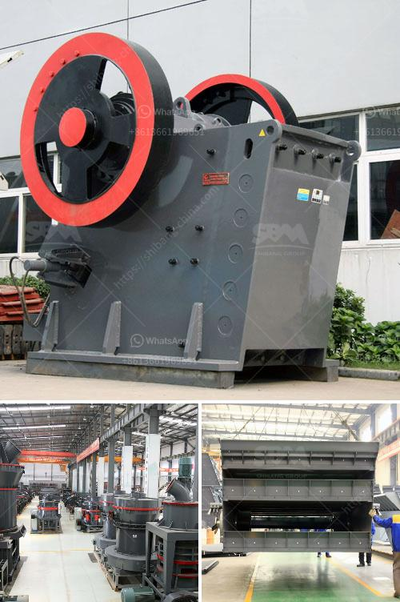

<h3>كسارة مخروط في الصين</h3>
تعتبر كسارة المخروط واحدة من أهم الآلات المستخدمة في صناعة التعدين والبناء في الصين. تعد الصين من الدول الرائدة في مجال تصنيع الكسارات المخروطية، حيث تتميز بجودتها العالية وأداءها الممتاز.

تستخدم الكسارة المخروطية لكسر المواد الصلبة والمتوسطة الصلابة مثل الصخور والخامات. يتم إدخال المواد في الكسارة عبر الفتحة العلوية ثم تتم إعادة توجيهها إلى عامود الكسارة المخروطية الداخلي والخارجي. تقدم الكسارة المخروطية تكسيرًا فعالًا وفعالًا للمواد، وتعتبر خيارًا مناسبًا لتغذية حجم الجسيمات الكبير والمتوسط.

تتميز الكسارات المخروطية في الصين بعدة مزايا تجعلها تتفوق على الكسارات الأخرى المتاحة في السوق. أولاً، توفر الكسارات المخروطية في الصين تصميمًا قويًا ومتينًا يضمن الاستقرار والمتانة أثناء الاستخدام اليومي. كما أنها تستخدم تقنية متقدمة في تصنيع الأجزاء الداخلية والأدوات القطع لضمان أداء ممتاز وعمر طويل للكسارة.

ثانيًا، تعتبر الكسارات المخروطية في الصين سهلة الاستخدام والصيانة. تم تصميم هذه الكسارات بطريقة تسهل عمليات التشغيل والتنظيف وإزالة الاحتكاك من المواد المسحوقة. كما يتم توفير دليل المستخدم الشامل للكسارة للمساعدة في فهم كيفية استخدامها بشكل صحيح وفعال.

ثالثًا، تعد الكسارات المخروطية في الصين من الأجهزة العالية الكفاءة. تتميز بتقنية تكسير فعالة وقدرة عالية على التكسير. تتناسب بشكل مثالي مع المعدات الأخرى في سلسلة إنتاج التعدين والبناء، وتساهم في زيادة إنتاجية العمل وتحسين جودة المنتج.

في الختام، تلعب الكسارات المخروطية دورًا هامًا في عمليات التعدين والبناء في الصين. تظهر جودة التصنيع العالية والأداء الممتاز للكسارات المخروطية الصينية تفوقها على المنافسين الأخرى. إن الاستثمار في كسارة مخروطية صينية سيكون خيارًا ذكيًا لأي منشأة تعدينية أو بنائية تبحث عن جودة عالية وأداء ممتاز.
<h3>Contact us</h3><ul><li><strong>Whatsapp:&nbsp;<a href="https://wa.me/8613661969651">+8613661969651</a></strong></li><li><a href="https://swt.shibang-china.com/?git&amp;zhl&amp;كسارة مخروط في الصين"><strong>Online Service(chat now)</strong></a></li></ul><h3>Related</h3><ul><li><a href='كسارة الرخام في الصين.md'>كسارة الرخام في الصين</a></li><li><a href='مشاريع المطاحن للسائل الزجاجي في الهند.md'>مشاريع المطاحن للسائل الزجاجي في الهند</a></li><li><a href='كسارة في الفلبين.md'>كسارة في الفلبين</a></li><li><a href='آلة طحن الجير.md'>آلة طحن الجير</a></li><li><a href='كسارة الحجر المحمولة للبيع في الفلبين.md'>كسارة الحجر المحمولة للبيع في الفلبين</a></li></ul>