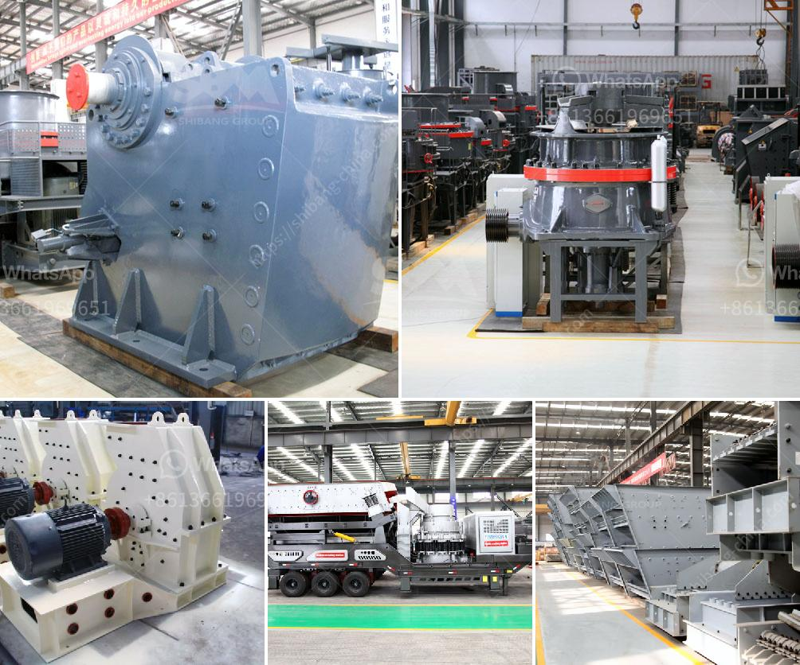

<h3>كسارة مخروط في جنوب أفريقيا</h3>
تعتبر كسارات المخروط من أهم الأدوات المستخدمة في صناعة التعدين ومعالجة المواد في جميع أنحاء العالم. تعتبر جنوب أفريقيا واحدة من الدول التي تمتلك العديد من هذه الكسارات، وذلك بسبب الثروات الطبيعية الهائلة التي تتمتع بها.

تعتبر الكسارة المخروطية أحد الأدوات الرئيسية في صناعة التعدين، حيث تستخدم لسحق المواد الصلبة والصخور الصلبة إلى قطع صغيرة. تتألف الكسارة المخروطية من جزئين رئيسيين: الجزء الثابت والجزء المتحرك. يتم وضع المادة في فجوة بين هذين الجزئين حيث تتم عملية السحق.

إحدى المناطق الرئيسية التي تمتلك العديد من كسارات المخروط في جنوب أفريقيا هي منطقة ليمبوبو الشمالية. تعد ليمبوبو الشمالية واحدة من أغنى المناطق من حيث الثروات المعدنية في البلاد، حيث تحتوي على موارد هائلة من الذهب والنحاس والماس والبلاتين والفوسفات والفحم والحديد. وبفضل تواجد هذه الموارد الضخمة، نجد عددًا كبيرًا من الشركات التعدينية والكسارات المختصة في هذه المنطقة.

تتميز كسارات المخروط في جنوب أفريقيا بتقنياتها المتقدمة وقدرتها على سحق المواد الصلبة بفعالية عالية. توفر هذه الكسارات أداءً ممتازًا في سحق المواد الصلبة إلى أحجام صغيرة مناسبة للمعالجة اللاحقة. تعتبر الكسارات المخروطية أيضًا قابلة للتعديل بحيث يمكن ضبط الفجوة بين الجزء الثابت والجزء المتحرك بشكل دقيق، مما يسمح بالتحكم الدقيق في حجم الإخراج.

وتستخدم كسارات المخروط في جنوب أفريقيا بشكل واسع في عمليات التعدين وتصنيع الركام ومعالجة المواد الصخرية. فهي تستخدم في سحق الصخور الكبيرة والمتوسطة إلى قطع صغيرة تستخدم في إنتاج الخرسانة والأسفلت والجير المستخدم في البناء. كما يتم استخدامها في صناعة التعدين لاستخراج الذهب والنحاس والبلاتين وغيرها من المعادن.

باختصار، تعد كسارات المخروط في جنوب أفريقيا أدوات ضرورية في صناعة التعدين ومعالجة المواد. تتميز بأداء ممتاز وتقنيات حديثة تجعلها قادرة على سحق المواد بفعالية عالية. تعتبر جنوب أفريقيا من أهم الدول التي تشهد ازدهارًا في صناعة التعدين وبالتالي تحتل الكسارات المخروطية مكانة هامة في هذا القطاع.
<h3>Contact us</h3><ul><li><strong>Whatsapp:&nbsp;<a href="https://wa.me/8613661969651">+8613661969651</a></strong></li><li><a href="https://swt.shibang-china.com/?git&amp;zhl&amp;كسارة مخروط في جنوب أفريقيا"><strong>Online Service(chat now)</strong></a></li></ul><h3>Related</h3><ul><li><a href='مصنع غسيل الرمال بسعة 50 طن في اليوم.md'>مصنع غسيل الرمال بسعة 50 طن في اليوم</a></li><li><a href='شركة تصنيع آلة كسارة الحجر.md'>شركة تصنيع آلة كسارة الحجر</a></li><li><a href='كسارة الحجر الجيري بيرو الجير.md'>كسارة الحجر الجيري بيرو الجير</a></li><li><a href='آلة سحق في الفلبين.md'>آلة سحق في الفلبين</a></li><li><a href='تجار في محطم الفحم وآلة طحن في الهند.md'>تجار في محطم الفحم وآلة طحن في الهند</a></li></ul>