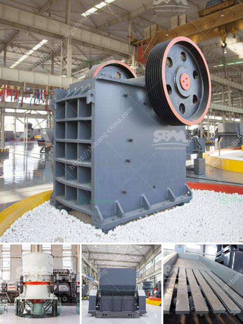

<h3>كسارة مخروطية HP 200</h3>
تعد الكسارة المخروطية HP 200 منتجًا رائعًا ومبتكرًا في صناعة التعدين ومواد البناء. تحظى بشعبية كبيرة بين المشغلين في جميع أنحاء العالم بفضل تصميمها المتطور وفعالية عالية في عمليات السحق. تستخدم هذه الكسارة في العديد من التطبيقات ، بدءًا من سحق الخامات الصلبة إلى سحق الأحجار الصلبة والأحجار الجيرية والجرانيت.

تتميز كسارة مخروطية HP 200 بالعديد من المزايا التي تجعلها مثلى للاستخدام الصناعي. تتميز بنظام تعديل الفجوة الهيدروليكي الذي يسمح بتعديل مستوى السحق بشكل سريع ودقيق بواسطة الضوابط الهيدروليكية. يتيح هذا نتائج سحق موحدة ومتسقة. بفضل مولد الحركة الكهروميكانيكية ، فإن الكسارة توفر قوة سحق كبيرة وكفاءة عالية في العملية. يضمن نظام التشحيم التلقائي الذي يعمل بواسطة الزيت الأوتوماتيكي منع حدوث التآكل والأضرار في المكونات الحيوية.

مع قدرة سحق قوية تتراوح من 200 إلى 400 طن في الساعة ، فإن الكسارة المخروطية HP 200 تناسب تطبيقات متنوعة وتستخدم على نطاق واسع في العديد من الصناعات. تم إنتاجها باستخدام مواد عالية الجودة وتجميعها بدقة ، بالإضافة إلى التكنولوجيا الحديثة ، مما يجعلها متينة وموثوقة في العمل الشاق.

تتميز الكسارة المخروطية HP 200 أيضًا بتصميمها الذكي الذي يسهل صيانتها وتشغيلها بكفاءة. يوفر نظام التحكم التلقائي المتقدم أداءً استثنائيًا وسهولة في استخدامه. يتميز الجهاز بواجهة بسيطة ومباشرة تسهل عمليات التحكم والمراقبة. تعمل الحماية المتقدمة للجهاز على منع حدوث تلف للمعدات وتكون آمنة للمشغلين.

بشكل عام ، الكسارة المخروطية HP 200 هي حلاً مثاليًا للعديد من التطبيقات الصناعية. تجمع بين الكفاءة والدقة والمتانة ، وتوفر عملية سحق فعالة وسريعة. يساهم تصميمها الذكي والتكنولوجيا المتطورة في تحسين أداء أعمال التعدين والبناء. إذا كنت تبحث عن جهاز قوي وفعال يمكن الاعتماد عليه في عمليات السحق ، فإن الكسارة المخروطية HP 200 هي الخيار الأمثل.
<h3>Contact us</h3><ul><li><strong>Whatsapp:&nbsp;<a href="https://wa.me/8613661969651">+8613661969651</a></strong></li><li><a href="https://swt.shibang-china.com/?git&amp;zhl&amp;كسارة مخروطية HP 200"><strong>Online Service(chat now)</strong></a></li></ul><h3>Related</h3><ul><li><a href='مورد مصنع تكسير الحجر في الفلبين.md'>مورد مصنع تكسير الحجر في الفلبين</a></li><li><a href='سعر محطم محمول.md'>سعر محطم محمول</a></li><li><a href='كسارة صخور محمولة صغيرة للسحق.md'>كسارة صخور محمولة صغيرة للسحق</a></li><li><a href='الحجم في مطاحن طحن الأسمنت.md'>الحجم في مطاحن طحن الأسمنت</a></li><li><a href='طريقة فحص عمودية.md'>طريقة فحص عمودية</a></li></ul>