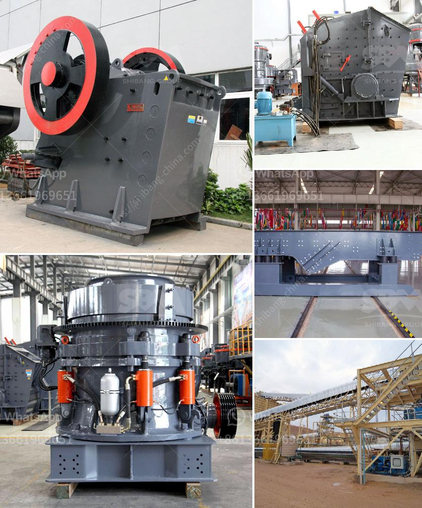

<h3>كسارة مخروطية hp300</h3>
كسارة مخروطية HP300 هي واحدة من الكسارات المخروطية التي تستخدم في صناعة التعدين ومعالجة المواد الصلبة. تعتبر هذه الكسارة منتجًا عالي الجودة وفعالًا في الأداء ، حيث توفر كسارة HP300 حلاً قويًا لتكسير الصخور والمواد الصلبة بفعالية.

إن نموذج HP300 يتميز بالعديد من الخصائص التصميمية والتقنية التي تجعلها مثالية للاستخدام في تطبيقات مختلفة. تعتبر قدرة الكسارة المخروطية HP300 على التعامل مع مواد مختلفة والقدرة على تحقيق نسبة تكسير عالية من أهم جوانبها. يستخدم نظام الحجم المستدام في هذه الكسارة لضمان تحقيق نسبة تكسير مطلوبة بدقة وبشكل مستمر.

تتميز كسارة HP300 أيضًا بسهولة الصيانة والتشغيل. يتم تجهيز هذا الطراز بمجموعة من التقنيات المتقدمة مثل نظام التشحيم التلقائي والتحكم الهيدروليكي. يتم توفير وحدات التحكم والمراقبة الفعالة وأنظمة تغيير الغربال وأنظمة النقل المتوفرة في الكسارة HP300 لتسهيل عملية التشغيل والصيانة.

توزع الكسارة المخروطية HP300 بشكل شائع في العديد من صناعات التعدين ومواد البناء. تستخدم في عمليات تكسير الصخور الكبيرة والثانوية وتستخدم أيضًا في تكسير المواد الخام للإعداد لعمليات التركيز. الكسارات المخروطية HP300 تتميز بالقدرة على التعامل مع مجموعة متنوعة من المواد بما في ذلك الأحجار الجيرية والغرانيت والدياباز والرخام وعدة أنواع من المخلفات الصناعية.

بخلاف ذلك ، يتميز الطراز HP300 أيضًا بمقاومته العالية للاهتزاز والصدمات ، وهو ميزة مهمة في تطبيقات التعدين حيث تكون الآلات عرضة للتطبيقات الصعبة والظروف القاسية.

إجمالًا ، تعتبر كسارة مخروطية HP300 منتجًا موثوقًا وفعالًا في صناعة التعدين ومعالجة المواد الصلبة. توفر هذه الكسارة أداءًا ممتازًا وسهولة في الصيانة والتشغيل ، وتعتبر الحل الأمثل لتحقيق نتائج ممتازة في عمليات التكسير.
<h3>Contact us</h3><ul><li><strong>Whatsapp:&nbsp;<a href="https://wa.me/8613661969651">+8613661969651</a></strong></li><li><a href="https://swt.shibang-china.com/?git&amp;zhl&amp;كسارة مخروطية hp300"><strong>Online Service(chat now)</strong></a></li></ul><h3>Related</h3><ul><li><a href='مصنع تعدين الدولوميت في إثيوبيا.md'>مصنع تعدين الدولوميت في إثيوبيا</a></li><li><a href='آلة طحن الكرة في الهند.md'>آلة طحن الكرة في الهند</a></li><li><a href='عصابات كسارة الحجر في جامايكا.md'>عصابات كسارة الحجر في جامايكا</a></li><li><a href='استخدام آلة مطحنة الكرة في إندونيسيا.md'>استخدام آلة مطحنة الكرة في إندونيسيا</a></li><li><a href='عملية تصنيع الإسمنت بالطريقة الرطبة.md'>عملية تصنيع الإسمنت بالطريقة الرطبة</a></li></ul>