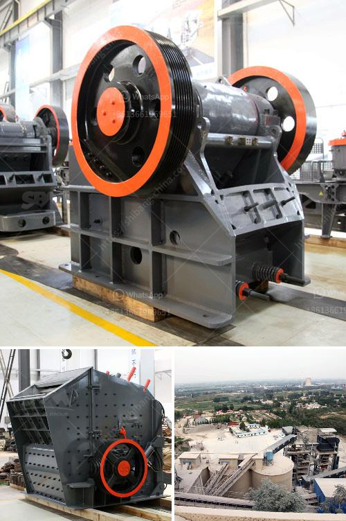

<h3>كسارة مخروطية أساسية</h3>
تعتبر الكسارة المخروطية أحد الأدوات الأساسية في صناعة التعدين، حيث تُستخدم لسحق المواد الصلبة وتحويلها إلى حجم أصغر. تُعتبر الكسارة المخروطية الأساسية من أنواع الكسارات المستخدمة على نطاق واسع في الصناعة بسبب كفاءتها العالية وقدرتها على التعامل مع المواد الصعبة والمتوسطة.

تتكون الكسارة المخروطية الأساسية من جزئين رئيسيين: الغلاف الخارجي الثابت والجزء الداخلي المتحرك. يتم تحميل المادة في الكسارة عن طريق فتحة التحميل في الجزء العلوي من الجزء الثابت من الكسارة، ثم يتم سحقها بين الغلاف الداخلي المتحرك وجدران الجزء الخارجي الثابت. تتمثل الميزة الرئيسية للكسارة المخروطية الأساسية في قدرتها على إحداث ضغط عالٍ على المواد لسحقها بفعالية، مما يعطي نتائج أفضل في تحويل المواد إلى حجم أصغر.

تعتبر الكسارة المخروطية الأساسية مثالية للمواد الصلبة مثل الصخور والمعادن، حيث يمكنها سحقها بكفاءة وتحويلها إلى حجم يمكن التحكم فيه بسهولة. كما يمكن استخدام الكسارة المخروطية في صناعة البناء لسحق الخرسانة والحجارة الصغيرة، مما يجعلها أداة مهمة في عمليات البناء وتأسيس المباني.

من المزايا الأخرى للكسارة المخروطية الأساسية قدرتها على ضبط الفجوة بين الغلاف الداخلي والغلاف الخارجي، مما يمكن التحكم في حجم الانتاج بسهولة. توفر الكسارة أيضًا عمرًا طويلًا للخدمة بفضل تصميمها المتين والمتين، والذي يمكنها المقاومة للاهتراء والتآكل الناجم عن مواد السحق.

في النهاية، يُمكن القول أن الكسارة المخروطية الأساسية هي أداة لا غنى عنها في صناعة التعدين والبناء. تتمتع بالقدرة على سحق المواد الصعبة والمتوسطة بكفاءة عالية، وتحويلها إلى حجم أصغر ومناسب. توفر الكسارة أيضًا تحكمًا سهلًا في حجم الإخراج وعمر خدمة طويل. بفضل فعاليتها ومتانتها، تعتبر الكسارة المخروطية الأساسية أحد أهم الأدوات في صناعتي التعدين والبناء.
<h3>Contact us</h3><ul><li><strong>Whatsapp:&nbsp;<a href="https://wa.me/8613661969651">+8613661969651</a></strong></li><li><a href="https://swt.shibang-china.com/?git&amp;zhl&amp;كسارة مخروطية أساسية"><strong>Online Service(chat now)</strong></a></li></ul><h3>Related</h3><ul><li><a href='مصانع غسيل الذهب للبيع في غانا.md'>مصانع غسيل الذهب للبيع في غانا</a></li><li><a href='عملية تعدين الدولوميت.md'>عملية تعدين الدولوميت</a></li><li><a href='معدات كسارة المحجر للبيع.md'>معدات كسارة المحجر للبيع</a></li><li><a href='كسارة الإسمنت في تركيا.md'>كسارة الإسمنت في تركيا</a></li><li><a href='مطحنة الكرة ماركاسيت.md'>مطحنة الكرة ماركاسيت</a></li></ul>