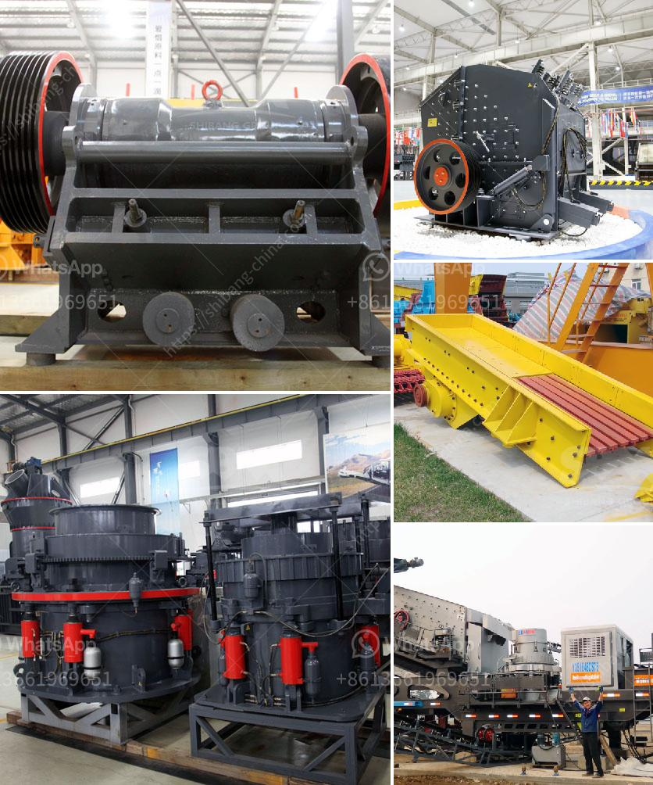

<h3>كسارة مخروطية الصين</h3>
تعتبر كسارات المخروطية من أهم الآلات المستخدمة في صناعة التعدين ومعالجة المواد الخام. ومن بين العديد من الشركات المصنعة لهذا النوع من الكسارات، تبرز الصين كواحدة من الدول الرائدة في هذا المجال. ففي السنوات الأخيرة، زاد الطلب على المنتجات الصينية في الأسواق العالمية، نظرًا للجودة المتميزة والتقنيات المتقدمة التي تتمتع بها هذه الكسارات. سنتحدث في هذه المقالة عن بعض المميزات والفوائد التي تقدمها كسارة المخروطية الصين.

تتمتع كسارة المخروطية الصين بتصميم هندسي مثالي يسهل استخدامها وصيانتها. يتم تصميم المعدات بعناية لضمان التشغيل السلس والفعالية العالية. كما تتميز بسهولة التحكم في حجم المنتج النهائي، حيث يمكن تعديل تدفق الإنتاج وفقًا لاحتياجات المشروع.

تعتبر أيضًا من الكسارات القوية والمتينة. تستخدم في تكسير المواد الصلبة والصعبة مثل الصخور والخامات اللافلزية. يتم استخدامها على نطاق واسع في مجالات متنوعة مثل التعدين والبناء والصناعات الكيماوية. تعمل بكفاءة عالية وتستخدم تقنيات متقدمة لتقليل استهلاك الطاقة وتقليل أثر التلوث على البيئة.

بفضل تقنيتها المتطورة، توفر كسارة المخروطية الصين نسبة كبيرة من سحق المواد وتحسن من جودة المنتج النهائي. يتم تحقيق ذلك من خلال التحكم في عملية التكسير وضمان تجانس المنتج وفقًا للمواصفات المطلوبة. وبالتالي، فإن استخدامها يساهم في زيادة الكفاءة وتحسين الأداء الإنتاجي للمشروع.

لا يمكننا أن نتجاهل أيضًا السعر التنافسي لكسارة المخروطية الصين. تعتبر الشركات المصنعة الصينية معروفة بإنتاج منتجات عالية الجودة بأسعار تنافسية. هذا يجعلها الخيار المثلى للعديد من الشركات والمشاريع التي تبحث عن أعلى مستويات الأداء بتكلفة معقولة.

بالاختصار، كسارة المخروطية الصين هي اختيار مثالي للشركات والمشاريع التي تبحث عن آلات قوية ومتينة لتكسير المواد الصعبة وتحسين جودة المنتج النهائي. إن تقنيات التصنيع المتقدمة والأداء العالي والتكلفة المنخفضة يجعلون كسارة المخروطية الصين الخيار الأمثل لمجموعة واسعة من الصناعات.
<h3>Contact us</h3><ul><li><strong>Whatsapp:&nbsp;<a href="https://wa.me/8613661969651">+8613661969651</a></strong></li><li><a href="https://swt.shibang-china.com/?git&amp;zhl&amp;كسارة مخروطية الصين"><strong>Online Service(chat now)</strong></a></li></ul><h3>Related</h3><ul><li><a href='إجراء التعدين في محجر الحجر الجيري.md'>إجراء التعدين في محجر الحجر الجيري</a></li><li><a href='آلة مسحوق الجير السريع.md'>آلة مسحوق الجير السريع</a></li><li><a href='كسارة الحجر في المغرب.md'>كسارة الحجر في المغرب</a></li><li><a href='كسارات الحجر في المحجر.md'>كسارات الحجر في المحجر</a></li><li><a href='عملية التئام الذاتي للحجر الجيري.md'>عملية التئام الذاتي للحجر الجيري</a></li></ul>