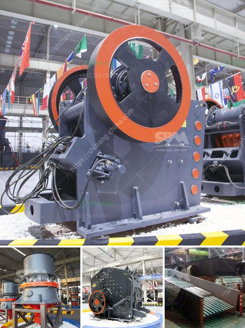

<h3>كسارة مخروطية بسعة 100 طن في الساعة</h3>
تعد الكسارات المخروطية من أهم وأكثر الأدوات التي تستخدم في صناعة البناء والتعدين. وتستخدم بشكل رئيسي لسحق المواد الخام إلى قطع صغيرة من حجم محدد. واحدة من أفضل الكسارات المخروطية المتوفرة في السوق هي الكسارة المخروطية ذات السعة الكبيرة والتي تستطيع سحق حتى 100 طن في الساعة.

يتميز هذا النوع من الكسارات بالعديد من الخصائص المميزة التي تمكنها من تحقيق أداء ممتاز وتلبية احتياجات العملاء بشكل مثالي. تُستخدم الكسارة المخروطية بشكل رئيسي لسحق المواد الصلبة مثل الصخور والخامات المعدنية بشكل دقيق وفعال.

تتوفر الكسارة المخروطية بسعة 100 طن في الساعة بتصاميم وموديلات متعددة تتناسب مع الاحتياجات المحددة لكل عميل. تتميز هذه الكسارات بوجود تصميم محدد يسمح بإدخال المواد الخام من الأعلى ودفعها نحو الأسفل بشكل متساوٍ، مما يؤدي إلى تقليل احتمالية حدوث انسدادات.

كما تتميز الكسارة المخروطية بسعة 100 طن في الساعة بوجود نظام تشغيل سهل وموثوق، يتيح تحقيق أداء عالي وخفض التكاليف التشغيلية. كما يتميز النظام بوجود مؤشرات للتشغيل والحماية تسهل على العاملين متابعة العملية وتجنب احتمالية حدوث أي خلل.

إضافة إلى ذلك، تمتاز الكسارة المخروطية بسعة 100 طن في الساعة بوجود تصميم مبتكر للقدرات الهيدروليكية، يسهم في زيادة كفاءة سحق المواد وتحسين الأداء. وبفضل هذه التقنيات الهندسية المتقدمة، يمكن تحقيق فعالية عالية في عملية السحق والحد من الانبعاثات الضارة.

تعتبر الكسارة المخروطية ذات السعة الكبيرة إضافة قوية لأي عملية تعدين أو بناء. فهي تسمح بسحق الصخور والخامات بسهولة وبكفاءة عالية، مما يؤدي إلى زيادة الإنتاجية وتقليل التكاليف. بالإضافة إلى ذلك، فإن استخدام هذه الكسارات يعود بالفائدة الكبيرة على البيئة، حيث يتم تقليل استخدام الموارد الطبيعية والطاقة المستهلكة.

باختصار، تُعد الكسارة المخروطية بسعة 100 طن في الساعة من أفضل الحلول المتاحة لسحق المواد الصلبة بكفاءة عالية. تتميز بسهولة التشغيل والتحكم وفعالية الأداء، مما يجعلها الاختيار الأمثل للعديد من الشركات في قطاع البناء والتعدين.
<h3>Contact us</h3><ul><li><strong>Whatsapp:&nbsp;<a href="https://wa.me/8613661969651">+8613661969651</a></strong></li><li><a href="https://swt.shibang-china.com/?git&amp;zhl&amp;كسارة مخروطية بسعة 100 طن في الساعة"><strong>Online Service(chat now)</strong></a></li></ul><h3>Related</h3><ul><li><a href='مصنعو الكرات في بنغالور.md'>مصنعو الكرات في بنغالور</a></li><li><a href='تجهيز خام الحديد بي دي إف.md'>تجهيز خام الحديد بي دي إف</a></li><li><a href='أسعار مطاحن الكرة وللبيع في سريلانكا.md'>أسعار مطاحن الكرة وللبيع في سريلانكا</a></li><li><a href='كسارة مخروطية للبيع.md'>كسارة مخروطية للبيع</a></li><li><a href='مصنع سحق وطحن.md'>مصنع سحق وطحن</a></li></ul>