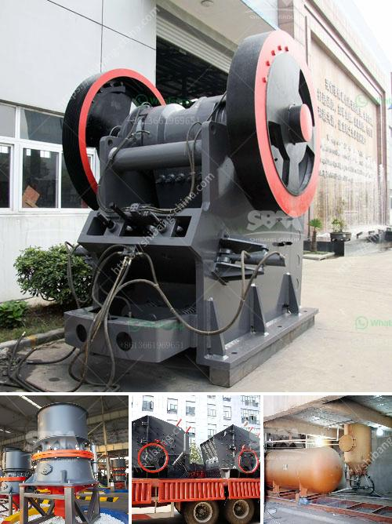

<h3>كسارة مخروطية بوزولانا 100 طن في الساعة</h3>
تعد الكسارة المخروطية بوزولانا من أهم الآلات المستخدمة في مجال التعدين والبناء. تقوم الكسارة المخروطية بتكسير المواد الخام بشكل فعال وسريع، مما يسهم في زيادة إنتاجية العمل وتحسين جودة المنتج النهائي.

تتميز الكسارة المخروطية بوزولانا بقدرتها على تكسير المواد الخام ذات القوام العالي بشكل فعال وبكفاءة عالية. تستخدم هذه الكسارة في عمليات التعدين واستخراج المواد الخام، حيث يتم تمرير المواد عبر فتحة التغذية إلى الجزء العلوي من الكسارة، ومن ثم يتم سحقها بواسطة المخروط الداخلي والجدران الخارجية للكسارة.

تتميز هذه الكسارة بقدرتها على تكسير المواد بأحجام مختلفة، حيث يمكن ضبط طول الشق بين المخروط والجدران الخارجية لتلبية احتياجات المستخدم. بالإضافة إلى ذلك، يمكن تبديل لوحة المخروط ولوحة الجدار الخارجي للحصول على حجم الشق المطلوب.

تتميز الكسارة المخروطية بوزولانا بأداء عالي وتكلفة صيانة منخفضة. وهذا يعود إلى تصميمها الذي يضمن تدفق سلس للمواد داخل الكسارة وتشتيت القوى التي تحدث أثناء عملية التكسير. هذا يؤدي إلى تقليل الاحتكاك بين المواد المكسرة وأجزاء الكسارة، مما يزيد من عمر الخدمة الافتراضية للآلة ويقلل من تكلفة الصيانة.

كما تتميز الكسارة بوزولانا بميزة قابلية التشغيل السهلة والآمنة. فهي مزودة بوحدة تحكم تلقائية تساعد في ضبط سرعة دوران المخروط والحفاظ على ثبات الكسارة أثناء عملية التكسير. كما تتوفر أيضًا إمكانية تشغيل الكسارة عن بعد باستخدام وحدة التحكم عن بُعد، مما يحسن من سلامة العاملين ويزيد من كفاءة الإنتاج.

في النهاية، تعتبر الكسارة المخروطية بوزولانا 100 طن في الساعة أحدث التقنيات في مجال التعدين والبناء. تعد هذه الكسارة حلاً فعالًا لتحسين إنتاجية العمل وتحسين جودة المنتج، مما يساهم في تحقيق أهداف المشروع بشكل أفضل وأسرع.
<h3>Contact us</h3><ul><li><strong>Whatsapp:&nbsp;<a href="https://wa.me/8613661969651">+8613661969651</a></strong></li><li><a href="https://swt.shibang-china.com/?git&amp;zhl&amp;كسارة مخروطية بوزولانا 100 طن في الساعة"><strong>Online Service(chat now)</strong></a></li></ul><h3>Related</h3><ul><li><a href='عصابات كسارة الحجر في جامايكا.md'>عصابات كسارة الحجر في جامايكا</a></li><li><a href='كسارة صخور محمولة صغيرة.md'>كسارة صخور محمولة صغيرة</a></li><li><a href='تكلفة إعداد مصنع طحن الكلنكر في الهند.md'>تكلفة إعداد مصنع طحن الكلنكر في الهند</a></li><li><a href='ميزات كسارة الفك.md'>ميزات كسارة الفك</a></li><li><a href='وحدة طحن الكلنكر الأسمنتي.md'>وحدة طحن الكلنكر الأسمنتي</a></li></ul>