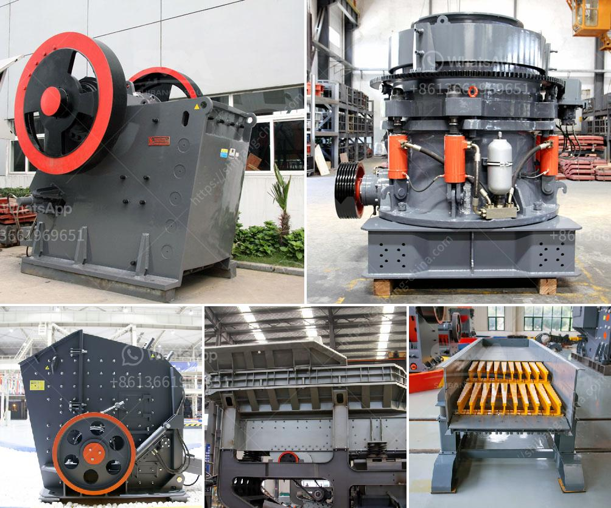

<h3>كسارة مخروطية ثانوية</h3>
تُعَد الكسارة المخروطية الثانوية أحد أهم الأدوات المستخدمة في صناعة التعدين والبناء. تعمل الكسارة المخروطية الثانوية على تكسير المواد الصلبة إلى حجم أصغر، مما يتيح استخدامها في عمليات تكسير الصخور والمعادن المختلفة.

تتميز الكسارة المخروطية الثانوية بتصميمها الممتاز الذي يوفر كفاءة عالية في عملية التكسير. تتألف الكسارة من غرفة تكسير تحوي مخروط داخلي وجدران مخروطية خارجية. عند تشغيل الكسارة، تتحرك الجدران المخروطية الخارجية بتحرك دائري، بينما يبقى المخروط الداخلي ثابتًا. هذا الحركة المستدامة تسمح للكسارة بتكسير المادة بشكل فعال ومتواصل.

تعتبر الكسارة المخروطية الثانوية أداة تكسير متعددة الاستخدامات. يمكن استخدامها في تكسير الحجارة الكبيرة للحصول على حجم أصغر يمكن استخدامه في صناعة البناء. كما يمكن استخدامها أيضًا في تكسير المعادن كالمنجنيز والنحاس والذهب والفحم، بالإضافة إلى الصخور الأخرى مثل الجرانيت والحجر الجيري.

تتميز الكسارة المخروطية الثانوية بقدرتها على توليد حبيبات متجانسة ومتناسقة. يعود ذلك إلى حقيقة أن المخروط الداخلي يعمل على تكسير المادة بتدرج، حيث يكسر الجزء العلوي من المواد بشكل أكبر من الجزء السفلي. هذه العملية تساهم في تقليل التفاوت في حجم الحبيبات المكسورة، مما يعزز جودة الناتج النهائي.

تعتبر الكسارة المخروطية الثانوية أداة هامة في صناعة التعدين والبناء بسبب فوائدها المتعددة. توفر هذه الأداة عملية تكسير فعالة ومتواصلة، وتساهم في تحسين توزيع حجم الحبيبات. كما تسهم في تحقيق توفير الزمن والموارد وتحسين كفاءة العملية الإنتاجية في العديد من الصناعات.
<h3>Contact us</h3><ul><li><strong>Whatsapp:&nbsp;<a href="https://wa.me/8613661969651">+8613661969651</a></strong></li><li><a href="https://swt.shibang-china.com/?git&amp;zhl&amp;كسارة مخروطية ثانوية"><strong>Online Service(chat now)</strong></a></li></ul><h3>Related</h3><ul><li><a href='كسارة الحجر كسارة الحجر.md'>كسارة الحجر كسارة الحجر</a></li><li><a href='كسارة مخروطية بوزولانا 100 طن في الساعة.md'>كسارة مخروطية بوزولانا 100 طن في الساعة</a></li><li><a href='كسارات الحجر الجيري المحمولة الصغيرة.md'>كسارات الحجر الجيري المحمولة الصغيرة</a></li><li><a href='طاحونة الحجر إلى النانوجسيمات.md'>طاحونة الحجر إلى النانوجسيمات</a></li><li><a href='مصنع معالجة أكسيد النحاس.md'>مصنع معالجة أكسيد النحاس</a></li></ul>