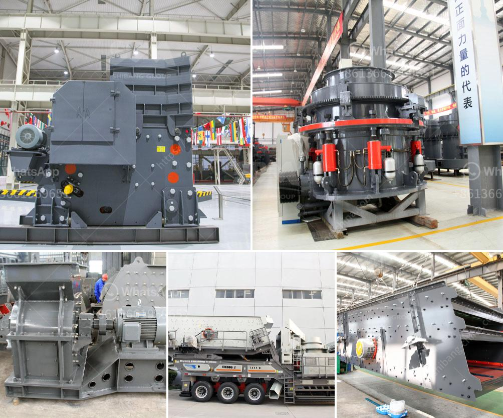

<h3>كسارة مخروطية سلسلة CS</h3>
تعتبر كسارة المخروطية سلسلة CS أحد أنواع الكسارات المستخدمة بشكل واسع في صناعة التعدين والبناء. تتميز هذه الكسارة بتصميم فريد وأداء عالي وكفاءة عالية في سحق المواد الصلبة.

تعتبر كسارة المخروطية سلسلة CS جزءًا من سلسلة منتجات شركة الDevo التي تعتبر واحدة من الشركات الرائدة في صناعة معدات التعدين والبناء. تتميز هذه الكسارة بتصميم مدمج وهيكل قوي يضمن استقرارها ومتانتها أثناء عملية السحق.

تستخدم كسارة المخروطية سلسلة CS بشكل رئيسي في سحق المواد الصلبة مثل الحجارة الكبيرة والمتوسطة. تعمل الكسارة عن طريق ضغط المواد بين الجزء الثابت والجزء المتحرك من المخروط. وبمجرد أن يتم ضغط المواد بشكل كافٍ ، يتم سحقها إلى قطع صغيرة من الحجم المطلوب.

تتميز كسارة المخروطية سلسلة CS بعدة مميزات. أولاً ، فهي تتمتع بكفاءة عالية في سحق المواد ، مما يجعلها مثالية للمشاريع التي تتطلب كمية كبيرة من الحجارة المسحوقة. ثانيًا ، فهي سهلة الاستخدام والصيانة ، مما يقلل من التكاليف العامة للإنتاج. ثالثًا ، تحتوي الكسارة على نظام تشحيم متقدم يحافظ على تشحيم جميع الأجزاء الداخلية بشكل مستمر ، وبالتالي تعزيز عمر الخدمة الطويل للماكينة.

بالإضافة إلى ذلك ، فإن كسارة المخروطية سلسلة CS تتميز بالتسارع السريع والحساسية العالية ، مما يعني أنها قادرة على سحق المواد بشكل سريع وفعال. تعمل الكسارة أيضًا بكفاءة في ظروف التشغيل القاسية ، مما يجعلها مناسبة للاستخدام في مواقع التعدين والبناء في العديد من البيئات الصعبة.

وفي الختام ، تعد كسارة المخروطية سلسلة CS خيارًا ممتازًا للشركات التي تبحث عن آلة سحق فعالة وموثوقة. توفر هذه الكسارة تأثيرًا قويًا في سحق المواد الصلبة وتعمل بكفاءة عالية في ظروف التشغيل القاسية. بفضل تصميمها الفريد وأدائها الممتاز ، فإن كسارة المخروطية سلسلة CS تلبي توقعات العديد من الشركات في مجال التعدين والبناء.
<h3>Contact us</h3><ul><li><strong>Whatsapp:&nbsp;<a href="https://wa.me/8613661969651">+8613661969651</a></strong></li><li><a href="https://swt.shibang-china.com/?git&amp;zhl&amp;كسارة مخروطية سلسلة CS"><strong>Online Service(chat now)</strong></a></li></ul><h3>Related</h3><ul><li><a href='مطحنة طحن الذرة في جنوب أفريقيا.md'>مطحنة طحن الذرة في جنوب أفريقيا</a></li><li><a href='كسارات للإيجار في سينسيناتي.md'>كسارات للإيجار في سينسيناتي</a></li><li><a href='تدريب مطحنة ريموند.md'>تدريب مطحنة ريموند</a></li><li><a href='تقرير مشروع تعدين الكاولين الصغير.md'>تقرير مشروع تعدين الكاولين الصغير</a></li><li><a href='كسارة محمولة للبيع.md'>كسارة محمولة للبيع</a></li></ul>