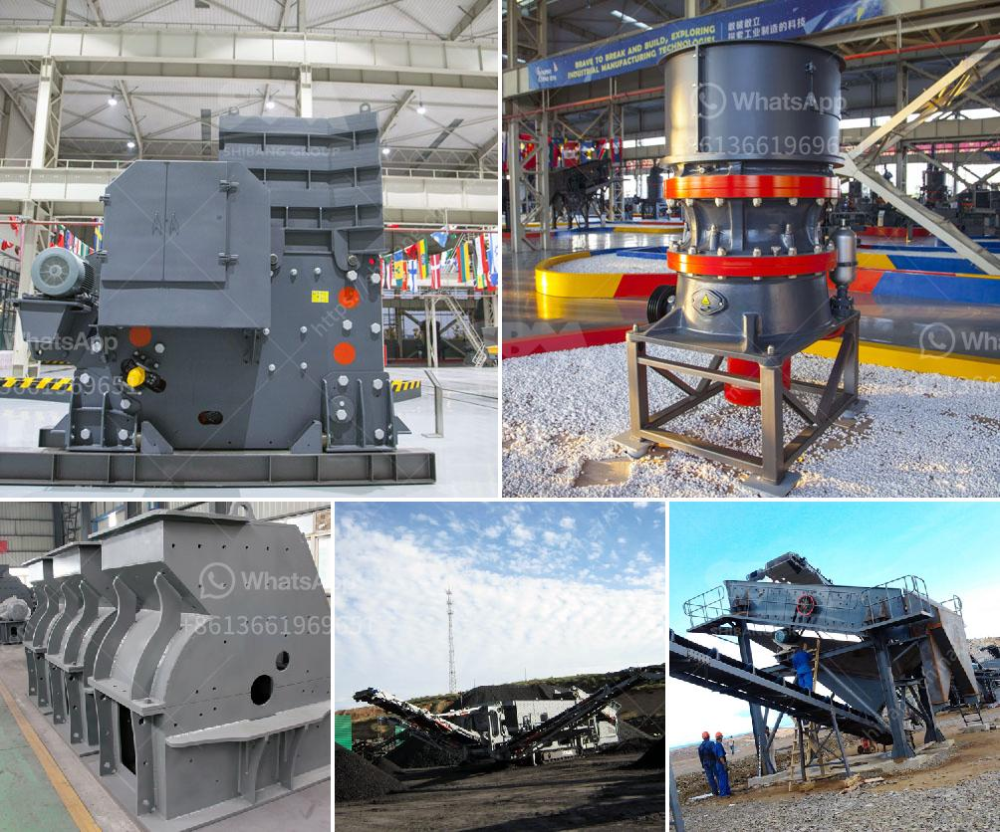

<h3>كسارة مخروطية صنعت في إيطاليا</h3>
تلعب الكسارات المخروطية دورًا حاسمًا في صناعة التعدين والبناء، حيث تستخدم لسحق المواد الخام وتحويلها إلى حجم صغير مناسب للاستخدام في البناء وصناعة الطرق. تعتبر الكسارات المخروطية صناعة إيطالية فريدة، حيث تتميز بالجودة العالية والتكنولوجيا المتطورة.

تتميز الكسارات المخروطية التي صنعت في إيطاليا بالعديد من المزايا. أولاً وقبل كل شيء، فإن تصميمها الدقيق يسمح بتحقيق أقصى قدر من الكفاءة في عملية السحق. تتكون هذه الكسارات من غطاء خارجي مع عناصر ميكانيكية داخلية مؤمنة بشكل صارم. يتم استخدام الحجر الكسارة كجزء من عملية السحق، حيث يتم ضغط المواد الخام بين الحجارة لتحقيق السحق النهائي.

بالإضافة إلى ذلك، فإن الكسارات المخروطية الإيطالية معروفة بأنها توفر نسبة عالية من التحويل بين الكتلة والحجم. وهذا يعني أنه يمكن سحق مواد كبيرة الحجم في كسارة صغيرة الحجم، مما يوفر المساحة ويزيد من الكفاءة التشغيلية للمنشأة.

إضافةً إلى هذا، توفر الكسارات المخروطية الإيطالية أيضًا تقنية متقدمة لضبط حجم الفتحة. يمكن للمشغلين ضبط الفتحة بدقة لتلبية احتياجات الإنتاج المختلفة. بفضل هذه الخاصية، يمكن للمشغلين تجنب إهدار الوقت والجهد في تغيير الأجزاء من أجل تغيير حجم السحق.

من الجدير بالذكر أن الكسارات المخروطية الإيطالية هي أيضًا معروفة بجودة صنعها العالية. تستخدم أعلى المواد الخام وتمتاز بالتصنيع الدقيق، وبالتالي فهي قادرة على التحمل الضغوط العالية والاستخدام الطويل الأمد.

في النهاية، تلعب الكسارات المخروطية الإيطالية دورًا حاسمًا في قطاعات التعدين والبناء، حيث توفر تحسينات كبيرة في عملية السحق وتوفر الكفاءة والجودة. تعتبر هذه الكسارات اختيارًا مثاليًا لأي منشأة تحتاج إلى كفاءة عالية وأداء متميز في عملية السحق. ومع احترافية الشركات المصنعة الإيطالية، يمكن الاعتماد عليها لتلبية احتياجات السوق بأعلى المعايير.
<h3>Contact us</h3><ul><li><strong>Whatsapp:&nbsp;<a href="https://wa.me/8613661969651">+8613661969651</a></strong></li><li><a href="https://swt.shibang-china.com/?git&amp;zhl&amp;كسارة مخروطية صنعت في إيطاليا"><strong>Online Service(chat now)</strong></a></li></ul><h3>Related</h3><ul><li><a href='تكلفة تركيب السيور الناقلة.md'>تكلفة تركيب السيور الناقلة</a></li><li><a href='موردين طاحونة الأسمنت.md'>موردين طاحونة الأسمنت</a></li><li><a href='بائع معدات الطحن.md'>بائع معدات الطحن</a></li><li><a href='عملية مصنع الأحجار الكوارتز 3080.md'>عملية مصنع الأحجار الكوارتز 30-80</a></li><li><a href='مطاحن الأسطوانات في الدول.md'>مطاحن الأسطوانات في الدول</a></li></ul>