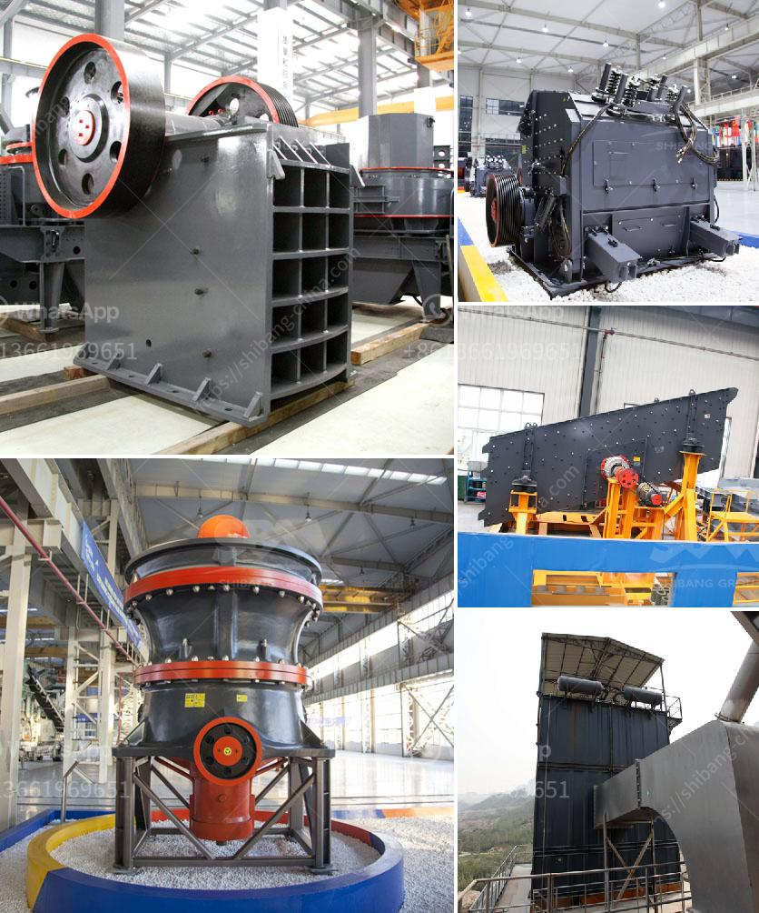

<h3>كسارة مخروطية في الشرق الأوسط</h3>
تعتبر الكسارات المخروطية من أهم المعدات في صناعة التعدين والبناء، حيث تستخدم لسحق الصخور الكبيرة إلى حجم صغير يمكن استخدامه في العديد من التطبيقات المختلفة. وتعتبر الشرق الأوسط واحدة من أبرز المناطق التي تستخدم هذه الكسارات بكثرة.

تتميز الكسارة المخروطية بقدرتها على سحق المواد بفعالية وسرعة عالية. فهي تتكون من جزء علوي ثابت (رئيس الكسارة) وجزء سفلي متحرك (المخروط)، حيث يتم تحريك المخروط بواسطة عمود المحرك. وعندما تدخل المواد في الكسارة، فإنها تتعرض لقوة الضغط والتوتر من المخروط، مما يؤدي إلى تفتيتها وتحويلها إلى حصى صغيرة.

من المميزات الرئيسية للكسارة المخروطية هي قدرتها على سحق مواد مختلفة بمستويات صلابة مختلفة. وهذا يعني أنها يمكن أن تستخدم لسحق العديد من المواد مثل الحجر الجيري، والجرانيت، والبازلت، والرخام، والرمل، والحصى وغيرها.

وتُستخدم الكسارات المخروطية بكثرة في الشرق الأوسط في عدة قطاعات. على سبيل المثال، تُستخدم في صناعة التعدين لاستخراج المعادن من باطن الأرض، حيث يتم سحق الصخور الكبيرة لاستخلاص الأحجار النفيسة مثل الذهب والفضة والنحاس. كما تستخدم في صناعة البناء لسحق الصخور وتحويلها إلى مواد بناء مثل الركام والحجر المكسر.

وتعتبر الكسارات المخروطية ذات أهمية كبيرة في تعزيز التنمية الاقتصادية في المنطقة. فقط مع وجود التكنولوجيا والمعدات المناسبة يمكن تحقيق نتائج فعالة في صناعة التعدين والبناء. وبالتالي، توفر الكسارات المخروطية المتطورة فرص عمل للمهندسين والعمال المهرة في الشرق الأوسط، وتسهم في تطوير الصناعة وتعزيز الاستقرار الاقتصادي في المنطقة.

على الرغم من الفوائد العديدة، يتطلب استخدام الكسارات المخروطية الاهتمام بالصيانة الدورية والسليمة لضمان عملية تشغيل فعالة وتجنب أي مشاكل تقنية. ومن المهم أن تتم المتابعة المنتظمة لتأكيد عمل الكسارة وضمان جودة المواد المستخرجة.

في الختام، يمكن القول أن الكسارات المخروطية تلعب دورًا حيويًا في صناعة التعدين والبناء في الشرق الأوسط. فهي تساهم في توفير المواد الأساسية للبناء وتحقيق التنمية الاقتصادية في المنطقة. ومع استمرار التطور التكنولوجي، يتوقع أن يزداد الاعتماد على هذه الكسارات في المستقبل في الشرق الأوسط وفي جميع أنحاء العالم.
<h3>Contact us</h3><ul><li><strong>Whatsapp:&nbsp;<a href="https://wa.me/8613661969651">+8613661969651</a></strong></li><li><a href="https://swt.shibang-china.com/?git&amp;zhl&amp;كسارة مخروطية في الشرق الأوسط"><strong>Online Service(chat now)</strong></a></li></ul><h3>Related</h3><ul><li><a href='كسارات الصخور للبيع.md'>كسارات الصخور للبيع</a></li><li><a href='شركات تصنيع آلات الكسارة في باكستان.md'>شركات تصنيع آلات الكسارة في باكستان</a></li><li><a href='مصنع كرة متنقل من ألمانيا.md'>مصنع كرة متنقل من ألمانيا</a></li><li><a href='مصنع تكسير المحاجر الكامل في جنوب أفريقيا.md'>مصنع تكسير المحاجر الكامل في جنوب أفريقيا</a></li><li><a href='آلات تصنيع الرمل في الصين.md'>آلات تصنيع الرمل في الصين</a></li></ul>