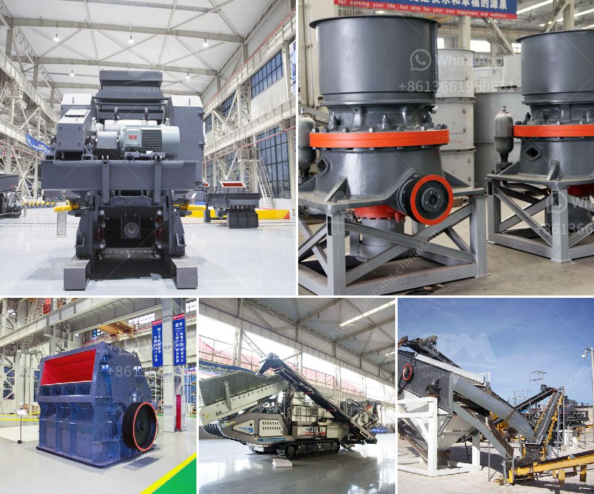

<h3>كسارة مخروطية في المملكة العربية السعودية</h3>
تُعد الكسارة المخروطية واحدة من أهم المعدات في صناعة التعدين والتكسير في المملكة العربية السعودية. تستخدم هذه الكسارة في تكسير الصخور والمواد الخام الصلبة إلى قطع أصغر حجماً، مما يُسهم في تحسين عمليات الإنتاج وزيادة الإنتاجية للمناجم ومواقع البناء.

تتكون الكسارة المخروطية من هيكل خارجي يحتوي على حجرة تغذية ومدخل للمواد الخام. وعند دخول المواد إلى الحجرة، تتم عملية التكسير بواسطة حركة القاطعة الدوارة المتبادلة بين الصخور والقاعدة المعدنية. تتميز الكسارات المخروطية بتقسيم المواد إلى حملة وغرامة، حيث يتم تعديل المسافة بين الغطاء وقعر الحجرة للتحكم في حجم الإخراج.

من أبرز مزايا الكسارة المخروطية في المملكة العربية السعودية هو أداءها الموثوق وكفاءتها العالية في تكسير الصخور بشكل نهائي ودقيق. كما تتميز بأداء عالٍ في عمليات التكسير الثانوي والتكسير الثلاثي، ما يسهم في زيادة إنتاجية المناجم وتحسين جودة المواد الناتجة.

تعد المملكة العربية السعودية من أبرز المناطق الصخرية في العالم، حيث تتواجد بها موارد طبيعية غنية من الصخور والمواد الخام. وبفضل استخدام الكسارات المخروطية في هذه المناطق، تتمكن المملكة من استخراج وتكسير الصخور وتحويلها إلى مواد قابلة للاستخدام في مختلف الصناعات.

علاوة على ذلك، تتميز الكسارات المخروطية بسهولة الصيانة والتشغيل، مما يساهم في خفض تكاليف التشغيل وزيادة فترة الخدمة الافتراضية للمعدات. كما أنها مصممة بشكل يسهل نقلها وتركيبها في الموقع وفقًا لمتطلبات المشروعات.

يمكن استخدام الكسارات المخروطية في العديد من المجالات، بما في ذلك صناعة الركام، والبناء، وصناعة التعدين، والصناعات الأخرى التي تتطلب تدمير المواد الصخرية. وتقدم المملكة العربية السعودية فرصًا كبيرة للاستثمار في هذه الصناعة، حيث تعتبر المنطقة الشرقية والشمالية من أهم المناطق المتاحة للاستغلال التعديني في المملكة.

في النهاية، تلعب الكسارة المخروطية دورًا حيويًا في صناعة التعدين والتكسير في المملكة العربية السعودية. فهي تساعد في تحقيق الإنتاجية العالية وتعزيز عمليات الإنتاج، مما يسهم في تطور صناعة التعدين وتعزيز الاقتصاد الوطني للمملكة.
<h3>Contact us</h3><ul><li><strong>Whatsapp:&nbsp;<a href="https://wa.me/8613661969651">+8613661969651</a></strong></li><li><a href="https://swt.shibang-china.com/?git&amp;zhl&amp;كسارة مخروطية في المملكة العربية السعودية"><strong>Online Service(chat now)</strong></a></li></ul><h3>Related</h3><ul><li><a href='مطحنة كبيرة القدرة في ماليزيا.md'>مطحنة كبيرة القدرة في ماليزيا</a></li><li><a href='نموذج عملي لكسارة الحجر.md'>نموذج عملي لكسارة الحجر</a></li><li><a href='أسعار الشاشات الاهتزازية.md'>أسعار الشاشات الاهتزازية</a></li><li><a href='كسارة بوزولانا الماليزية.md'>كسارة بوزولانا الماليزية</a></li><li><a href='آلة فصل خام النحاس.md'>آلة فصل خام النحاس</a></li></ul>