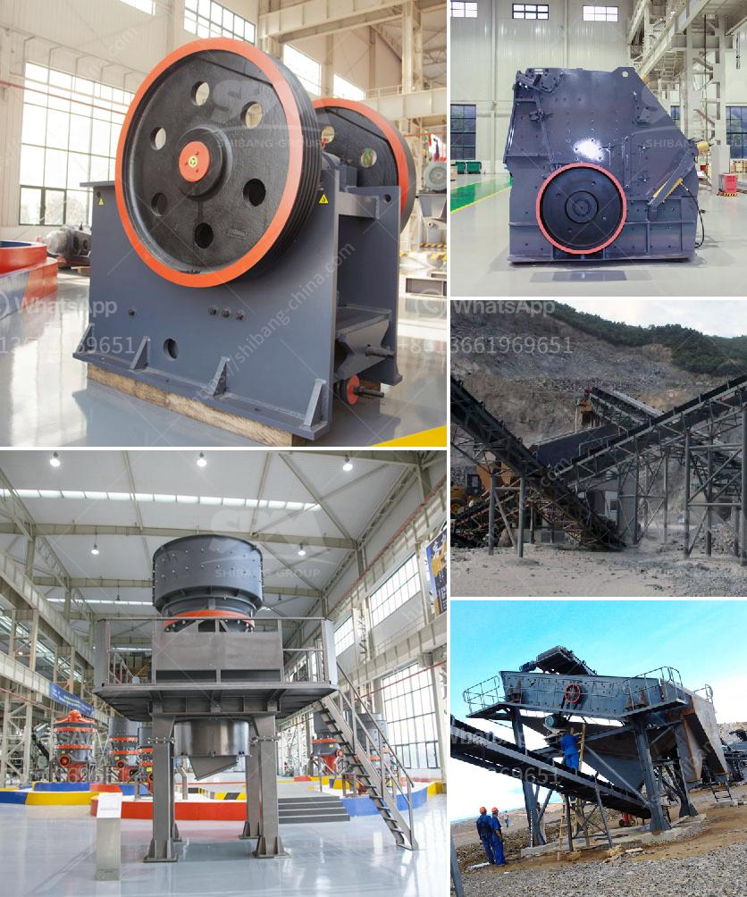

<h3>كسارة مخروطية قياسية دليل الإصلاح</h3>
تعتبر الكسارة المخروطية القياسية أحد الأدوات الرئيسية المستخدمة في صناعة التعدين والبناء، حيث تستخدم لسحق الصخور والمواد الصلبة الأخرى إلى حجم قابل للتعامل والتصدير. تعتبر هذه الكسارة أكثر كفاءة واستدامة من سحق يدوي للمواد، بالإضافة إلى أنها توفر العديد من الفوائد.

إحدى الفوائد الرئيسية للكسارة المخروطية القياسية هي توفير الوقت والجهد. فبدلاً من القيام بعملية السحق يدويًا، يمكن للكسارة المخروطية القياسية استكمال هذه العملية بشكل فعال وسريع. كما أنها تعمل بفاعلية في سحق المواد الصلبة مثل الصخور والحصى والخامات المعدنية، وتحقق نسبة استرداد عالية.

علاوة على ذلك، توفر الكسارة المخروطية القياسية إرشادات الإصلاح الضرورية للحفاظ على أداء الماكينة على أعلى مستوى. يشتمل دليل الإصلاح على معلومات حول كيفية التحقق من أجزاء الكسارة ومراقبة حالتها وإجراء الصيانة الوقائية. فهو يوفر تحديدًا للمشكلات الشائعة التي يمكن أن تحدث مع الكسارة وكيفية إصلاحها بسرعة وفعالية.

أيضًا، تحتوي الكسارة المخروطية القياسية على بعض المميزات الفريدة التي تعزز كفاءتها. على سبيل المثال، فإن تصميمها الهندسي الدقيق يسهل عملية السحق ويحسن كفاءتها. كما أنها مجهزة بنظام تشحيم متطور يحافظ على تشغيلها السلس دون حدوث تلف. تتوفر الكسارة المخروطية القياسية بأحجام مختلفة تتراوح بين 200-400 واط، مما يمكن المستخدمين من اختيار الحجم المناسب وفقًا لاحتياجاتهم المحددة.

في الختام، فإن الكسارة المخروطية القياسية تعتبر أحد الأدوات القوية والفعالة في صناعة التعدين والبناء. تساعد في سحق المواد الصلبة بكفاءة عالية وبسهولة وتوفر دليل الإصلاح الذي يسهل عملية الصيانة والاستخدام. إذا كنت تبحث عن تحسين إنتاجيتك وتقليل التكاليف، فإن استخدام الكسارة المخروطية القياسية سوف يكون خيارًا رائعًا لك.
<h3>Contact us</h3><ul><li><strong>Whatsapp:&nbsp;<a href="https://wa.me/8613661969651">+8613661969651</a></strong></li><li><a href="https://swt.shibang-china.com/?git&amp;zhl&amp;كسارة مخروطية قياسية دليل الإصلاح"><strong>Online Service(chat now)</strong></a></li></ul><h3>Related</h3><ul><li><a href='معدات تعدين الرمال والحصى للبيع.md'>معدات تعدين الرمال والحصى للبيع</a></li><li><a href='كسارة محمولة تريمان.md'>كسارة محمولة تريمان</a></li><li><a href='آلة تكسير وطحن مناجم الذهب.md'>آلة تكسير وطحن مناجم الذهب</a></li><li><a href='كسارة الكرةست في كينيا صنعت في الصين.md'>كسارة الكرةست في كينيا صنعت في الصين</a></li><li><a href='كم تكلفة بناء مصنع الأسمنت بسعة 100 طن.md'>كم تكلفة بناء مصنع الأسمنت بسعة 100 طن</a></li></ul>