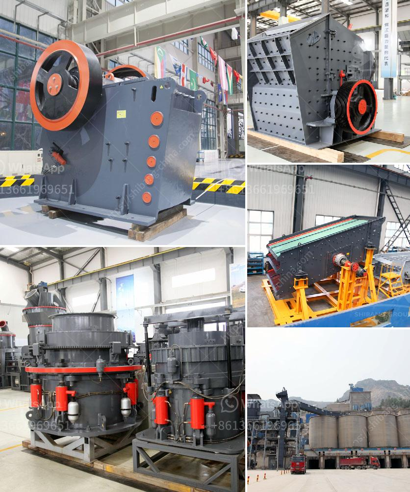

<h3>كسارة مخروطية قياسية قدم</h3>
الكسارة المخروطية القياسية هي جهاز ميكانيكي مهم في صناعة التعدين والبناء. تعتبر الكسارة المخروطية واحدة من أهم الأدوات التي يستخدمها المهندسون في عملية تكسير المواد الصلبة.

تتكون الكسارة المخروطية القياسية من جسم مخروطي مع وجود فجوة بين السطح الخارجي للجسم والغلاف الثابت المحيط به. يعود تصميم الكسارة المخروطية القياسية إلى القرن التاسع عشر ومنذ ذلك الحين تم تطويرها لتلبية متطلبات الصناعة المتغيرة.

يتم استخدام الكسارة المخروطية القياسية لسحق المواد الصلبة مثل الحجر والجرانيت والرمل والحصى والدولوميت والخامات المعدنية الأخرى. تعتبر الكسارة المخروطية القياسية خيارًا ممتازًا للشركات التعدينية الكبرى وشركات البناء الكبيرة.

تتميز الكسارة المخروطية القياسية بعدة مزايا. أولاً وقبل كل شيء، فإنها توفر قوة كسر عالية وكفاءة استخدام عالية. بفضل تصميمها المتقدم وقدرة الدخول العالية، يمكن للكسارة المخروطية القياسية سحق المواد بشكل فعال وسريع.

ثانياً، توفر الكسارة المخروطية القياسية توزيعًا متساويًا للحبيبات المكسورة. هذا يعني أن المواد المكسورة ستكون لها أحجام متنوعة، مما يتيح استخدامها في تطبيقات متنوعة. بفضل هذه الخاصية، يمكن استخدام المواد المكسورة في البناء لتعزيز الخرسانة أو في الصناعات الأخرى.

ثالثاً، تعمل الكسارة المخروطية القياسية بطريقة بسيطة ويسهل صيانتها. يمكن للمشغلين صيانة الكسارة بشكل منتظم بسهولة وباستخدام قطع الغيار المتوفرة بسهولة في السوق. بفضل هذه الخاصية، فإن الكسارة المخروطية القياسية تعتبر اختيارًا اقتصاديًا للشركات وتقلل من تكاليف التشغيل والصيانة.

في الختام، تعتبر الكسارة المخروطية القياسية جهازًا ممتازًا في صناعة التعدين والبناء. تقدم الكسارة قوة كسر عالية وتوزيعًا متساويًا للحبيبات المكسورة وعملية صيانة سهلة. بفضل هذه الميزات، يمكن استخدام الكسارة المخروطية القياسية في العديد من التطبيقات وتحقيق أداء متميز.
<h3>Contact us</h3><ul><li><strong>Whatsapp:&nbsp;<a href="https://wa.me/8613661969651">+8613661969651</a></strong></li><li><a href="https://swt.shibang-china.com/?git&amp;zhl&amp;كسارة مخروطية قياسية قدم"><strong>Online Service(chat now)</strong></a></li></ul><h3>Related</h3><ul><li><a href='سعر كسارة الزحف المتنقلة.md'>سعر كسارة الزحف المتنقلة</a></li><li><a href='قمع التفريغ لمطحنة الكرة.md'>قمع التفريغ لمطحنة الكرة</a></li><li><a href='عملية كربونات الكالسيوم المترسبة.md'>عملية كربونات الكالسيوم المترسبة</a></li><li><a href='كسارة الفك في مصنع معالجة البوكسيت.md'>كسارة الفك في مصنع معالجة البوكسيت</a></li><li><a href='خط إنتاج التلك.md'>خط إنتاج التلك</a></li></ul>