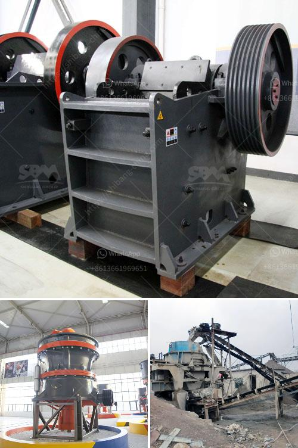

<h3>كسارة مخروطية قياسية</h3>
تعتبر الكسارة المخروطية قياسية واحدة من أهم الأدوات المستخدمة في صناعة التعدين والبناء. تعمل الكسارة المخروطية على طحن الصخور والمواد الصلبة الأخرى بواسطة ضغط كبير واحتكاك بين الأسطوانة المخروطية الداخلية وقطعة التكسير الخارجية التي تسمى الكأس، مما يساعد على تكسير المواد إلى قطع صغيرة ومتجانسة.

تتألف الكسارة المخروطية القياسية من جسم مخروطي يقع في الجزء العلوي من الكسارة، حيث تتم عملية التغذية للمواد المراد طحنها. بينما يوجد في الجزء السفلي من الكسارة محطم ثانوي يعمل على تكسير الصخور بعد عملية الطحن الأولية. تعمل الكسارة عن طريق تدفق المواد داخل الجسم المخروطي، حيث يتم تحويل الحركة الدورانية إلى حركة خطية من خلال قطعة التكسير الخارجية المثبتة حول الأسطوانة الداخلية. وعندما تدخل المواد داخل الكسارة، يحدث تكسيرها تحت تأثير الضغط الكبير الناتج عن حركة التدفق وتحريك الأسطوانة.

تتميز الكسارة المخروطية بقدرتها على معالجة الصخور ذات الصلابة المتوسطة والعالية بفعالية، كما أنها قادرة على طحن مواد متنوعة مثل الحجر الجيري والجرانيت والرخام والديكورات والحصى. بالإضافة إلى ذلك، الكسارة المخروطية تتميز بأنها تعمل بكفاءة عالية وبطريقة صامتة مقارنة بأنواع كسارات أخرى، كما أن صيانتها سهلة نسبياً وتحتاج إلى تكلفة صيانة أقل.

بالنظر إلى المواد السائدة في الصناعة الحديثة، فإن الكسارة المخروطية القياسية جهاز أساسي للعديد من المشروعات. فهي توفر تكلفة إنتاج منخفضة وجودة عالية للمنتج النهائي، كما أنها تساهم في تحقيق الاستدامة وحماية البيئة من خلال استخدام أساليب تكسير المواد الحديثة والفعالة.

في الختام، الكسارة المخروطية قياسية هي جهاز هام في صناعة التعدين والبناء، وتستخدم لطحن الصخور والمواد الصلبة الأخرى. تتميز هذه الكسارة بكفاءة عالية، وصيانة سهلة، وتوفير تكلفة إنتاج منخفضة. تعتبر الكسارة المخروطية القياسية أداة لا غنى عنها في مختلف المشروعات الكبرى.
<h3>Contact us</h3><ul><li><strong>Whatsapp:&nbsp;<a href="https://wa.me/8613661969651">+8613661969651</a></strong></li><li><a href="https://swt.shibang-china.com/?git&amp;zhl&amp;كسارة مخروطية قياسية"><strong>Online Service(chat now)</strong></a></li></ul><h3>Related</h3><ul><li><a href='شركة تصنيع كسارة في جوجارات.md'>شركة تصنيع كسارة في جوجارات</a></li><li><a href='آلة كسارة الحجر الصينية.md'>آلة كسارة الحجر الصينية</a></li><li><a href='سعر تكسير الخرسانة في جنوب أفريقيا.md'>سعر تكسير الخرسانة في جنوب أفريقيا</a></li><li><a href='مصنع غسيل الماس في جنوب أفريقيا.md'>مصنع غسيل الماس في جنوب أفريقيا</a></li><li><a href='سعر مطحنة الكرة في نيجيريا.md'>سعر مطحنة الكرة في نيجيريا</a></li></ul>