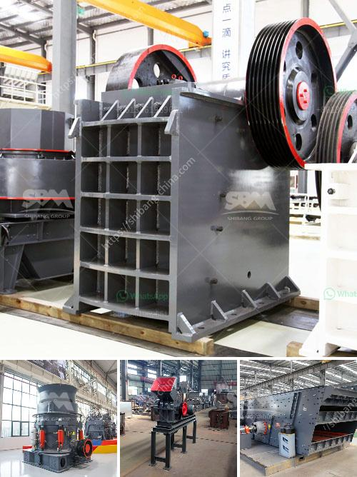

<h3>كسارة مخروطية للبيع في جنوب أفريقيا</h3>
تعتبر الكسارة المخروطية واحدة من أهم الآلات المستخدمة في صناعة التعدين ومعالجة المواد. وتشتهر جنوب أفريقيا بوفرة الموارد المعدنية المتنوعة، مما يعني أن هناك طلبًا متزايدًا على آلات التكسير والطحن في البلد. ومن بين هذه الأجهزة المستخدمة، تأتي الكسارة المخروطية على رأس القائمة.

توفر الكسارة المخروطية تكسيرًا فعالًا ودقيقًا للمواد الخام بفضل تصميمها الفريد وكفاءتها العالية. تستخدم الكسارات المخروطية لسحق مجموعة متنوعة من المواد، بدءًا من الصخور الصلبة إلى خامات المعادن، مثل خامات الذهب والماس ومنتجات الفحم والبوكسيت والكوارتز. وبالإضافة إلى ذلك، فإن الكسارات المخروطية يمكن استخدامها أيضًا في صناعة البناء والبناء والتشييد، حيث يمكنها سحق الحصى والرمل والخرسانة والأحجار لإنتاج مواد البناء.

في جنوب أفريقيا، تتوفر العديد من الشركات والمصانع التي تقدم الكسارات المخروطية للبيع. وتتنوع خيارات الكسارات المخروطية في الأحجام والمستويات المختلفة من التكسير والإنتاج، مما يتيح للمشترين الاختيار المناسب بناءً على احتياجاتهم ومتطلباتهم الفردية.

بالنسبة لكسارات المخروطية المتاحة في جنوب أفريقيا، يمكن العثور على آلات ذات قدرات إنتاج مختلفة، مثل الكسارة المخروطية الصغيرة التي يمكن استخدامها في العديد من التطبيقات الصغيرة والمتوسطة الحجم. وبالإضافة إلى ذلك، يتوفر أيضًا العديد من الكسارات المخروطية الكبيرة في السوق.

عند الشراء، هناك عوامل مهمة يجب مراعاتها. أحدها هو السعر، حيث يجب التأكد من أنها تلبي الميزانية المتاحة وتقدم أفضل قيمة ممكنة للمشتري. بالإضافة إلى ذلك، يجب مراجعة المواصفات الفنية للكسارة المخروطية، مثل قدرة الإنتاج وحجم التغذية القصوى والضغط والمزيد. كما يجب التحقق من سمعة الشركة المصنعة وأداء آلاتها.

باختصار، تعتبر الكسارة المخروطية خيارًا ممتازًا للبيع في جنوب أفريقيا لاحتياجات التعدين ومعالجة المواد. مع تشكيلة واسعة من الكسارات المتاحة، يسهل العثور على الجهاز المناسب للاحتياجات المحددة. وبفضل تقنية التكسير المبتكرة والكفاءة العالية، يمكن للكسارات المخروطية دعم صناعة التعدين في جنوب أفريقيا وتلبية احتياجاتها المستمرة في مجال التكسير والطحن.
<h3>Contact us</h3><ul><li><strong>Whatsapp:&nbsp;<a href="https://wa.me/8613661969651">+8613661969651</a></strong></li><li><a href="https://swt.shibang-china.com/?git&amp;zhl&amp;كسارة مخروطية للبيع في جنوب أفريقيا"><strong>Online Service(chat now)</strong></a></li></ul><h3>Related</h3><ul><li><a href='مصنع معالجة التنغستن في الهند.md'>مصنع معالجة التنغستن في الهند</a></li><li><a href='مصنع تكسير الحجر الجيري في الهند.md'>مصنع تكسير الحجر الجيري في الهند</a></li><li><a href='آلات إنتاج الجبس.md'>آلات إنتاج الجبس</a></li><li><a href='صيانة محطة توليد الفحم بصيغة PDF.md'>صيانة محطة توليد الفحم بصيغة PDF</a></li><li><a href='كسارة أسطوانية للحجر الجيري.md'>كسارة أسطوانية للحجر الجيري</a></li></ul>