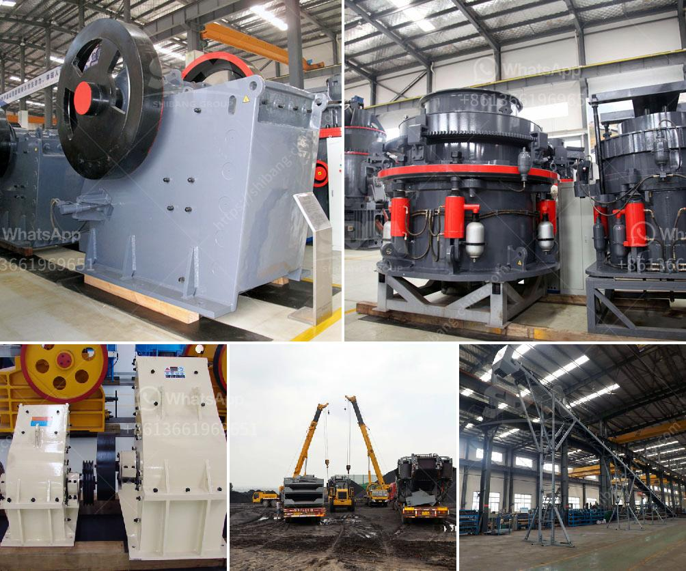

<h3>كسارة مخروطية للبيع</h3>
تعتبر الكسارة المخروطية من أهم الأدوات في صناعة التعدين والبناء، حيث يتم استخدامها بشكل واسع في سحق المواد الصلبة والصخور وتحويلها إلى جزيئات أصغر. وبالتالي، تساعد هذه الكسارات في استخراج المواد الخام بشكل فعال وزيادة كفاءة عمليات الإنتاج.

إذا كنت تبحث عن كسارة مخروطية للبيع، فإنه يتوجب عليك مراعاة العديد من العوامل المهمة التي تؤثر على أداء الجهاز وجودته. ومن أبرز هذه العوامل هي القدرة الإنتاجية للكسارة ومدى تحملها للضغوط والتأثيرات الخارجية، بالإضافة إلى مدى الدقة والتحكم الذي توفره في عملية التكسير. 

تتوفر الكسارات المخروطية بعدة أحجام ونماذج مختلفة، وتختلف في نسبة تكسير المواد وحجم الجزيئات الناتجة. ويمكن أن تتراوح القدرة الإنتاجية للكسارات المخروطية بين 50 إلى أكثر من 1000 طن في الساعة، وفقًا لحجم الماكينة والمواد المطحونة. 

تتميز الكسارة المخروطية بعدة مزايا تجعلها الخيار المثالي للعديد من المشاريع الكبيرة. أحد هذه المزايا هو قدرتها على التكيف مع مختلف أنواع المواد، سواء كانت الحجارة الصلبة أو الصخور. كما أن الكسارات المخروطية تمتاز بكفاءتها العالية في سحق المواد بشكل متساوٍ ومنتظم، مما يقلل من فقدان الطاقة ويحسن جودة المواد الناتجة.

إضافةً إلى ذلك، فإن الكسارات المخروطية تحتوي على نظام تعديل الفجوة الذاتي، الذي يسمح بضبط حجم الفجوة بين الجزء الثابت والمتحرك من الجهاز. وهذا يسمح بتكييف الكسارة مع مواد مختلفة ذات خصائص مختلفة، وبالتالي، يمكن تحقيق حد أدنى من تكسير المواد الزائدة والمرغوبة.

في النهاية، فإن البحث عن كسارة مخروطية للبيع يتطلب دراسة مستفيضة واختيار الجهاز الذي يناسب احتياجاتك ومتطلباتك بأفضل شكل ممكن. يجب النظر في القدرة الإنتاجية، وجودة المواد والتحمل، والدقة، وسهولة الصيانة والاستخدام، بالإضافة إلى تحديد الميزانية المتاحة والتشاور مع الخبراء في هذا المجال. إذا تم اتخاذ القرار الصحيح وتم شراء الكسارة المخروطية المناسبة، فإنها ستكون استثمارًا مفيدًا ومجدًا لمشروعك وسيتم تحقيق العديد من المزايا والفوائد لسنوات قادمة.
<h3>Contact us</h3><ul><li><strong>Whatsapp:&nbsp;<a href="https://wa.me/8613661969651">+8613661969651</a></strong></li><li><a href="https://swt.shibang-china.com/?git&amp;zhl&amp;كسارة مخروطية للبيع"><strong>Online Service(chat now)</strong></a></li></ul><h3>Related</h3><ul><li><a href='إنتاج مطحنة الأسمنت في أفريقيا.md'>إنتاج مطحنة الأسمنت في أفريقيا</a></li><li><a href='محطم الحجر الجيري روتور.md'>محطم الحجر الجيري روتور</a></li><li><a href='سعر فحص الرمل بسعة كبيرة للبيع.md'>سعر فحص الرمل بسعة كبيرة للبيع</a></li><li><a href='معدات طحن الرماد الخشن.md'>معدات طحن الرماد الخشن</a></li><li><a href='مصنع تكسير الخرسانة في تركيا.md'>مصنع تكسير الخرسانة في تركيا</a></li></ul>