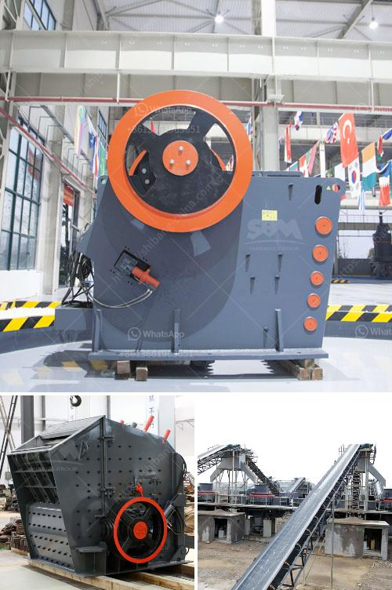

<h3>كسارة مخروطية لنيجيريا</h3>
الكسارة المخروطية هي أحد أهم المعدات المستخدمة في صناعة التعدين والبناء، وتعد نيجيريا واحدة من البلدان التي تهتم بتلك الصناعة وتملك تحت باطنها موارد غنية من المواد الخام. تلعب الكسارة المخروطية دورًا حيويًا في استخراج وتكسير الصخور والمعادن، وتحويلها إلى حجم مناسب للاستخدام في عدة مجالات مثل البناء والطرق والتشييد والتعدين.

تمتاز الكسارة المخروطية بتصميمها المبتكر وهي تعمل عن طريق الضغط، حيث يتم تحويل الصخور إلى حجم أصغر باستخدام طاحونة دوارة محورية وغرفة سحق. يتم دفع المواد إلى الداخل وتتحرك المكونات الدوارة لتسحق الصخور وتقليل حجمها. تختلف آليات الكسارة المخروطية في حجم الفتحة وشكل الجدار السحق، مما يتيح تحقيق مجموعة متنوعة من الأحجام والتكوينات المطلوبة.

في نيجيريا، تمثل الكسارات المخروطية جزءًا هامًا من صناعة التعدين والبناء الناشئة. فهي تستخدم بشكل واسع في تكسير الصخور والمعادن مثل الجرانيت والحجر الجيري وخام الحديد والذهب والفحم. توفر الكسارات المخروطية المعدلات العالية للتكسير والإنتاجية الفائقة، مما يعزز إمكانية زيادة الإنتاج وتحقيق الربحية المثلى لشركات التعدين.

تعمل شركات تصنيع الكسارات المخروطية في نيجيريا جاهدة لتقديم تقنيات حديثة ومبتكرة لتحسين الأداء وتحديث المعدات. توفر الكسارات المخروطية التكنولوجيا والكفاءة في عمليات التكسير، مع الاهتمام بتقليل الانبعاثات والتأثير على البيئة. تمتاز هذه الكسارات بقدرتها على التكيف مع مجموعة واسعة من المواد الخام وتحقيق الإنتاجية الممتازة بتكلفة منخفضة.

بالنظر إلى مستقبل صناعة التعدين والبناء في نيجيريا، يلعب استخدام الكسارة المخروطية دورًا حيويًا في تعزيز النمو الاقتصادي وتحقيق التنمية المستدامة للبلاد. يعتمد الاستخدام المفضل للكسارات المخروطية على تطور صناعة البناء والتعدين في نيجيريا والطلب المتزايد على المواد الخام والمنتجات. لذا، يجب على الحكومة النيجيرية والجهات المعنية في الصناعة توفير الدعم اللازم والتشجيع للاستثمار في تلك المعدات، وتعزيز التعاون والشراكات مع الشركات العالمية المتخصصة في تصنيع الكسارات المخروطية.

لا شك أن الكسارة المخروطية ستستمر في تطورها وتقدمها التكنولوجي في نيجيريا، مما يساهم في تعزيز صناعة التعدين والبناء وتوفير فرص العمل والنمو الاقتصادي. تعتبر تلك المعدات استثمارًا استراتيجيًا يجب الاهتمام به لتحقيق الاستدامة والازدهار في القطاع الصناعي في نيجيريا.
<h3>Contact us</h3><ul><li><strong>Whatsapp:&nbsp;<a href="https://wa.me/8613661969651">+8613661969651</a></strong></li><li><a href="https://swt.shibang-china.com/?git&amp;zhl&amp;كسارة مخروطية لنيجيريا"><strong>Online Service(chat now)</strong></a></li></ul><h3>Related</h3><ul><li><a href='آلات غسيل الفحم.md'>آلات غسيل الفحم</a></li><li><a href='إنتاج مطحنة الأسمنت في أفريقيا.md'>إنتاج مطحنة الأسمنت في أفريقيا</a></li><li><a href='مشغل مصنع كسارة في كسارة.md'>مشغل مصنع كسارة في كسارة</a></li><li><a href='مورد آلة كسارة الأسطوانة.md'>مورد آلة كسارة الأسطوانة</a></li><li><a href='آلات كسارة الحجر في ماليزيا.md'>آلات كسارة الحجر في ماليزيا</a></li></ul>