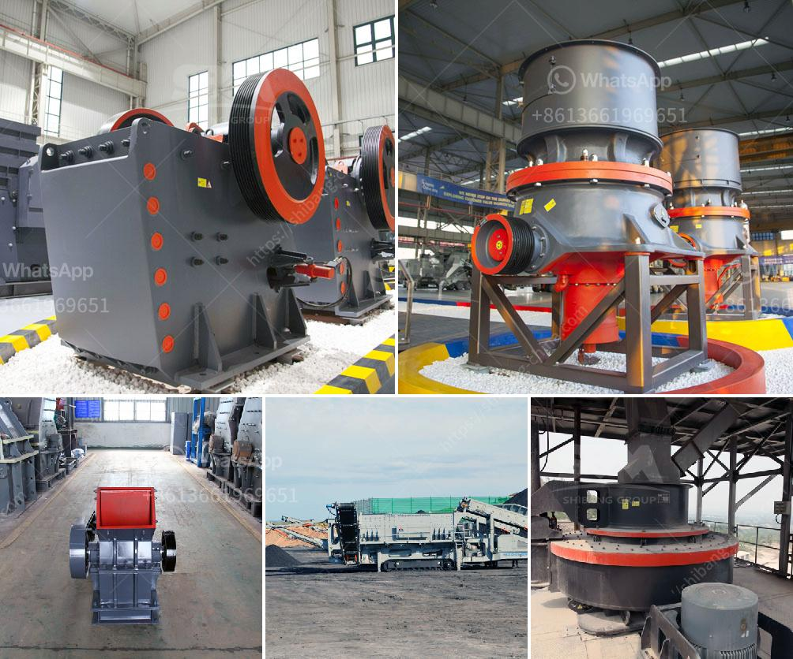

<h3>كسارة مخروطية</h3>
تعتبر الكسارة المخروطية واحدة من أهم الأدوات في صناعة التعدين والبناء، حيث يتم استخدامها لتكسير وسحق المواد الخام الكبيرة إلى قطع صغيرة يمكن استخدامها في عملية البناء أو التصنيع الصناعي. تتوفر الكسارة المخروطية بمجموعة متنوعة من الأحجام والقدرات، لكن النموذج الشائع والأكثر استخدامًا هو الكسارة المخروطية بسعة من 200 إلى 400 طن في الساعة.

تتكون الكسارة المخروطية من جزئين رئيسيين، وهما جسم الكسارة والجزء المتحرك من الكسارة المعروف بالمخروط. يتم تغذية المواد الخام إلى الكسارة من خلال الجزء العلوي من المخروط، حيث تتمركز آلية الضغط التي تقوم بضغط المواد الخام وتكسيرها بين اللوح العلوي واللوح السفلي في جسم الكسارة.

يتم تشغيل الكسارة المخروطية عن طريق محرك كهربائي يدور الجزء المتحرك من الكسارة بسرعة عالية. ويتم ضبط فتحة الخروج من خلال آلية تعديل الجزء المتحرك من الكسارة، مما يسمح بتحديد الحجم المطلوب للمنتج النهائي.

تتميز الكسارة المخروطية بعدة مزايا، حيث تعتبر عملية وفعالة في تكسير المواد الصلبة والكبيرة بفضل تصميمها الفريد وفعالية الأداء. وبفضل هيكلها المتين والقوي، فإن الكسارة المخروطية تتحمل الأحمال الثقيلة وتعمل بشكل مستقر لفترات طويلة من الزمن.

بالإضافة إلى ذلك، تعد الكسارة المخروطية سهلة الصيانة والتشغيل. يمكن إجراء عمليات الصيانة الروتينية بسهولة، مما يساهم في تحسين كفاءة العملية وزيادة عمر الكسارة. كما أن تكلفة التشغيل معتدلة ومقبولة بالنسبة لقدرتها الكبيرة على إنتاج المواد المسحوقة بكفاءة.

في الختام، تعد الكسارة المخروطية أداة هامة في صناعة التعدين والبناء. بفضل تصميمها القوي والفعال وسهولة صيانتها وتشغيلها، فإنها تتيح للشركات تحقيق مستوى عالٍ من الإنتاجية والجودة. بالإضافة إلى ذلك، تتمتع الكسارة المخروطية بالعديد من المزايا مثل الكفاءة والاستدامة والاقتصادية، مما يجعلها خيارًا مثاليًا لمختلف الصناعات المتعلقة بتكسير وسحق المواد.
<h3>Contact us</h3><ul><li><strong>Whatsapp:&nbsp;<a href="https://wa.me/8613661969651">+8613661969651</a></strong></li><li><a href="https://swt.shibang-china.com/?git&amp;zhl&amp;كسارة مخروطية"><strong>Online Service(chat now)</strong></a></li></ul><h3>Related</h3><ul><li><a href='وحدة معالجة الحجر الجيري بالمنغنيز.md'>وحدة معالجة الحجر الجيري بالمنغنيز</a></li><li><a href='الفرق بين مطاحن الكرة وكسارة الفك.md'>الفرق بين مطاحن الكرة وكسارة الفك</a></li><li><a href='سعر كسارة الطاحونة الصناعية.md'>سعر كسارة الطاحونة الصناعية</a></li><li><a href='آلة مطحنة المطارق.md'>آلة مطحنة المطارق</a></li><li><a href='معدات معالجة الحجر الكاملة محطم 100 طن.md'>معدات معالجة الحجر الكاملة محطم 100 طن</a></li></ul>