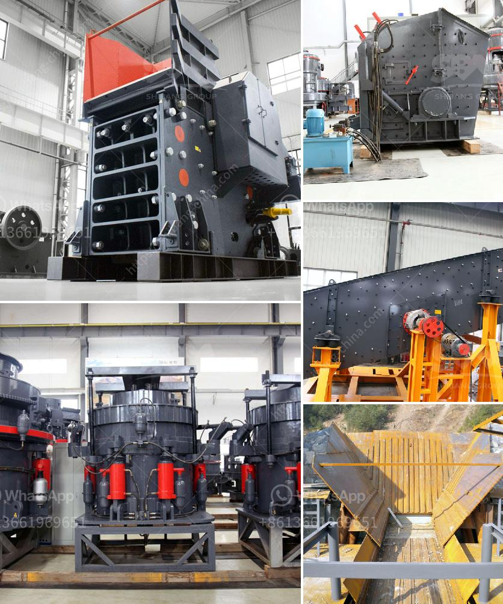

<h3>كسارة مستعملة للبيع في تنزانيا</h3>
تنزانيا هي واحدة من الدول الواعدة في شرق أفريقيا، وهي تعتبر واحدة من الوجهات الرائجة لرجال الأعمال والمستثمرين في القارة السمراء. تشتهر تنزانيا بمواردها الطبيعية الغنية ومنها المعادن والمواد البنائية. وفي هذا السياق، تعتبر الكسارات من بين أهم الآلات والمعدات المستخدمة في صناعة البناء والتشييد.

في العديد من المشاريع الكبيرة والصغيرة في تنزانيا، يتطلب استخدام الكسارات لتكسير الصخور والأحجار الكبيرة للاستفادة منها في إنتاج الرمل والحصى والركام، وذلك لاستخدامها في مجالات مختلفة مثل البناء والطرق والأعمال العامة. بالإضافة إلى ذلك، فإن الكسارات المستعملة تعتبر خيارًا اقتصاديًا للكثير من المقاولين وأصحاب الأعمال في تنزانيا.

للبيع في تنزانيا، يمكن العثور على العديد من الكسارات المستعملة التي تتراوح أسعارها بين 200 و400 ألف شلن تنزاني. تتوفر هذه الكسارات بأحجام وسعات مختلفة ويمكن تخصيصها وفقًا لاحتياجات المشروع المحدد. فبفضل توفر الكسارات المستعملة، يمكن للمستثمرين والمقاولين توفير الكثير من التكاليف والوقت الضائع في شراء الكسارات الجديدة.

يُعتبر شراء كسارة مستعملة في تنزانيا خيارًا ذكيًا للعديد من الأسباب. فعلى الرغم من أنها قد تكون مستعملة، إلا أنها غالبًا ما تكون في حالة جيدة وقادرة على القيام بالمهام المطلوبة. من جانب آخر، يمكن الاعتماد على توفر قطع الغيار والصيانة للكسارات المستعملة، حيث تكون قطع الغيار أرخص وأسهل في الحصول عليها مقارنة بالمعدات الجديدة.

عند شراء كسارة مستعملة في تنزانيا، من المهم أخذ بعض الاحتياطات. ينبغي التأكد من فحص حالة الكسارة وقوتها والتأكد من أنها تعمل بشكل صحيح قبل الشراء. يجب أيضًا الاطلاع على سجل صيانة الكسارة إذا كان متوفرًا، والتأكد من أنها تمت صيانتها بانتظام. يفضل أيضًا التعاون مع بائع موثوق ومعتمد لضمان جودة الكسارة.

باختصار، يمكن القول إن الكسارات المستعملة للبيع في تنزانيا هي خيار جيد للمقاولين وأصحاب الأعمال. فهي ليست فقط توفر التكاليف، ولكنها أيضًا عملية وذات جودة عالية. ومع توفر قطع الغيار والصيانة في المنطقة، فإن شراء كسارة مستعملة يعد خطوة استراتيجية في تلبية احتياجات صناعة البناء والتشييد في تنزانيا.
<h3>Contact us</h3><ul><li><strong>Whatsapp:&nbsp;<a href="https://wa.me/8613661969651">+8613661969651</a></strong></li><li><a href="https://swt.shibang-china.com/?git&amp;zhl&amp;كسارة مستعملة للبيع في تنزانيا"><strong>Online Service(chat now)</strong></a></li></ul><h3>Related</h3><ul><li><a href='طاحونة عمودية للفحم.md'>طاحونة عمودية للفحم</a></li><li><a href='مطحنة الفحم في محطة توليد الطاقة.md'>مطحنة الفحم في محطة توليد الطاقة</a></li><li><a href='مورد آلة طحن التنتالوم على نطاق صغير.md'>مورد آلة طحن التنتالوم على نطاق صغير</a></li><li><a href='عملية الحجر الجيري.md'>عملية الحجر الجيري</a></li><li><a href='كسارة صغيرة للبيع في المحجر.md'>كسارة صغيرة للبيع في المحجر</a></li></ul>