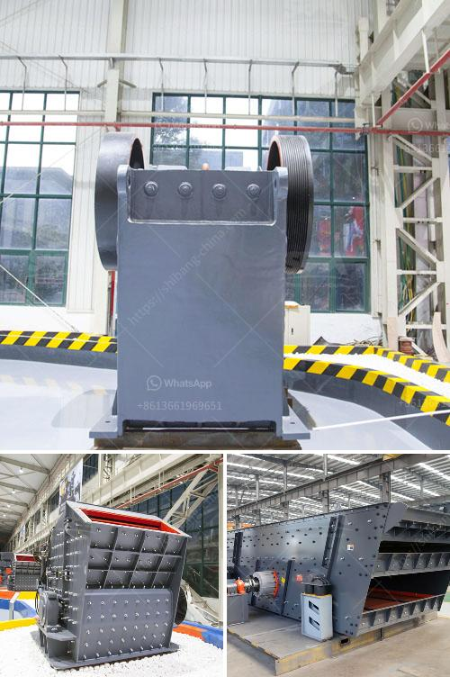

<h3>كسارة مطرقية متعددة</h3>
تعتبر الكسارة المطرقية المتعددة أحد الأدوات الأساسية في صناعة التعدين ومعالجة المواد الخام. تستخدم هذه الكسارة لتكسير المواد الصخرية الكبيرة إلى قطع صغيرة تتناسب مع متطلبات العملية الإنتاجية.

تتألف الكسارة المطرقية المتعددة من جسم رئيسي يحتوي على دورانين أو أكثر من المطارق المعدنية المثبتة على الأسطوانة الدوارة. عندما يتم تشغيل الكسارة، يتم دفع المواد الصخرية إلى داخل الكسارة حيث يتم سحقها عن طريق تأثير المطرقة. ثم تتم تفتيتها إلى قطع صغيرة بفضل القوة الدورانية التي تطبق على المطارق. تخرج المواد المكسورة من الفتحة الموجودة في الجسم الرئيسي للكسارة وتستخدم للاستخدامات المختلفة.

تتميز الكسارة المطرقية المتعددة بالقدرة على تكسير المواد الصلبة والمتساوية بشكل فعال وسرعة. كما تمتاز بقدرتها على التعامل مع مجموعة واسعة من المواد، بما في ذلك الحجر الجيري والفحم والجبس والمعادن الصخرية الأخرى.

تستخدم الكسارات المطرقية المتعددة في العديد من الصناعات، بما في ذلك صناعة البناء والتعدين ومعالجة المواد الكيميائية والصناعات الكهربائية وصناعة الأسمنت. فهي تعتبر أداة مهمة لتكسير المواد الخام وإعدادها للاستخدام في العمليات التصنيعية اللاحقة.

بالإضافة إلى ذلك، تتميز الكسارة المطرقية المتعددة بسهولة الصيانة والتشغيل. يمكن للفنيين تثبيت المطارق وصيانتها بسرعة وسهولة لضمان أداء مستدام للكسارة. كما توفر هذه الكسارة أيضًا نظامًا آليًا للتحكم، مما يسمح بضبط حجم الإخراج والسرعة المثلى للعملية الإنتاجية.

باختصار، تعتبر الكسارة المطرقية المتعددة أداة حيوية لصناعة التعدين وتجهيز المواد الخام. توفر هذه الكسارة طريقة فعالة وسريعة لتحويل المواد الصخرية الكبيرة إلى قطع صغيرة تستخدم في العمليات التصنيعية المختلفة. كما تمتاز بقدرتها على التعامل مع مجموعة واسعة من المواد وسهولة الصيانة والتشغيل.
<h3>Contact us</h3><ul><li><strong>Whatsapp:&nbsp;<a href="https://wa.me/8613661969651">+8613661969651</a></strong></li><li><a href="https://swt.shibang-china.com/?git&amp;zhl&amp;كسارة مطرقية متعددة"><strong>Online Service(chat now)</strong></a></li></ul><h3>Related</h3><ul><li><a href='سعر معدات معالجة الكاولين.md'>سعر معدات معالجة الكاولين</a></li><li><a href='عملية سحق الصخور في الركام.md'>عملية سحق الصخور في الركام</a></li><li><a href='سعر كسارة مخروطية هيدروليكية.md'>سعر كسارة مخروطية هيدروليكية</a></li><li><a href='مصانع طحن الكرات.md'>مصانع طحن الكرات</a></li><li><a href='مصنع تكسير الحجر الألماني.md'>مصنع تكسير الحجر الألماني</a></li></ul>