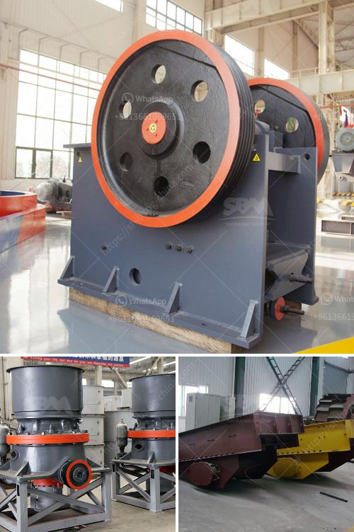

<h3>كسارة معالجة الحجر الجيري</h3>
تمثل كسارة معالجة الحجر الجيري جزءًا هامًا من عملية استخراج الحجر الجيري، حيث تستخدم لتكسير الحجارة الكبيرة إلى قطع صغيرة قابلة للاستخدام. تعتبر الكسارة الحجرية الجيرية أداة أساسية في صناعة الأسمنت والرمل والزجاج والصلب والأسمدة والعديد من الصناعات الأخرى التي تحتاج إلى الحجارة الجيرية مثل المواد الخام.

تتكون الكسارة المعالجة للحجر الجيري من عدة أجزاء رئيسية. الجزء الأساسي هو المطرقة التي تتحرك بسرعة عالية لتضرب الحجر الكبير وتكسيره إلى حجم صغير. تم تصميم الكسارة هندسيًا بشكل يسمح للحجر بتمرير من خلالها وفقًا للحجم الذي يتم ضبطه عن طريق التحكم في مواصفات الكسارة.

تُستخدم الكسارات المعالجة للحجر الجيري في المقام الأول لتحويل الحجارة الكبيرة إلى حجم صغير ومناسب للاستخدام في مختلف الصناعات. يتم تحميل الحجارة الكبيرة في الكسارة بواسطة آلية سحب أو بواسطة العمال البشريين. وعند دخول الحجارة إلى الكسارة، توجد شبكة تنظيمية تساعد على توجيه الحجارة بطريقة أفضل للسماح للكسارة بتكسيرها بكفاءة.

يتم تحديد حجم الحجارة المتوقع تكسيرها عن طريق وضع شبكة تنظيمية ذات ثقوب صغيرة بناءً على المتطلبات المحددة. ينظر إلى حجم الحجر النهائي كما أنه جزء مهم في تحديد نوع الكسارة المستخدمة.

تعمل الكسارة أثناء حركة الحجر عبر الكسارة بشكل أفقي أو عمودي. تبدأ العملية بكبسولة المطرقة أو اللوحة المطرقة التي تضرب الحجر وتكسره. بعد ذلك، يتم توجيه الحجارة التي تم تكسيرها بواسطة المصعد والسيور الناقلة إلى المكان الذي يتم فيه تخزين الحجارة المكسورة.

باختصار، إن كسارة معالجة الحجر الجيري تعتبر جهازًا هامًا في صناعات البناء والبناء والصناعات الأخرى. يتم استخدامها لتحويل الحجارة الكبيرة إلى حجم صغير يمكن استخدامه بسهولة. تأتي الكسارات المعالجة للحجر الجيري في مختلف الأحجام والتصاميم لتناسب متطلبات الإنتاج المختلفة. تكمن فعاليتها في قدرتها على تكسير الحجارة بسرعة وفي كمية كبيرة لتلبية الطلب العالي على المواد الأساسية في الصناعات المختلفة.
<h3>Contact us</h3><ul><li><strong>Whatsapp:&nbsp;<a href="https://wa.me/8613661969651">+8613661969651</a></strong></li><li><a href="https://swt.shibang-china.com/?git&amp;zhl&amp;كسارة معالجة الحجر الجيري"><strong>Online Service(chat now)</strong></a></li></ul><h3>Related</h3><ul><li><a href='شركات تصنيع آلات الكسارة في شنغهاي.md'>شركات تصنيع آلات الكسارة في شنغهاي</a></li><li><a href='مصنع معدات التعدين للذهب.md'>مصنع معدات التعدين للذهب</a></li><li><a href='تكلفة مشروع طحن التلك.md'>تكلفة مشروع طحن التلك</a></li><li><a href='مطاحن الكرة في زابوبان.md'>مطاحن الكرة في زابوبان</a></li><li><a href='استخدام مطحنة ريموند.md'>استخدام مطحنة ريموند</a></li></ul>