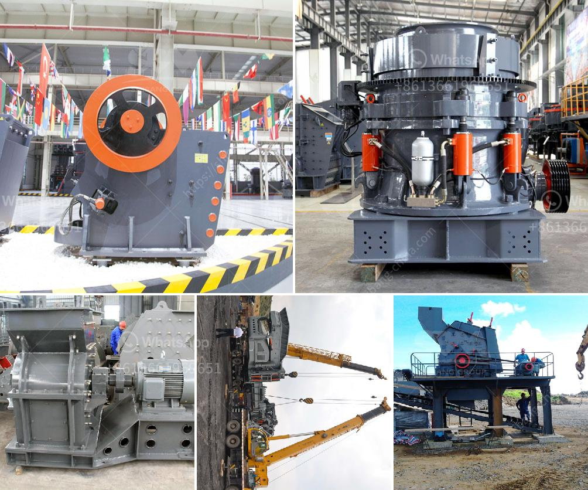

<h3>كسارة معدنية للإيجار</h3>
كسارة معدنية للإيجار: الحل المثالي لمشاريع البناء والهدم

تعتبر الكسارات المعدنية من الأدوات الهامة في صناعة البناء والهدم، حيث تستخدم لتفتيت وتكسير الصخور والمواد الصلبة لإعادة تدويرها واستخدامها في مشاريع جديدة. وعندما يكون لديك مشروع يتطلب هذه الأداة الثقيلة، فإن الاستفادة من خدمة تأجير الكسارات المعدنية يمكن أن توفر لك الوقت والجهد والمال.

أحد الفوائد الرئيسية لتأجير الكسارة المعدنية هو أنه يوفر لك الفرصة للاستفادة من أحدث التقنيات والمعدات في هذا المجال دون الحاجة إلى شراء معدات جديدة. ففي عالم التكنولوجيا المتقدم، تشهد الكسارات تحسينًا متواصلًا في الأداء والكفاءة، وبالتالي يمكن أن يساهم تأجير الكسارة المعدنية في تقديم أفضل النتائج لمشروعك.

من الجوانب الإيجابية الأخرى لتأجير الكسارة المعدنية أنه يساهم في تقليل التكاليف المادية والمالية المرتبطة بشكل كبير مع شراء الكسارة الخاصة بك. إذا قامت عمليتك بفترة محددة للعمل على مشروع معين، فإن استئجار الكسارة المعدنية لتلك الفترة يعني أنك لن تدفع أموالًا ضخمة على شراء المعدات التي قد لا تحتاجها في المستقبل.

أيضًا، يمنحك تأجير الكسارة المعدنية مرونة في تعديل وتخصيص المعدات حسب احتياجات مشروعك. يمكنك اختيار وتنسيق الكسارة المناسبة لتلبية متطلبات الموقع ونوع المواد المراد تكسيرها، مما يسهل العمل على المشروع ويعزز الإنتاجية والكفاءة.

يعد تأجير الكسارة المعدنية أيضًا الخيار الأمثل من الناحية البيئية. إذ يساهم في تقليل النفايات والتلوث البيئي، حيث يمكن إعادة تدوير واستخدام مواد البناء والهدم في مشاريع أخرى. وبالتالي، يمنحك تأجير الكسارة المعدنية فرصة للمساهمة في حماية البيئة والمحافظة على الموارد الطبيعية.

في الختام، لا يمكن إنكار فوائد تأجير الكسارة المعدنية في مشاريع البناء والهدم. فهو يوفر لك الفرصة للاستفادة من أحدث التقنيات والموارد، ويخفض التكاليف ويعزز الكفاءة ويساهم في حماية البيئة. لذا يجب أن يعتبر تأجير الكسارة المعدنية الخيار الأمثل للتفكير فيه عندما تحتاج إلى هذه الأداة الثقيلة في مشروعك التالي.
<h3>Contact us</h3><ul><li><strong>Whatsapp:&nbsp;<a href="https://wa.me/8613661969651">+8613661969651</a></strong></li><li><a href="https://swt.shibang-china.com/?git&amp;zhl&amp;كسارة معدنية للإيجار"><strong>Online Service(chat now)</strong></a></li></ul><h3>Related</h3><ul><li><a href='أسعار كسارات نيجيريا الجديدة.md'>أسعار كسارات نيجيريا الجديدة</a></li><li><a href='شركة معالجة الذهب في الصين.md'>شركة معالجة الذهب في الصين</a></li><li><a href='شركات تعدين الذهب في ألمانيا.md'>شركات تعدين الذهب في ألمانيا</a></li><li><a href='كسارة متنقلة صغيرة الخرسانة.md'>كسارة متنقلة صغيرة الخرسانة</a></li><li><a href='معدات معالجة الحجر الجيري في جنوب أفريقيا.md'>معدات معالجة الحجر الجيري في جنوب أفريقيا</a></li></ul>