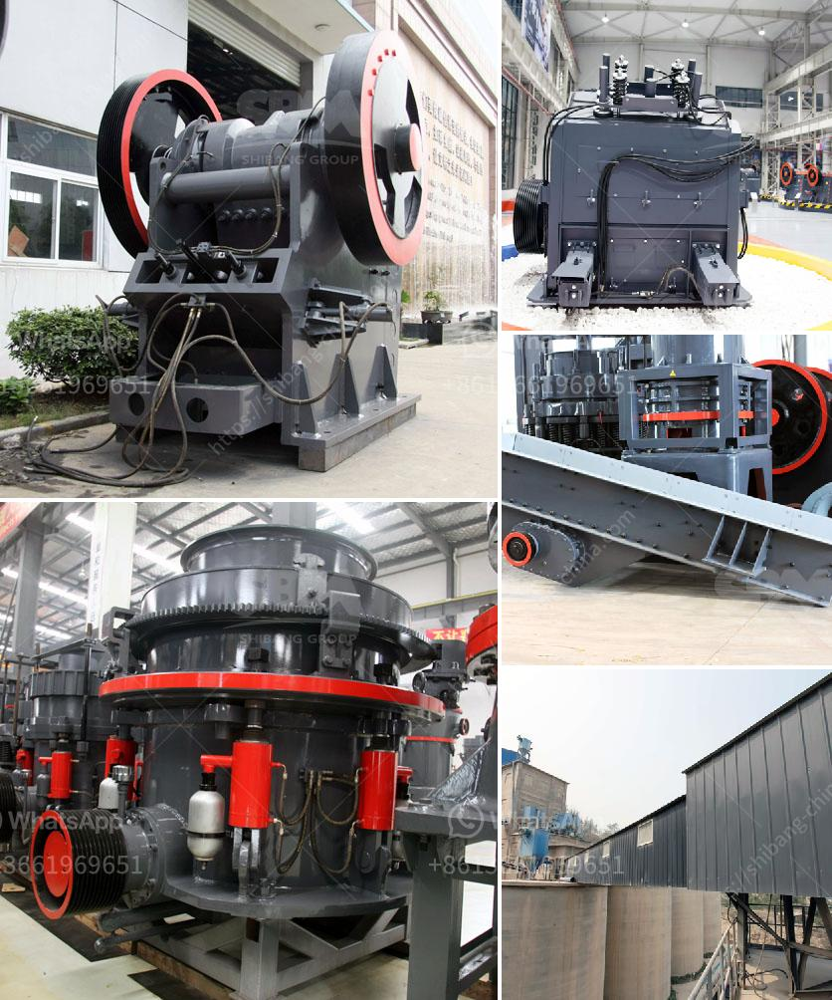

<h3>كسارة من الصين السعر</h3>
تعتبر الصين واحدة من الدول الرائدة في مجال صناعة الآلات والمعدات الصناعية، بما في ذلك صناعة الكسارات. يعتبر الاستثمار في كسارة من الصين خيارًا ممتازًا للعديد من الشركات والمقاولين الذين يبحثون عن أدوات عالية الجودة بأسعار تنافسية.

توفر الكسارات الصينية التكنولوجيا المتقدمة والجودة العالية في الأداء والموثوقية. تستخدم بشكل شائع في مجالات متنوعة مثل التعدين وبناء الطرق والبناء العام. بإمكانها سحق المواد الخام بفعالية، بما في ذلك الصخور والحصى والخرسانة، مما يعزز إنتاجية المشروع.

ميزة الكسارات الصينية هي توافرها بسعر معقول بالنسبة للشركات ذات الميزانية المحدودة. يمكن العثور على الكسارات بتكلفة تتراوح بين 200 و 400 دولار، وهو سعر معقول مقارنةً بالكسارات المصنعة في أماكن أخرى.

تعمل الشركات المصنعة في الصين على تحسين الجودة والأداء الفني للكسارات لضمان أعلى مستويات الكفاءة والصلابة. يتم التركيز على تناسق الأجزاء والمواد المستخدمة في التصنيع، بالإضافة إلى الاهتمام بالتصميم والتقنيات الحديثة للتشغيل.

تتوفر الكسارات الصينية بتصاميم مختلفة ومجموعة واسعة من الأحجام، مما يتيح للمشترين اختيار الكسارة التي تناسب احتياجاتهم بشكل مثالي. يمكن العثور على الكسارات المتنقلة والثابتة، والتي يمكن أن تتلاءم مع تحديات محددة في موقع العمل.

علاوة على ذلك، يوفر الشركات المصنعة الصينية خدمة ما بعد البيع الفعالة، بما في ذلك توفير قطع الغيار والدعم الفني. يمكن للعملاء الاعتماد على خدمة مرضية لمساعدتهم في حل أي مشاكل تواجههم مع الكسارات المصنعة في الصين.

باختصار، الكسارات المصممة والمصنعة في الصين تعتبر خيارًا ممتازًا للشركات التي تبحث عن كسارات ذات جودة عالية بأسعار مناسبة. تتميز بتقديم كفاءة عالية وقوة سحق ممتازة للمواد الخام المختلفة. إذا كنت تبحث عن كسارة بأسعار تتراوح بين 200 و 400 دولار، فإن الشركات المصنعة الصينية ستكون خيارًا مثاليًا لك.
<h3>Contact us</h3><ul><li><strong>Whatsapp:&nbsp;<a href="https://wa.me/8613661969651">+8613661969651</a></strong></li><li><a href="https://swt.shibang-china.com/?git&amp;zhl&amp;كسارة من الصين السعر"><strong>Online Service(chat now)</strong></a></li></ul><h3>Related</h3><ul><li><a href='خطة عمل كاملة لمصنع تكسير الحجارة.md'>خطة عمل كاملة لمصنع تكسير الحجارة</a></li><li><a href='خط إنتاج مسحوق الجبس الرسم التخطيطي.md'>خط إنتاج مسحوق الجبس الرسم التخطيطي</a></li><li><a href='عملية كولمان للطحن.md'>عملية كولمان للطحن</a></li><li><a href='مطحنة المطرقة لتركيز السعر.md'>مطحنة المطرقة لتركيز السعر</a></li><li><a href='آلة كسارة الحجر للشراء السعر.md'>آلة كسارة الحجر للشراء السعر</a></li></ul>