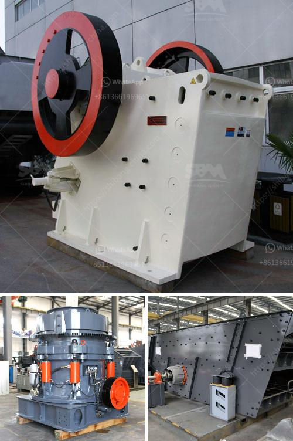

<h3>كسارة نصف متنقلة</h3>
تعدّ كسارة نصف متنقلة الأداة الأكثر فعالية وملاءمة في صناعة تكسير وطحن المواد الصلبة والمعادن. إنها تمتاز بقدرتها على العمل في المواقع الحضرية والمناطق النائية على حد سواء، مما يجعلها خيارًا شائعًا للعديد من الشركات والمشاريع التي تتطلب تكسير المواد.

تتألف الكسارة النصف متنقلة من وحدة تكسير متنقلة تحتوي على سلسلة من المعدات المتخصصة مثل الكسّارة الفكية، والكسّارة الصدمية والغربال الاهتزازي. تعمل هذه المعدات بشكل متكامل مع بعضها البعض لتكسير المواد إلى قطع صغيرة ومنتظمة.

تمتلك الكسارة النصف متنقلة العديد من المزايا. فهي قابلة للنقل بسهولة ومرونة، حيث يمكن نقلها بسهولة من مكان إلى آخر دون الحاجة إلى إعدادات طويلة ومعقدة. تتوفر أيضًا بأحجام وموديلات مختلفة تناسب احتياجات العملاء المختلفة. كما تعمل الكسارة النصف متنقلة بشكل فعال وفي وقت قصير، مما يزيد من إنتاجية الأعمال.

واحدة من أهم المزايا للكسارة النصف متنقلة هي قدرتها على تقليل التكاليف التشغيلية. يمكن تشغيلها بشكل مستقل، دون الحاجة إلى الدعم المستمر من قِبل الأدوات الأخرى أو خطوط الإنتاج. هذا يعني أيضًا تقليل احتياجات الطاقة والعمالة، مما يساهم في تقليل تكاليف التشغيل وزيادة الربحية.

بالإضافة إلى ذلك، تتيح الكسارة النصف متنقلة إعادة استخدام المواد القابلة لإعادة التدوير، مثل الخرسانة والخرسانة المجروشة والحصى. هذا يعزز الاستدامة البيئية ويحمي الموارد الطبيعية.

للخلاصة، تعد الكسارة النصف متنقلة أداة مهمة وفعالة في صناعة تكسير المواد. تتميز بسهولة التنقل وقدرتها على التعامل مع مجموعة متنوعة من المواد. كما تساهم في تقليل التكاليف وزيادة الربحية. إنها خيار مثالي للشركات والمشاريع التي تحتاج إلى تكسير المواد الصلبة والمعادن بكفاءة وفعالية.
<h3>Contact us</h3><ul><li><strong>Whatsapp:&nbsp;<a href="https://wa.me/8613661969651">+8613661969651</a></strong></li><li><a href="https://swt.shibang-china.com/?git&amp;zhl&amp;كسارة نصف متنقلة"><strong>Online Service(chat now)</strong></a></li></ul><h3>Related</h3><ul><li><a href='عمود المرفق لكسارة الفك.md'>عمود المرفق لكسارة الفك</a></li><li><a href='كسارة الكرةست في كينيا صنعت في الصين.md'>كسارة الكرةست في كينيا صنعت في الصين</a></li><li><a href='خط إنتاج مسحوق الجبس.md'>خط إنتاج مسحوق الجبس</a></li><li><a href='مطحنة أسمنت صغيرة مستعملة في الإمارات.md'>مطحنة أسمنت صغيرة مستعملة في الإمارات</a></li><li><a href='أسعار مطاحن الكرة وللبيع في سريلانكا.md'>أسعار مطاحن الكرة وللبيع في سريلانكا</a></li></ul>