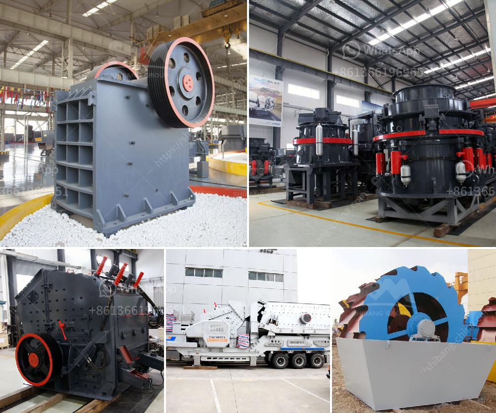

<h3>كسارة هيدروليكية</h3>
تعتبر الكسارة الهيدروليكية أحد الآلات المهمة في صناعة التعدين والبناء، حيث تستخدم لسحق وتكسير المواد الصلبة لأحجام أصغر. تتكون الكسارة الهيدروليكية من مجموعة من الأجزاء المتحركة والثابتة، مثل القواطع والمطارق الهيدروليكية والفك المتحرك، وتعتمد على الضغط الهيدروليكي لتوليد القوة اللازمة للتكسير.

تعتبر الكسارة الهيدروليكية فعالة جداً في عمليات التكسير والتحطيم، حيث تقدم قوة كبيرة وقدرة عالية على التحمل لسحق المواد الصلبة مثل الصخور والخرسانة والحجارة. كما أنها قادرة على سحق المواد إلى أحجام أصغر ومن ثم إعادة استخدامها في البناء أو تجهيزها لعمليات أخرى.

تتميز الكسارة الهيدروليكية بالسرعة والدقة في عملية التكسير، حيث تستخدم قوة الضغط الهيدروليكي للسيطرة على تردد ضربات المطرقة وقوتها لتحقيق أفضل نتيجة. كما أنها مزودة بنظام للتحكم عن بعد، مما يتيح للعاملين التحكم في عملية التكسير من مسافة آمنة وتجنب أي حوادث قد تحدث، وبالتالي زيادة السلامة في موقع العمل.

تستخدم الكسارة الهيدروليكية في العديد من التطبيقات المختلفة، مثل التعدين، والبناء، وصناعة الأسمنت، وإعادة التدوير. فعلى سبيل المثال، في صناعة التعدين، تستخدم الكسارة الهيدروليكية في سحق المواد الخام لتجهيزها لعمليات التركيز، بينما في صناعة البناء، تساعد في سحق الخرسانة القديمة لإعادة استخدامها في مشاريع البناء المختلفة.

في الختام، يمكن القول أن الكسارة الهيدروليكية لها دور كبير في تسهيل عمليات السحق والتحطيم في صناعة التعدين والبناء. تستخدم القوة الهيدروليكية لتكسير المواد الصلبة وسحقها إلى أحجام أصغر، مما يتيح إعادة استخدامها في عمليات أخرى. بالإضافة إلى ذلك، فإن الكسارة الهيدروليكية تعتبر أداة آمنة وفعالة تساعد في زيادة الإنتاجية وتحسين الجودة في مختلف المجالات الصناعية.
<h3>Contact us</h3><ul><li><strong>Whatsapp:&nbsp;<a href="https://wa.me/8613661969651">+8613661969651</a></strong></li><li><a href="https://swt.shibang-china.com/?git&amp;zhl&amp;كسارة هيدروليكية"><strong>Online Service(chat now)</strong></a></li></ul><h3>Related</h3><ul><li><a href='سعر مصنع التكسير.md'>سعر مصنع التكسير</a></li><li><a href='مطحنة الكرة لمسحوق الألمنيوم.md'>مطحنة الكرة لمسحوق الألمنيوم</a></li><li><a href='كسارة صخرية صناعية.md'>كسارة صخرية صناعية</a></li><li><a href='مطحنة ريموند للرخام.md'>مطحنة ريموند للرخام</a></li><li><a href='كسارة مخروطية بوزولانا 100 طن في الساعة.md'>كسارة مخروطية بوزولانا 100 طن في الساعة</a></li></ul>