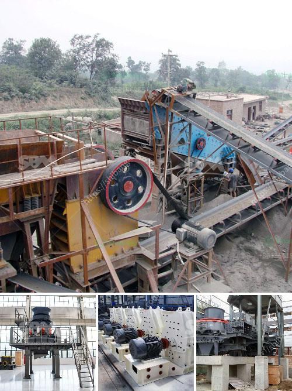

<h3>كسارة ومصنع الفرز</h3>
يُعد مصنع الكسارة ومصنع الفرز جزءًا هامًا من صناعة التعدين والبناء. تقوم الكسارة بسحق المواد الخام ، مثل الصخور والحجارة ، إلى قطع صغيرة قابلة للفحص ويمكن استخدامها في عمليات البناء المختلفة.

تعتبر الكسارة آلة تستخدم القوة الميكانيكية لكسر المواد إلى مقاسات أصغر. تحتوي الكسارات على محرك يستخدم الطاقة الكهربائية أو الديزل لتشغيلها. تعتمد الكسارة على حركة التدحرج والضغط لكسر المادة إلى قطع صغيرة. تتكون الكسارة عادةً من فكين قادرين على التحرك باتجاهين معًا لسحق المواد بينهما. كما تشتمل الكسارة على مجموعة من الأسطوانات والحجارات الدوارة لمعالجة المواد.

بعد سحق المواد بواسطة الكسارة ، يتم نقلها إلى مصنع الفرز. يتم استخدام مصنع الفرز لفصل المواد وتصنيفها حسب حجمها ونوعها. يتم استخدام الشاشات والأجهزة الميكانيكية الأخرى في مصنع الفرز لترتيب الحجم أو النوع المطلوب للمواد. يُطلق على العملية التي يتم فيها تمرير المواد عبر المصنع وتصنيفها باسم "عملية الفرز".

يعتبر مصنع الكسارة ومصنع الفرز أساسيًا في صناعة البناء والتشييد. فالمواد المكسورة التي تنتجها الكسارة يمكن استخدامها في إنشاء الطرق والجسور والمباني والأنفاق والسدود وغيرها من المشاريع الضخمة. عملية الفرز تساعد على إزالة المواد غير المرغوب فيها أو غير قابلة للاستخدام وتحسين جودة المواد النهائية التي ستستخدم في المشروع.

على المستوى البيئي، يجب أن تلتزم مصانع الكسارة ومصانع الفرز بالتشريعات البيئية لضمان حماية البيئة المحيطة. يجب التعامل بعناية مع الطاقة الكهربائية أو الديزل لتشغيل المصانع. كما يجب أن يتم التخلص من المواد الناتجة عن عملية الفرز والتي لا تستخدم بشكل صحيح بطرق صحية وآمنة.

في النهاية ، فإن وجود مصنع الكسارة ومصنع الفرز أمر ضروري لصناعة البناء والتشييد. يساهمون في توفير المواد اللازمة لإنشاء المباني والبنية التحتية الحديثة. على الرغم من أهميتهم ، يجب أن يتم تشغيل المصانع بطرق مستدامة وصديقة للبيئة للحفاظ على البيئة الطبيعية وصحة الأفراد.
<h3>Contact us</h3><ul><li><strong>Whatsapp:&nbsp;<a href="https://wa.me/8613661969651">+8613661969651</a></strong></li><li><a href="https://swt.shibang-china.com/?git&amp;zhl&amp;كسارة ومصنع الفرز"><strong>Online Service(chat now)</strong></a></li></ul><h3>Related</h3><ul><li><a href='كسارة الحصى لمطحنة الطحن.md'>كسارة الحصى لمطحنة الطحن</a></li><li><a href='تصميم وتخطيط محطة تكسير الحجارة pdf.md'>تصميم وتخطيط محطة تكسير الحجارة pdf</a></li><li><a href='قائمة أسعار كسارة الفك.md'>قائمة أسعار كسارة الفك</a></li><li><a href='مصنع كسارة الحجر بسعة 100 طن.md'>مصنع كسارة الحجر بسعة 100 طن</a></li><li><a href='آلات سحق تعمل في بيرو.md'>آلات سحق تعمل في بيرو</a></li></ul>