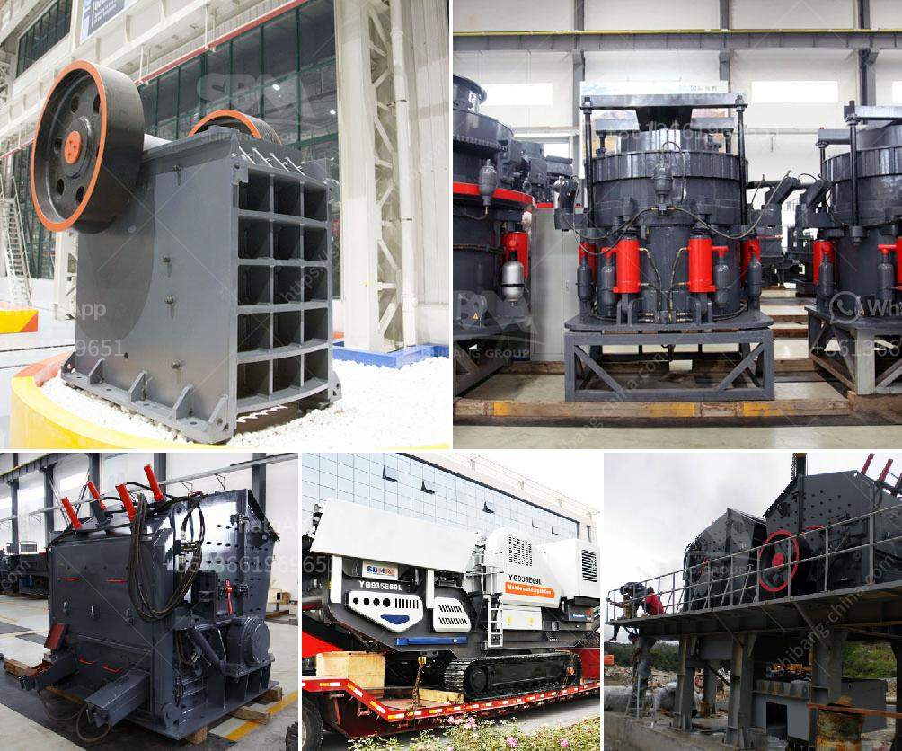

<h3>كسارة ومصنع غسيل الذهب للبيع</h3>
تقدم الكسارات ومصانع غسيل الذهب فرصًا ذهبية للبيع بأسعار مناسبة، حيث تعد هذه الصناعة من أهم القطاعات التي تساهم في نمو الاقتصاد وتعزيز التنمية المستدامة للدولة.

تساهم الكسارة في عملية تكسير وسحق الأحجار والصخور المستخرجة من المناجم، وذلك بهدف صناعة الحصى والركام المستخدمين في مشاريع البناء والتشييد. تتميز الكسارات بقدرتها العالية على تحويل الصخور الكبيرة إلى أحجار صغيرة ذات قيمة تجارية عالية.

أما مصانع غسيل الذهب، فتستخدم لاستخلاص وتنقية الذهب من الرمال والتربة المحتوية على نسب من معدن الذهب. يتم استخدام أجهزة ومعدات متطورة في عملية غسل الذهب، حيث يتم إزالة الشوائب والمواد الغير ضرورية للوصول إلى الذهب الخام الخالص.

ومن المهم أن نذكر أن الكسارات ومصانع غسيل الذهب تأتي بمجموعة متنوعة من الأحجام والطاقات، حيث يمكن للمشترين اختيار الحجم الذي يتناسب مع احتياجاتهم وميزانيتهم. وبالإضافة إلى ذلك، يسعى البائعون لتوفير ضمانات وصيانة ما بعد البيع لضمان استمرارية الأداء الجيد لتلك المعدات.

الاستثمار في الكسارات ومصانع غسيل الذهب يعد خيارًا جيدًا للمستثمرين، حيث يمكن توسيع نطاق العمل وزيادة الإنتاجية بمرور الوقت. وباستمرار الطلب على الحصى والركام في أعمال البناء، والازدياد المستمر في سعر الذهب، يمكن لمشتري هذه المعدات تحقيق أرباح مجزية في المستقبل القريب.

وبشكل عام، تعتبر صناعة الكسارات ومصانع غسيل الذهب مناسبةً للمستثمرين الراغبين في الاستثمار في القطاع التعديني وصناعة البناء. فمع التوسع العمراني والزيادة في الطلب على المواد الخام في العالم، تظل هذه الصناعة تحظى بالاهتمام والطلب المستمر.

وبهذا، فإن امتلاك كسارة ومصنع غسيل الذهب يعد فرصة جيدة للمستثمرين الباحثين عن استثمار يجمع بين الربحية والاستدامة، حيث تظل هذه الصناعة ذات قيمة ثابتة وتغطي الاحتياجات المتزايدة من المواد الخام في قطاع البناء والتشييد.
<h3>Contact us</h3><ul><li><strong>Whatsapp:&nbsp;<a href="https://wa.me/8613661969651">+8613661969651</a></strong></li><li><a href="https://swt.shibang-china.com/?git&amp;zhl&amp;كسارة ومصنع غسيل الذهب للبيع"><strong>Online Service(chat now)</strong></a></li></ul><h3>Related</h3><ul><li><a href='سحق النفايات الخرسانية والحديد.md'>سحق النفايات الخرسانية والحديد</a></li><li><a href='سعر كسارة الحجر بسعة 100 طن في الساعة.md'>سعر كسارة الحجر بسعة 100 طن في الساعة</a></li><li><a href='تأجير حزام الناقل في أيرلندا.md'>تأجير حزام الناقل في أيرلندا</a></li><li><a href='معدات إنتاج الأسمنت في ألمانيا.md'>معدات إنتاج الأسمنت في ألمانيا</a></li><li><a href='كسارات محمولة في محجر جنوب أفريقيا.md'>كسارات محمولة في محجر جنوب أفريقيا</a></li></ul>